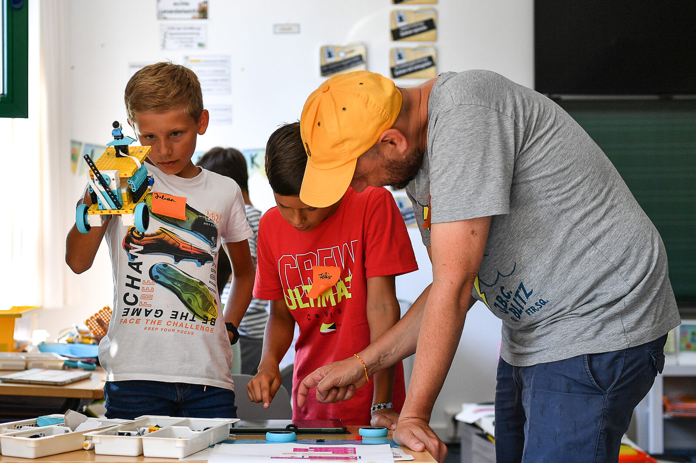
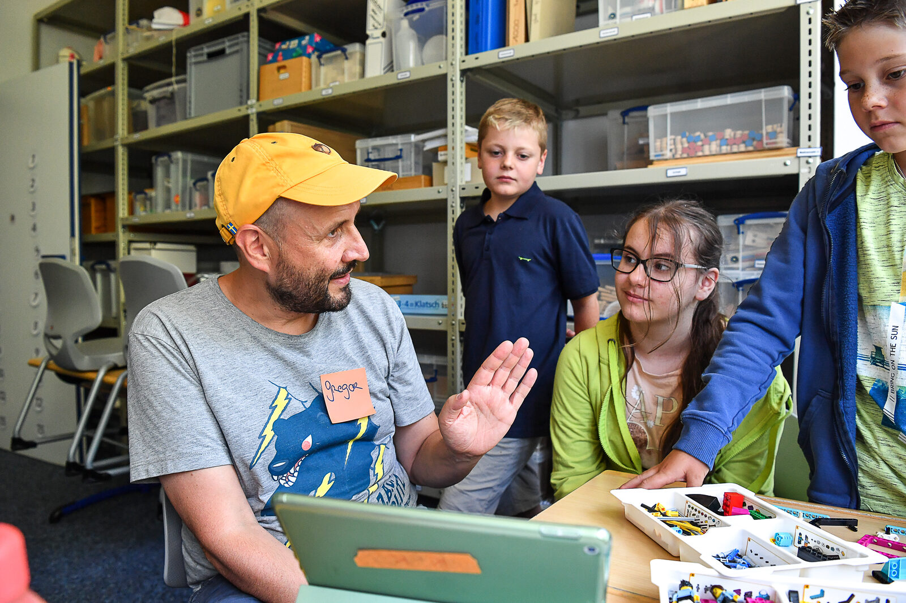
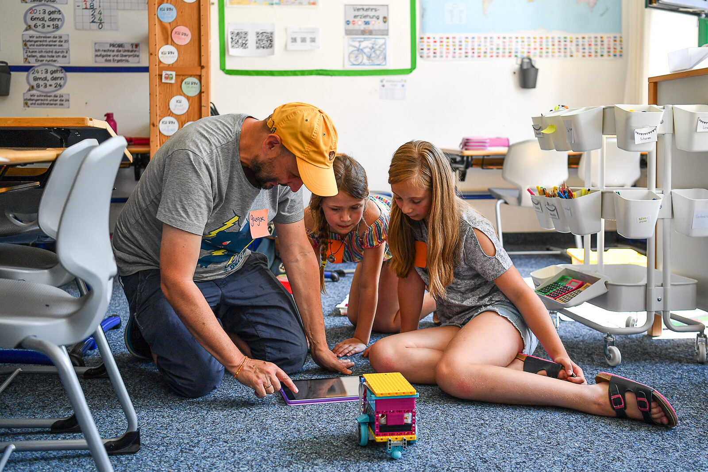

# Digital Education for Kids and Teens ッ

Welcome to KidsLab! Here you'll learn how technology works — and how to use it to bring your own ideas to life.

- Learn to code in Minecraft and Scratch
- Build and program robots
- Solder, 3D-print, and develop your own games
- Experience democracy in digital worlds
- Workshops for schools and teachers

Four holiday courses in August: building robots, 3D design with Tinkercad, Lego Robotics, and game development with Godot.

## Holiday courses this summer

Two weeks of tech, code, and action at KidsLab Augsburg — from 3D design to robotics to building your own game engine.






  
  
  
  


## Reserve your spot now



---



---

## Our offers for schools and teachers

Our workshops reach students directly in the classroom — no prior knowledge needed. We take away the fear of getting started and show that everyone can do IT! From LEGO Robotics to Scratch to AI workshops: we come to your school.

Offers for schools

## News – what we've been up to



All news


