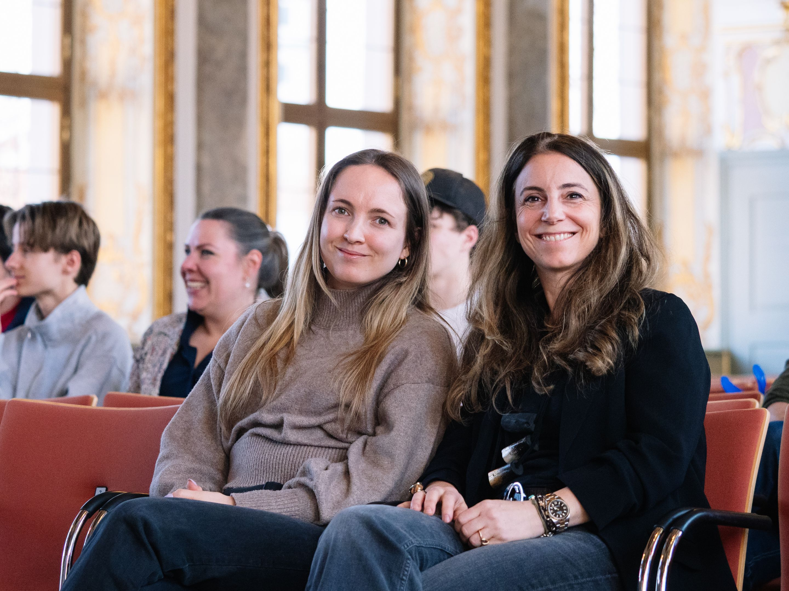
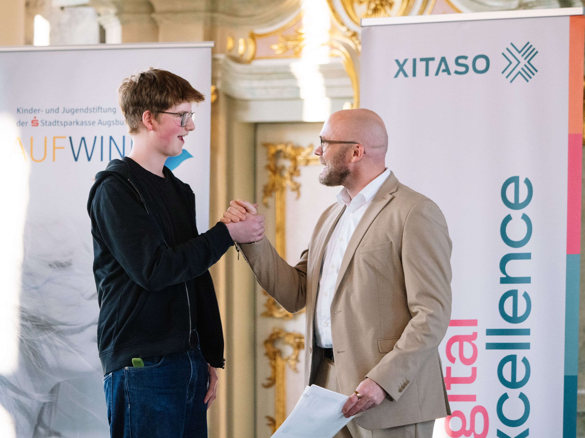
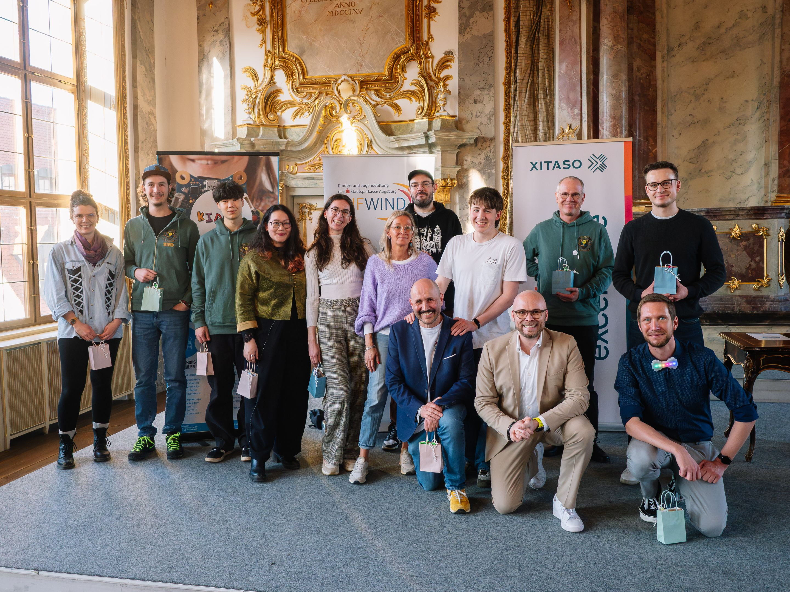

# Digitale Bildung für junge Menschen ッ

Willkommen beim KidsLab! Bei uns lernst du, wie Technik funktioniert — und wie du damit eigene Ideen umsetzen kannst.

- Programmieren lernen in Minecraft und Scratch
- Eigene Spiele entwickeln im GamesLab
- Löten, 3D-drucken und Roboter bauen
- Demokratie erleben in digitalen Welten
- Workshops für Schulen und Lehrkräfte

500 Schüler, 20 Klassen, 12 Preise – Digitalminister Mehring zeichnete junge Programmiertalente aus.









## Aktuelle Workshops und Angebote für Kinder und Jugendliche



## Unsere Angebote für Schulen und Lehrkräfte

Mit unseren Workshops erreichen wir Schülerinnen und Schüler direkt im Klassenzimmer – unabhängig von Vorkenntnissen. Wir nehmen Berührungsängste und zeigen, dass jede und jeder IT kann! Von LEGO Robotik über Scratch bis KI-Workshops: Wir kommen an eure Schule.

Angebote für Schulen

## Neuigkeiten – was machen wir alles so!



Alle Neuigkeiten


