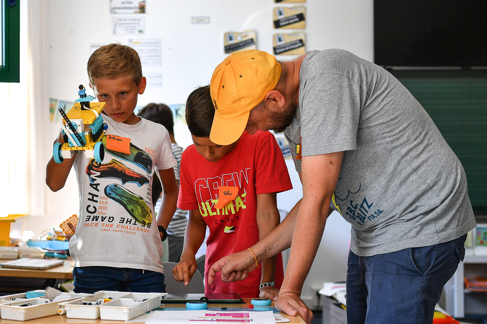
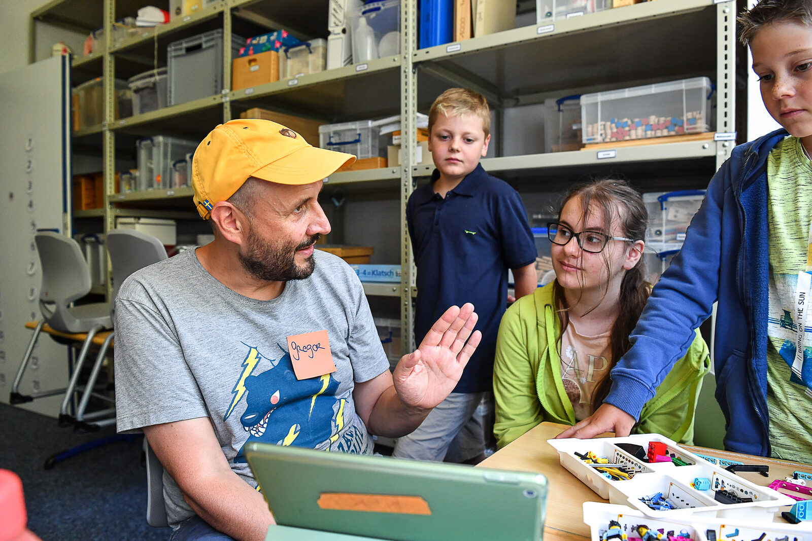
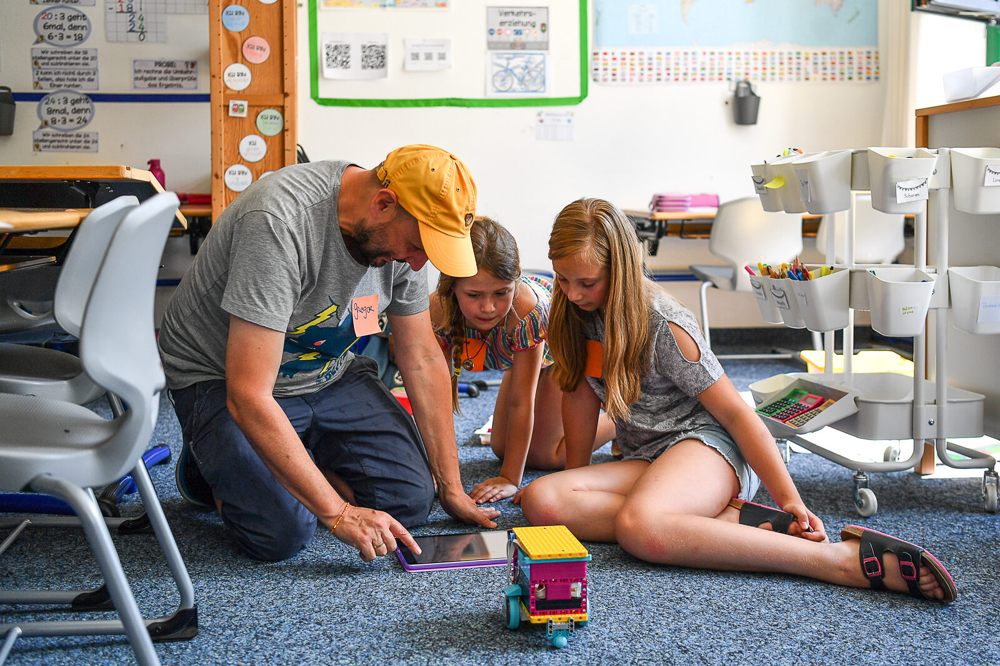

# Digitale Bildung für junge Menschen ッ

Willkommen beim KidsLab! Bei uns lernst du, wie Technik funktioniert — und wie du damit eigene Ideen umsetzen kannst.

- Programmieren lernen in Minecraft und Scratch
- Roboter bauen und programmieren
- Löten, 3D-drucken und eigene Spiele entwickeln
- Demokratie erleben in digitalen Welten
- Workshops für Schulen und Lehrkräfte



Vier Ferienkurse im August: Roboter bauen, 3D-Design mit Tinkercad, Lego Robotics und Spieleentwicklung mit Godot.

## Ferienkurse in den Sommerferien

Zwei Wochen Technik, Code und Action im KidsLab Augsburg — von 3D-Design über Robotik bis zur eigenen Spiele-Engine.






  
  
  
  


## Jetzt Platz sichern



## Unsere Angebote für Schulen und Lehrkräfte

Mit unseren Workshops erreichen wir Schülerinnen und Schüler direkt im Klassenzimmer – unabhängig von Vorkenntnissen. Wir nehmen Berührungsängste und zeigen, dass jede und jeder IT kann! Von LEGO Robotik über Scratch bis KI-Workshops: Wir kommen an eure Schule.

Angebote für Schulen

## Neuigkeiten – was machen wir alles so!



Alle Neuigkeiten


