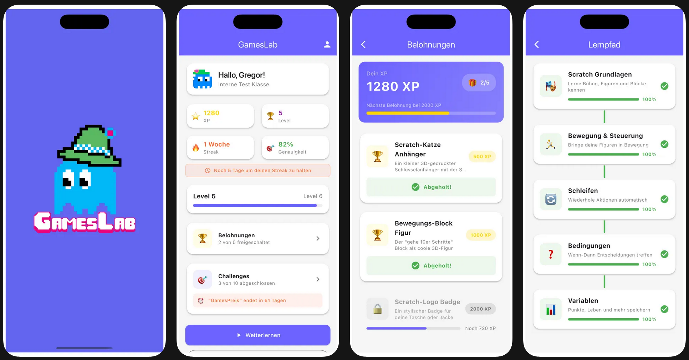
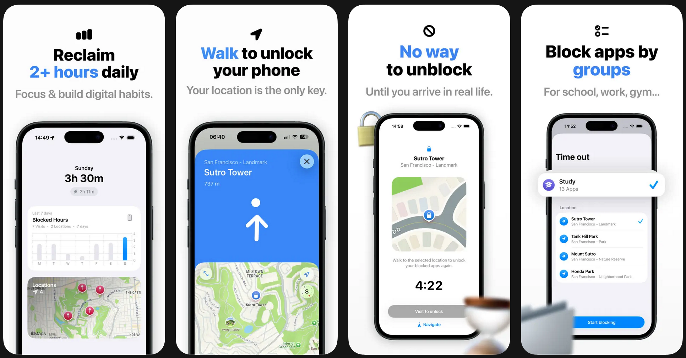
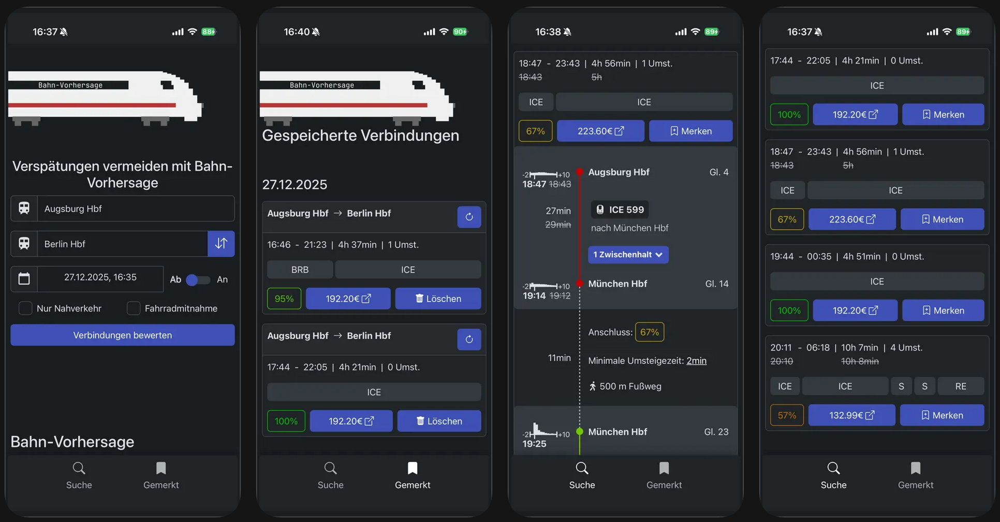
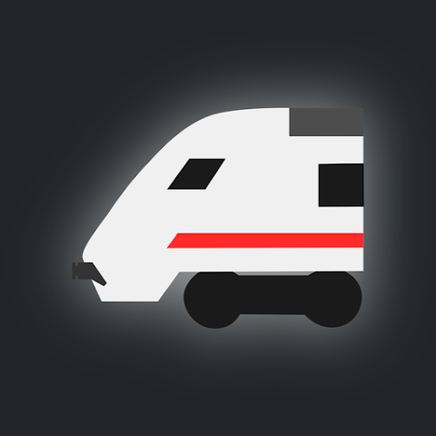
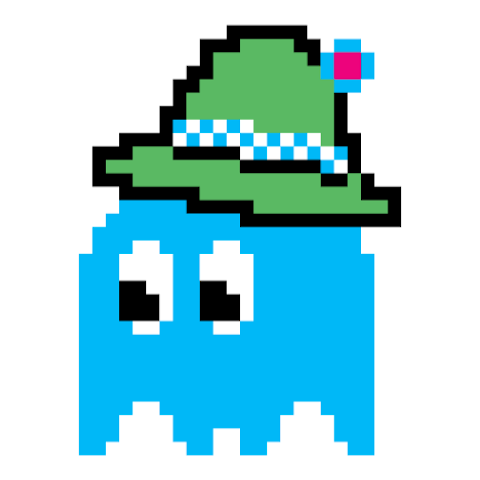
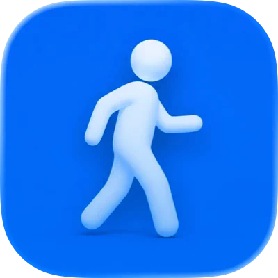

## Apps, Apps, Apps...

Liebe Eltern, liebe Unterstützer,

im KidsLab-Universum passiert gerade richtig viel – und dieses Mal dreht sich alles um Apps! Von unserer eigenen GamesLab-App über eine geniale Gründung zweier 18-Jähriger bis hin zu einer preisgekrönten Bahn-App: Hier kommen vier App-Geschichten, die zeigen, was junge Menschen mit Technik und Ideen auf die Beine stellen können.

## Die GamesLab-App – Scratch lernen & Belohnungen kassieren

Unsere eigene App ist der perfekte Begleiter zum Scratch-Programmieren: Lektionen durcharbeiten, Quizze lösen, XP sammeln – und echte Belohnungen verdienen! Wer fleißig dabei bleibt, kann sich coole Preise abholen.

**Die GamesLab-App**

## Lockation – Weniger Handy, mehr Bewegung

Hans und Lovis haben mit 17 Jahren ihre eigene Firma gegründet und mit 18 ihre erste App im App Store veröffentlicht. Lockation sperrt ausgewählte Apps (Instagram, Spiele &amp; Co.) und entsperrt sie erst, wenn man zu einem bestimmten Ort gelaufen ist – etwa zur Bibliothek, zum Sportplatz oder zu Freunden.

Das KidsLab hat Hans und Lovis auf dem Weg zur eigenen App unterstützt. Gregor Walter (KidsLab-Gründer) hat mit ihnen ihre allerersten Apps kostenlos auf iOS veröffentlicht – das war der Startschuss für ihre Gründung als Squash GbR.

Die Geschichte von Hans & Lovis

Lockation App im App-Store (Apple Geräte)

## Bahn-Vorhersage – KI sagt Zugverspätungen voraus

Wird mein Anschluss klappen? Theo Döllmann hat als Schüler eine KI trainiert, die genau das vorhersagt. Das System wurde mit über einer Milliarde Zughalten trainiert und berechnet für jede Verbindung einen Zuverlässigkeits-Score. Entstanden ist das Projekt im Rahmen von Jugend Forscht – mittlerweile nutzen es tausende Bahnfahrer täglich.

Das KidsLab unterstützt das Projekt und betreut die iOS-Version der App.

Bahnvorhersage & App




