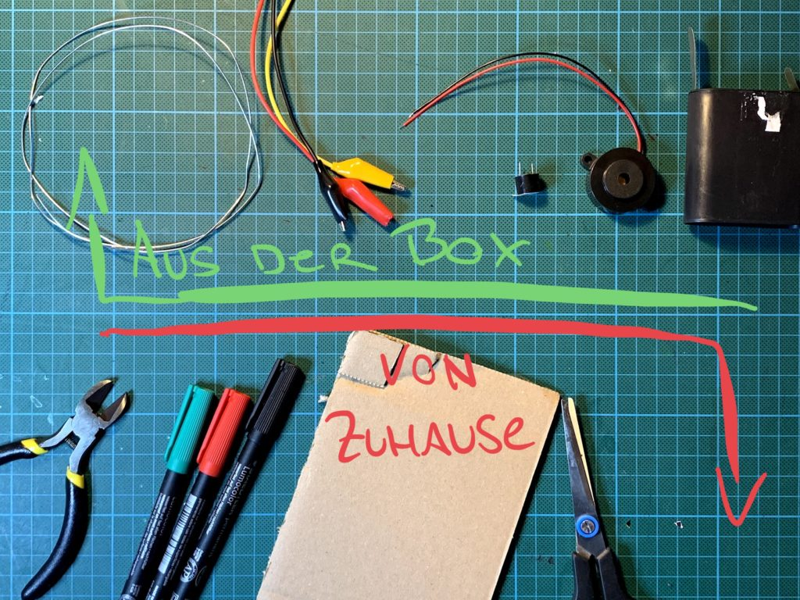
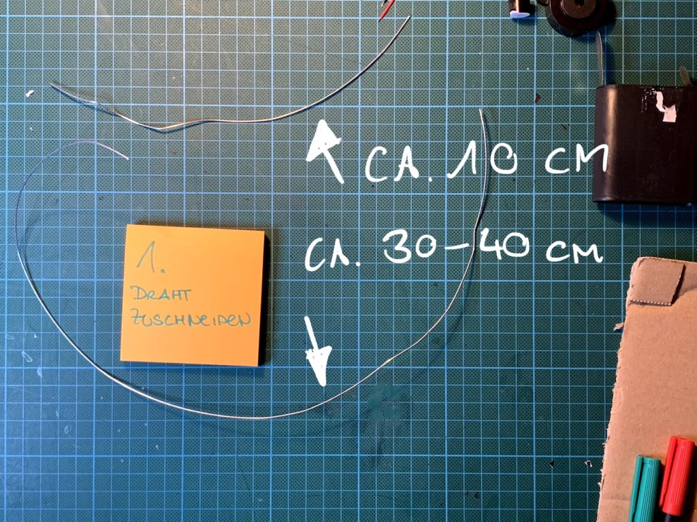
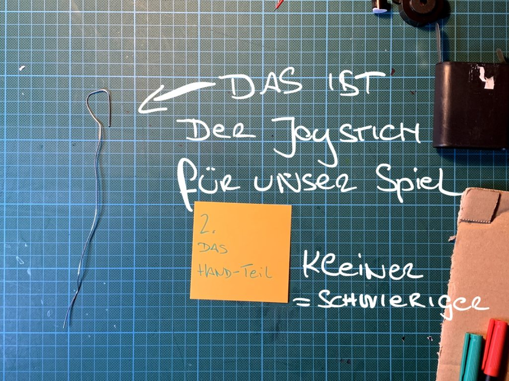
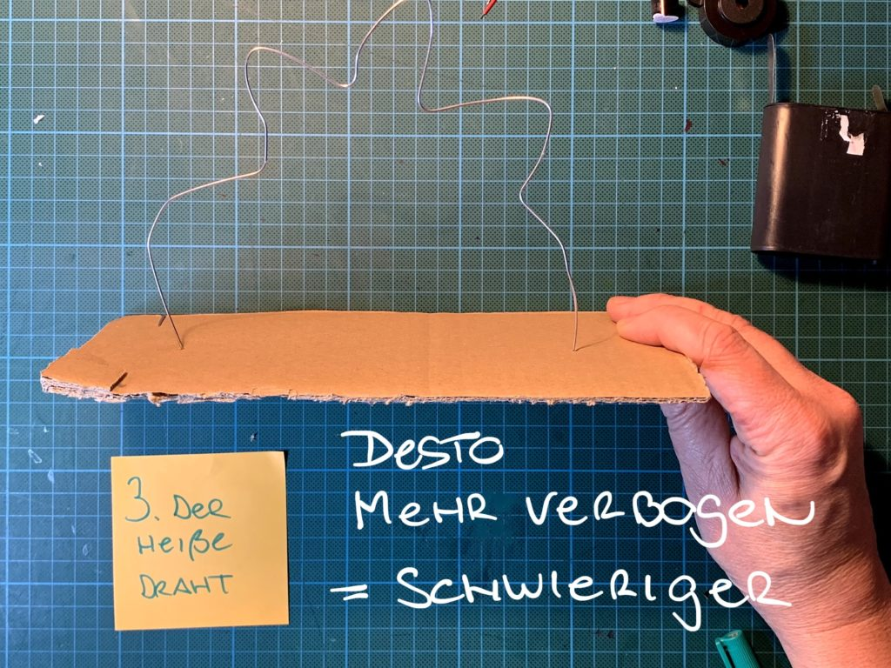
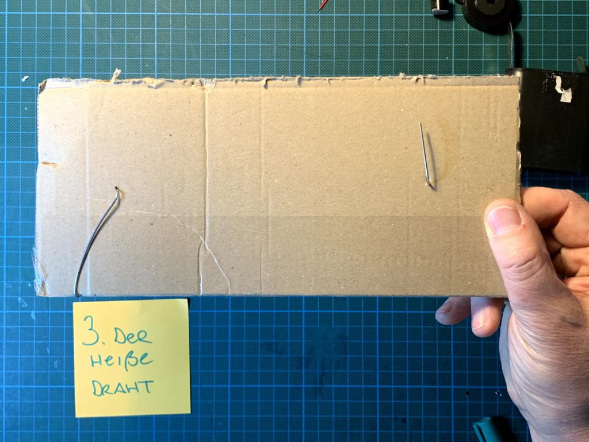
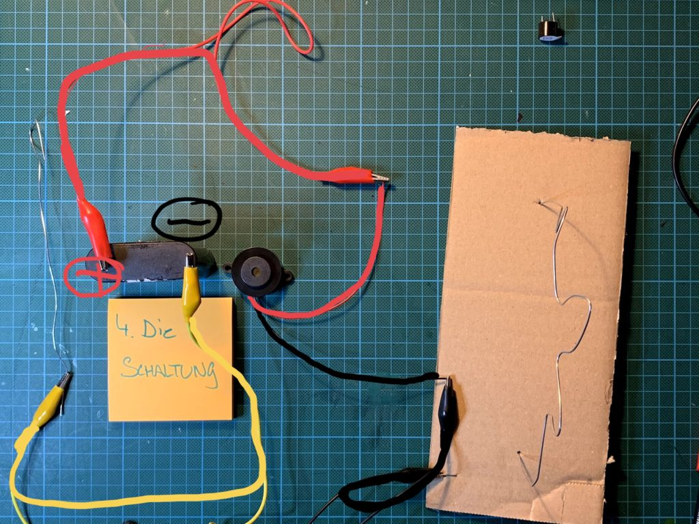

## Was ist bitte ein heißer Draht?

Heute möchte ich mit Dir ein Spiel bauen: Heißer Draht! In diesem Spiel musst du mit einem Handteil (=Joystick) vorsichtig an einem Draht entlangfahren, ohne ihn zu berühren!

Wenn du den Draht berührst, piept es ganz laut! Wenn du es bis zum Ende schaffst, ohne den Draht zu berühren, hast du gewonnen.

Dazu brauchst Du:

- Draht ca. 1-2mm dick, 50 cm
- Krokoklemmen
- einen Summer
- eine Batterie
- eine Zange oder Schere um den Draht abzuschneiden
- ein Stück Karton oder eine kleine Schachtel aus Pappe
- Stifte zum bemalen

***Wenn du keinen Summer / Piepser hast, geht natürlich auch eine Lampe oder LED.***

- Zuerst schneiden wir den Draht zu:
- ein Stück ca. 10 cm – das wird unser Handteil
- ein Stück ca. 30-40 cm – das wird der heiße Draht!

Aus dem kürzeren Stück Draht bauen wir unser Joystick:

- Biege das vordere Teil zu einer kleinen Schlaufe
- Desto kleiner die Schlaufe ist, desto schwieriger das Spiel später

Aus dem langen Draht machst du das Spielfeld

- stecke die beiden Enden durch deinen Karton oder Pappe
- verbiege den Draht
- desto mehr du ihn verbiegst – desto schwieriger das Spiel!

So sieht das ganze von unten aus…

### Und nun zur Schaltung:

- Rote Klemme verbindet ** Plus der Batterie** und **Plus des Summers**
- Gelbe Klemme verbindet **Minus der Batterie **und den **Joystick**
- Schwarze Klemme verbindet **Minus des Summers **und den **heißen Draht**
-

Fertig! Und es darf gespielt werden!

Noch nicht genug? Weiter gehts [mit Level 2](/blog/heisser-draht-level-2/)
