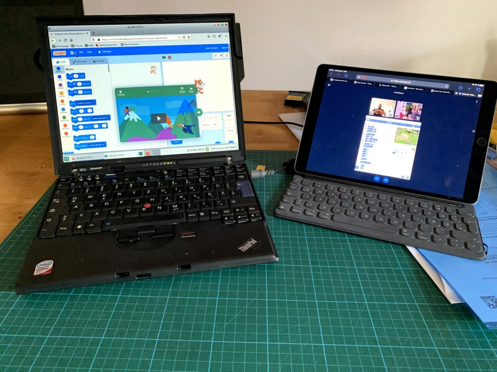

Für die Online-Kurse nutze ich das Open-Source Video-Konferenz-System „(https://bigbluebutton.org)„. BigBlueButton ist eine Open-Source-Software. Für die Video-Übertratung wird das Protkoll (https://de.wikipedia.org/wiki/WebRTC) eingesetzt – es funktioniert „Peer to Peer“ – also direkt von Ihrem Rechnen zum Rechner der anderen Teilnehmer. Die Video-Daten werden also nicht zentral gespeichert oder ähnliches. Die Verbindungen zwischen den einzelnen Teilnehmern sind zusätzlich verschlüsselt.

Mit dem Link, den Ihr erhalten habt, könnt ihr Euch direkt in dem jeweiligen Raum anmelden:



Also auf eine Seite den Browser und auf die andere Seite den Video-Chat. So könnt ihr beides sehen.

Dazu gibt es eine Anleitung zum runterladen und ausdrucken:

*(Anleitung zum Bildschirm-Teilen ist leider nicht mehr verfügbar.)*

Die Luxus-Variante sieht so aus:

Wenn ihr zusätzlich zu Eurem Computer noch ein Tablet habt, könnt ihr den Video-Chat auf dem Tablet laufen lassen und das Programmieren auf einem Laptop.

## Test

Wollt ihr das ganze mal testen? Dann könnt ihr das jederzeit hier ausprobieren:

*(Der Video-Chat-Test ist leider nicht mehr verfügbar.)*

Gerne auch mit 2 Geräten – Handy, Tablet etc.

## Unterstützte Geräte & Browser

Grundsätzlich geht der Video-Chat mit allen Geräten und Betriebssystemen:

- Computer
- Laptop
- Tablet
- macOS
- Windows
- Linux

Auch fast alle Browser werden unterstützt:

- Chrome
- Firefox
- Safari
- ….

**Nicht gut unterstützt wird leider der Internet Explorer bzw. Microsoft Edge!**
