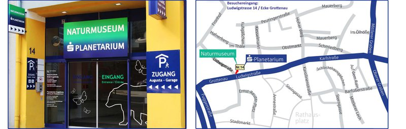

Am **Montag den 10. Februar** machen wir als Abschluss des Forscherkurses „(https://forscherkurse-augsburg.de/unsichtbares-in-der-welt-kurs-fuer-grundschulkinder-1-bis-4-klasse/)“ einen Ausflug ins Augsburger Planetarium. Da das Planetarium Platz für bis zu 70 Leute bietet, sind auch gerne alle anderen Kinder und auch die Eltern eingeladen.

Herr Cerny, der Leiter des Planetariums wird das Programm persönlich leiten und auch die zahlreichen Fragen gerne beantworten!
Schwerpunkt der 1h30m Vorführung sind Themen, die wir bereits im Kurs behandelt haben – aber auch in anderen Kursen, wie zum Beispiel die Mars-Sonde aus dem Lego-WeDo Kurs:

- Unser Sonnensystem
<li>Die Sonne
- Besuch verschiedener Planeten

</li>- Schwerkraft
<li>Sir Isaac Newton live, Start von Raketen etc.

</li>- Menschen auf dem Mars

<li>Kurze Ausschnitte aus dem längeren Programm 
- In 20 Jahren fliegen wahrscheinlich die ersten Menschen zum Mars – und natürlich wieder zurück
- Wie sieht die Reise aus, wie lebt es sich dann auf dem Mars?

</li>

**Kosten für Kinder (gerne auch mit Freunden und Geschwistern) jeweils 2,70 € – Erwachsene dürfen natürlich auch mit, da sind die (ermäßigten) Kosten 6,- Euro pro Person.**

**Treffpunkt 10 Minuten vor der Veranstaltung (14:50) an der Kasse des Planetariums**

##### Das Planetarium liegt gut erreichbar im Herzen Augsburgs, integriert im Gebäude des Naturmuseums, im 5. Stock. 

##### Den Eingang finden Sie in der Ludwigstraße am nördlichen Ende der Fußgängerzone, an der Ecke zur Grottenau.

##### **

Besuchereingang:**

**Ludwigstraße 14**
(Ecke Ludwigstraße/Grottenau)
gemeinsamer Eingang mit Naturmuseum und Augusta-Garage

(https://www.s-planetarium.de/kontakt/anfahrt/)

(https://www.s-planetarium.de)
