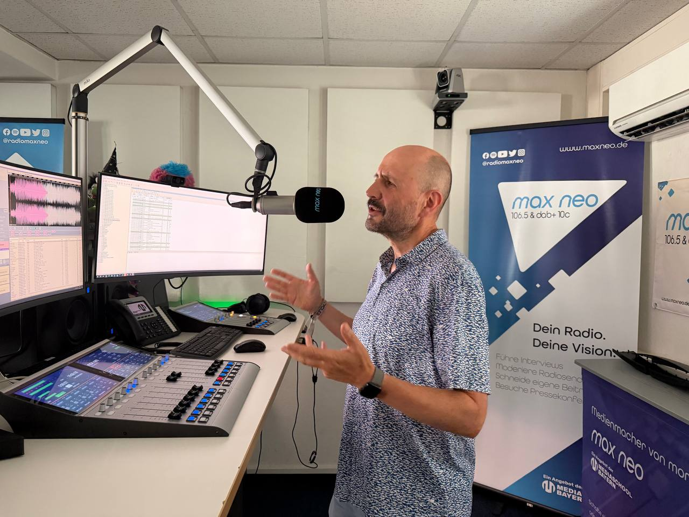
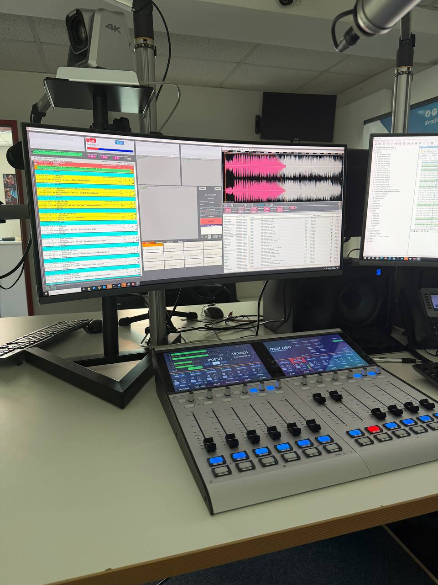

Ein Raum voller blinkender Lichter, riesige Mischpulte und die absolute Stille eines professionellen Aufnahmezeitraums, in dem jede Nuance der Stimme zählt. Genau dort war ich letzte Woche beim **Medienzentrum PARABOL** in Nürnberg.

Das PARABOL ist mehr als nur eine Einrichtung – es ist ein Ort zum Ausprobieren. Seit über 40 Jahren ermöglichen sie es Kindern und Jugendlichen, Medien aktiv zu gestalten, statt sie nur zu konsumieren. Dieser Ansatz ist genau das, was wir auch im KidsLab verfolgen.

### Im Maschinenraum von *max neo*

Besonders beeindruckend war das Studio von **max neo**. Wer schon einmal vor einem echten Profi-Mischpult stand, weiß, wie viel Energie in so einem Raum steckt. Neben der Technik ging es vor allem um den Austausch über die medienpädagogische Arbeit mit Jugendlichen.

### Fazit des Besuchs

Der Besuch hat mir viel Inspiration gegeben. Wenn Maker und Medienmacher gemeinsam an einem Tisch sitzen, entstehen die besten Ideen.

Wir freuen uns auf den weiteren Austausch und mögliche Kooperationen in der Medienarbeit.

**Wenn sich Maker und Medienmacher treffen, entstehen die spannendsten Ideen.**
