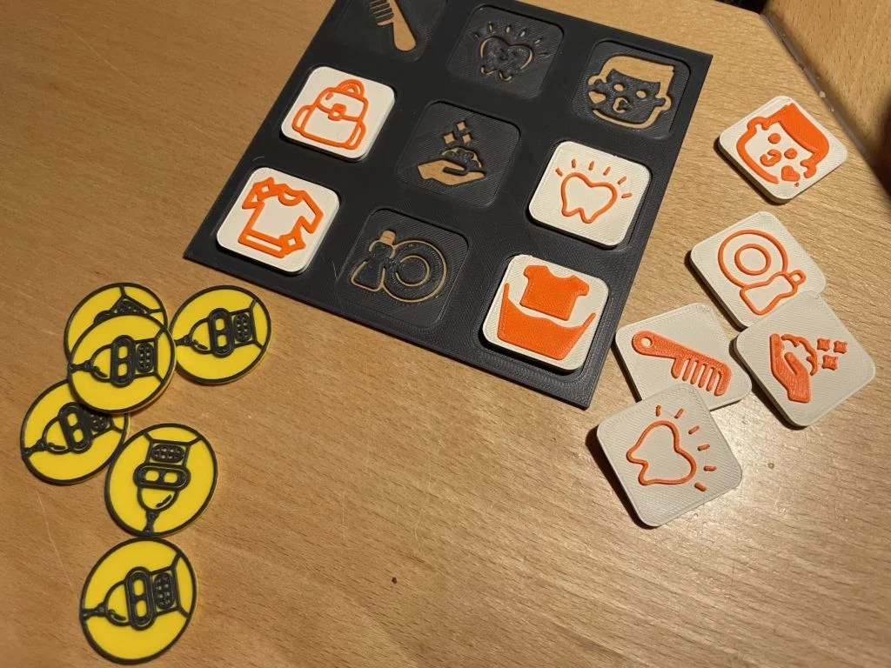
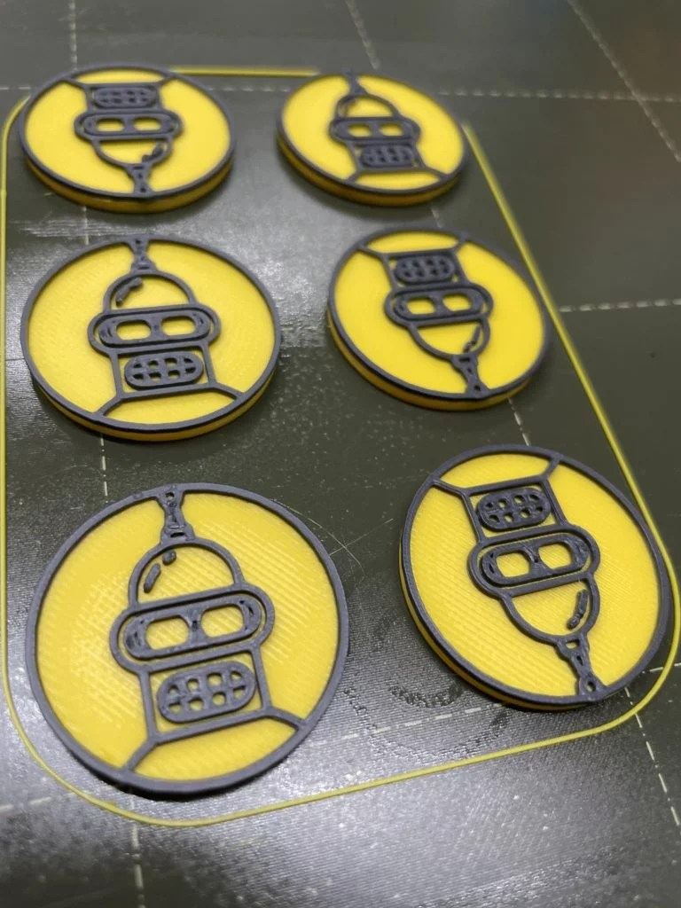
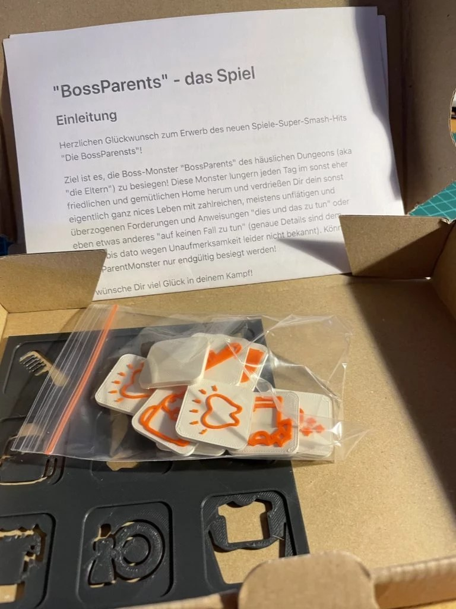
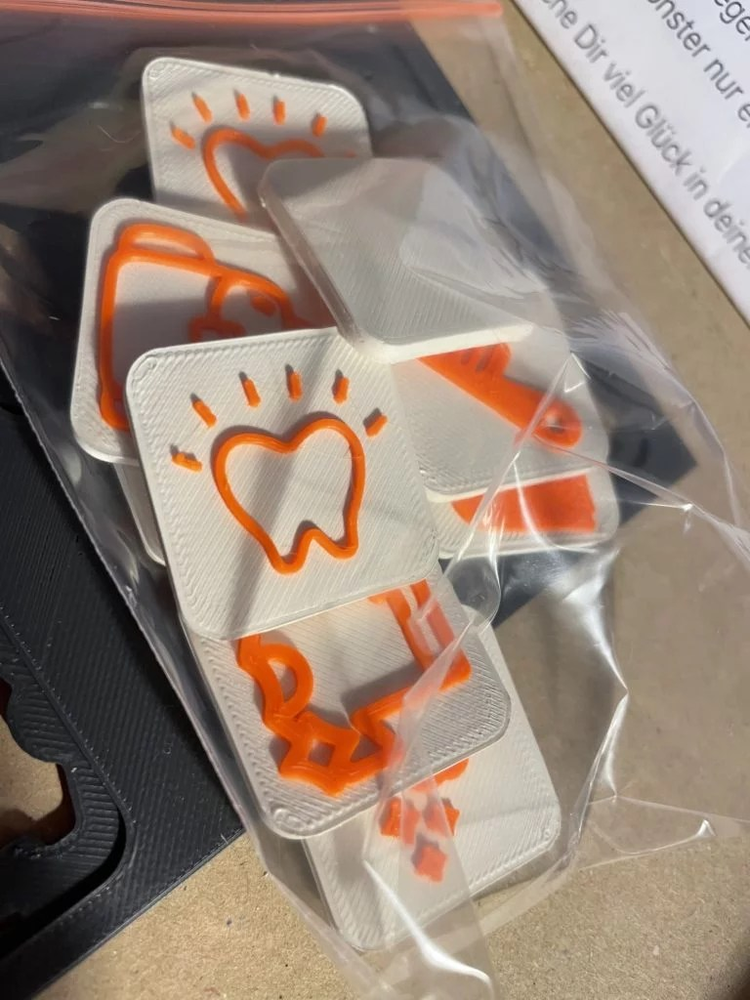
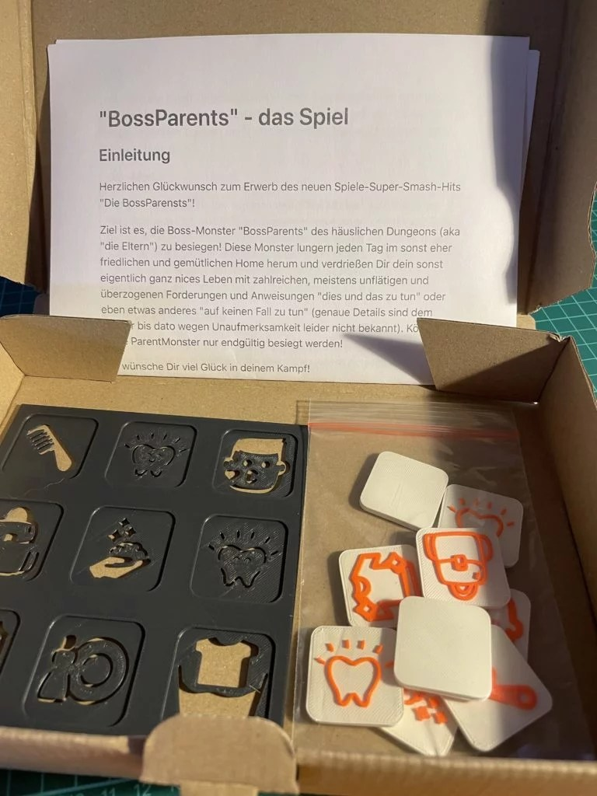
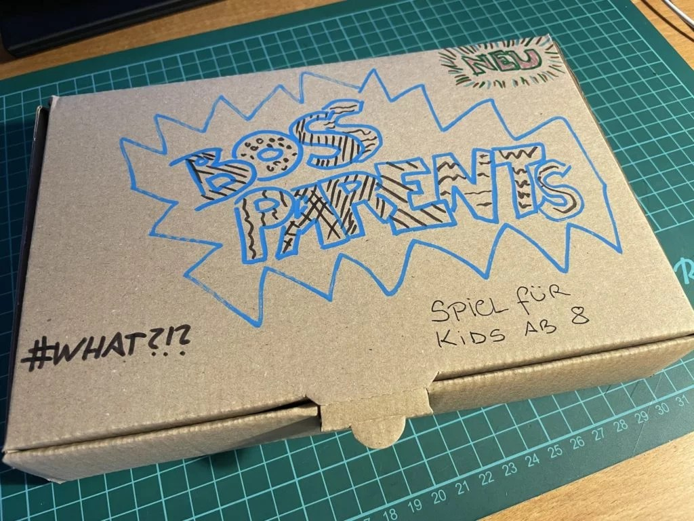
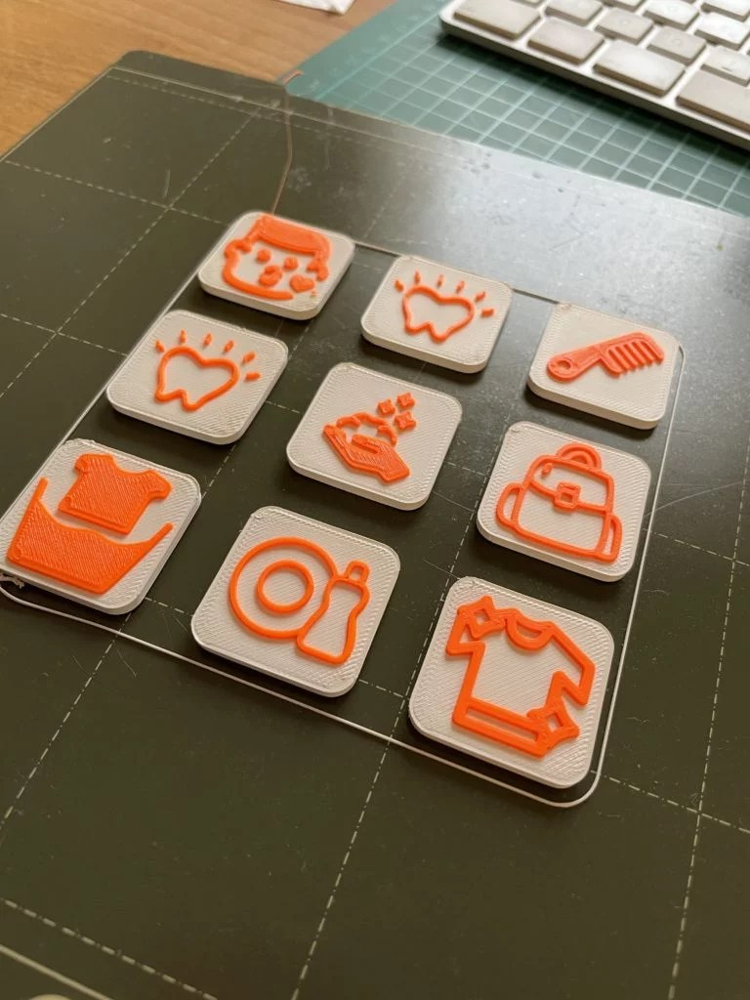

Zur Vorbereitung eines Workshops habe ich mich selbst mal an die Gestaltung eines Brettspiels mit TinkerCAD und 3D-Drucker gemacht.

Alle Drucktdateien findest Du hier zum Selbstausdrucken:

(https://www.prusaprinters.org/prints/84014-bossparents-a-board-game-for-parents-and-kids)

Viel Spaß!

# "BossParents" – das Spiel

## Einleitung

Herzlichen Glückwunsch zum Erwerb des neuen Spiele-Super-Smash-Hits "Die BossParents"!

Ziel ist es, die Boss-Monster "BossParents" des häuslichen Dungeons (aka "die Eltern") zu besiegen! Diese Monster lungern jeden Tag im sonst eher friedlichen und gemütlichen Home herum und verdrießen Dir dein sonst eigentlich ganz nices Leben mit zahlreichen, meistens unflätigen und überzogenen Forderungen und Anweisungen "dies und das zu tun" oder eben etwas anderes "auf keinen Fall zu tun" (genaue Details sind dem Spieler bis dato wegen Unaufmerksamkeit leider nicht bekannt). Könnten diese BossParents nur endgültig besiegt werden!

Ich wünsche Dir viel Glück in deinem Kampf!

## Ziel des Spiels

Ziel des Spiels ist es, alle 9 Steine innerhalb von 24h auf das Siegerbrett zu setzen! Wenn Du es schaffst, kommst Du direkt in den Himmel der glückseligen Teenager: deine Eltern werden stumm geschaltet – sie dürfen Dir ab diesem Zeitpunkt keine Aufträge mehr erteilen zum Thema Ordnung etc.. Außerdem: **Du bekommst ein Boss-Smiley**!

Fehlt nur ein einziger Stein, bist verloren! Du stürzt in ein bodenloses Loch (auch als bottomless pit bekannt) und wirst dort von aufgeheizten, über-engagierten Elternpack wieder gepiesackt und malträtiert. Wenn Sie dich einmal in Ihren Fängen haben, gibt es nie wieder ein entkommen! Ach ja, und **du verlierst ein Boss-Smiley**!

### Endsieg

Solltest Du es schaffen, in einer Woche von Montag bis Samstag JEDEN TAG zu gewinnen, ist Dir der finale Sieg sicher! Du hältst gerade 6 Boss-Smileys in der Hand – der Schlüssel zu einem paradiesischen Sonntag: Du darfst in Nutella baden, es wird dir ein Playstation-Controller implantiert (für immerwährendes Zocken) und (jetzt kommt das beste): du hast de Omi-Modus aktiviert!

>
***Omi-Modus***

Der Sonntag steht dir der sogenannten "Omi-Modus" zur Verfügung. Was das bedeutet, weißt Du am besten: Happiness ohne Grenzen! Sollen die BossParents für dich in Unterhose im Garten tanzen, bei Schnee? Willst du deine Smacks mit Blattgold verfeinern? Spielen bis die Playstation durchbrennt? Sollen lästige Aufräumarbeiten doch die BossParents doch selbst durchführen – **jetzt bist Du der BubiBoss!**

## Ablauf des Spiels

Die 9 Spielsteine werden am Vormittag von den Hütern des Ordnungs-Dungeons (auch bekannt als "Die Eltern") an den strategisch wichtigen Stellen im Dungeon verteilt.

Jeder Stein ist an der richtigen Stelle zu platzieren.

>
**Sind die Steine nicht richtig platziert?** Glückwunsch! Du hast das Tagesziel erreicht und damit den Sieg für diesen Tag erreicht!

Jeder Stein ist direkt mit seiner Aufgabe verbunden – alleine am Standort kannst Du erkennen, um welche Aufgabe es sich handelt und die Aufgabe ist auch an diesem Ort zu erledigen.

Die Auf dem Stein aufgedruckten Symbole geben Dir weitere Hinweise.

Nachdem Du die Aufgabe **komplett, sorgfältig und ohne audiovisuelle Dispute** ausgeführt hast, gilt es den Stein auf schnellstmöglichem Weg ins Zielbrett zu verfrachten!

>
Dies ist die **brenzligste Phase** des Spiels: während sich der Stein in deinem Besitzt befindet, können die Dungeon-Hüter dich mit weiteren Anordnungen und sinnlosen Befehlen überziehen! Verberge in besser für ihren neugierigen Augen und langen Fingern!

Befindet sich der Stein auf dem Brett, bist du erst mal in Sicherheit. Die Elterntiere dürfen dich nicht mit weiteren <s>Flüchen</s> Aktivitätskommandos überziehen!

>
Fragen sie etwa: "Hast du an … gedacht?" Glückwunsch! Du hast soeben den Tagessieg erlangt!

Um **7:15 Uhr ist es soweit** – die Stunde der Wahrheit naht: Es geht nun an die Kontrolle der Steine!

Sind alle Steine abgelegt! Glückwunsch! Der Tagessieg ist dein! Ein Boss-Smiley ist auf deinem Charma-Konto zu hinterlegen!

>
Solltest Du einen Stein abgelegt haben, aber die dazugehörige Aufgabe nicht oder gar nur teilweise durchgeführt haben, können die Hüter des Dungeons dich zur **sofortigen, widerspruchsfreien Erledigung der Aufgabe verdonnern!** Natürlich ist **ein Boss-Smiley abzugeben.**

## Die einzelnen Spielsteine und Ihre Bedeutung

### Abends:

- Zahn – Zähne sauber putzen (2 min mit der App) & Zahnseide

- Hand mit Schaum – Reinigung beider Hände mit Seife, um danach duftende Selbige zu erhalten

- Geschirr – Einräumen benutzter Gegenstände der frühstücklichen Sättigung in vorgesehene Aufbewahrungsorte überführen: Spülmaschine, Schrank und Kühlschrank

- Schulranzen – Einräumen Selbigens mit nötigen Unterlagen für den kommenden Tag, Entfernen unnötiger Unterlagen

### Morgens:

- Zahn – Zähne sauber putzen (2 min mit der App)

- Kamm – Frisieren! Bedeutet: den widerspenstigen Auswüchsen auf dem Kopf des Spielers mittels eines geeigneten Werkzeugs eine uniforme Richtung zuweisen

- Kussgesicht – Gesicht Waschen (mit Wasser) und überschüssiges Material (Grind, Schmutz, Gummibärchen, Schokolade, Sand etc.) entfernen

- T-Shirt mit Sternen – Wechseln der Wäsche wenn nötig (z.B. wegen Fliegenbefall der Spielers = Geruch oder farbliche Veränderung der Kleidung = Schmutz, Nutella etc. auf selbiger)

- Wäsche mit Bottich – Verbringung der abgelegten Wäsche in dafür vorbereitete Abgabebehältnisse
