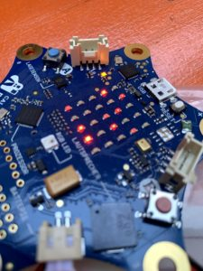
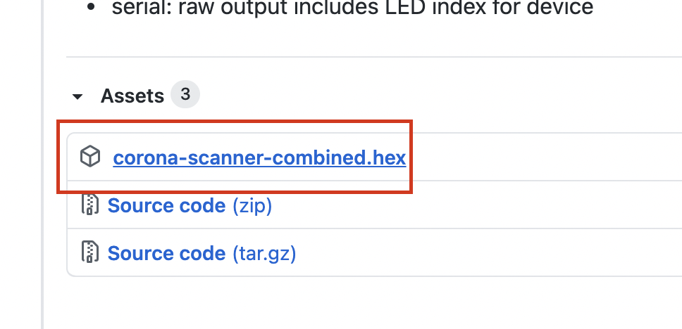

Aktuell ist sie in aller Munde – die App der Bundesregierung, die helfen soll, die Ausbreitung von Corona zu begrenzen. Aber wie funktioniert das genau und geht das

Mit diesem kleinen Programm könnte Ihr Euren [Calliope](/selber-machen/calliope-einfuhrung/) zu einem Scanner für die Corona-App erweitern! Damit könnt ihr sehen, ob es in Eure nähe jemanden gibt, der die App installiert hat.

Das tolle am calliope ist ja, das er mobil ist – zieht doch mal los, und schaut wem ihr auf dem Gehweg trefft, der eine App aktiv hat!

Das ganze ist aber aus datenschutzsicht alles in Ordnung – ihr könnt nicht sehen, wer das ist oder wer keine hat – nur pro aktiver App ein leuchtendes LED 🙂

Einfach nur diese HEX Datei auf Euren Calliope spielen und los gehts!

Das Projekt findet ihr hier: (https://github.com/znuh/microbit-corona-scanner)

Hier könnte ihr die neueste Version runterladen:

(https://github.com/znuh/microbit-corona-scanner/releases)

Das funktioniert so:

- Rechts auf die Hex-Datei klicken
- „Link speichern unter…“ und dann den Mini auswählen
- Vorher anstecken nicht vergessen 🙂

