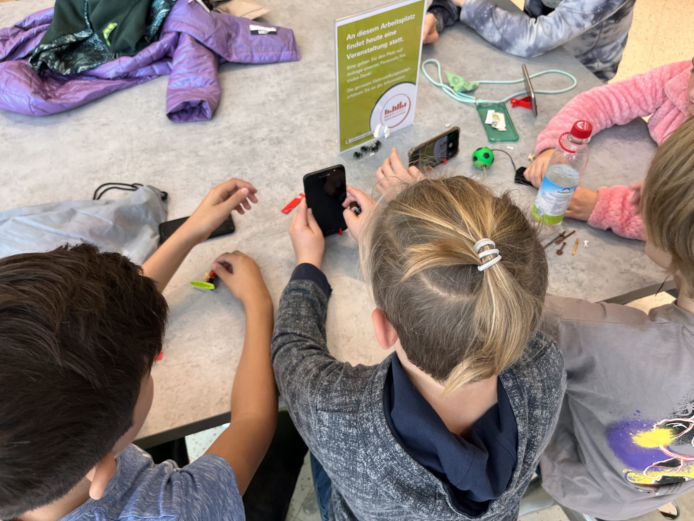
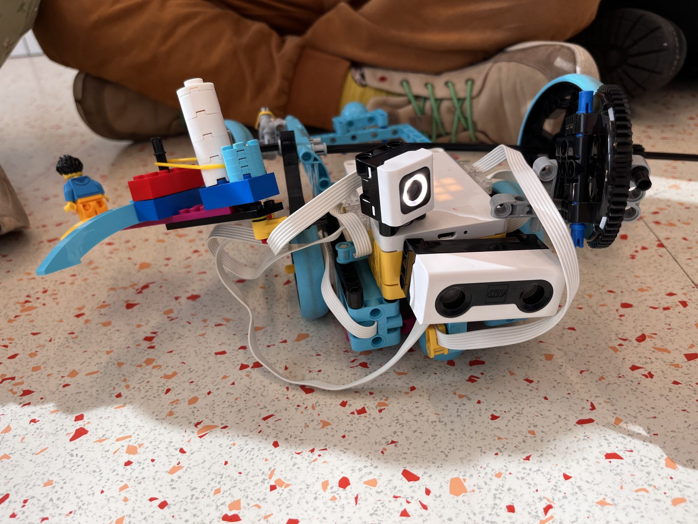
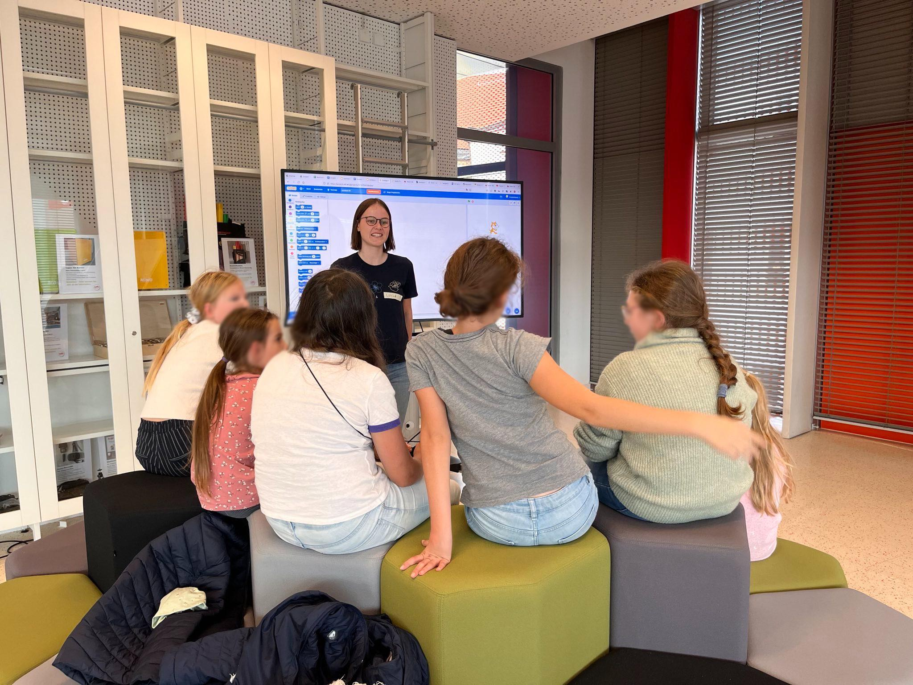
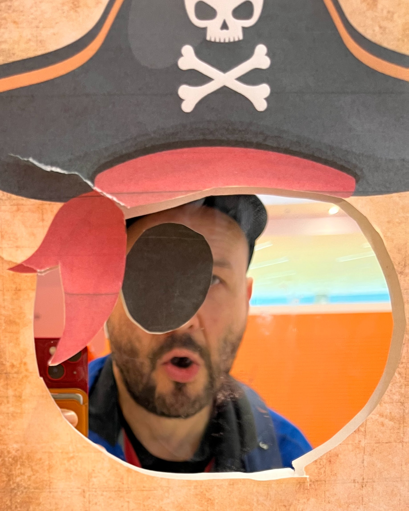

Jedes Jahr findet im Oktober die CodeWeek statt –

Wir haben dieses Jahr mit insgesamt 4 kostenlosen Workshops mitgemacht!

Anbei findest Du ein paar Eindrücke!

Insgesamt haben über 100 Kinder an den verschiedenen Veranstaltungen teil genommen.

<figure >
<figure ><figcaption>Mein erstes Smartphone</figcaption></figure>

<figure ><figcaption>Lego Roboter</figcaption></figure>

<figure ><figcaption>Spiele Programmieren mit Scratch</figcaption></figure>

</figure>
