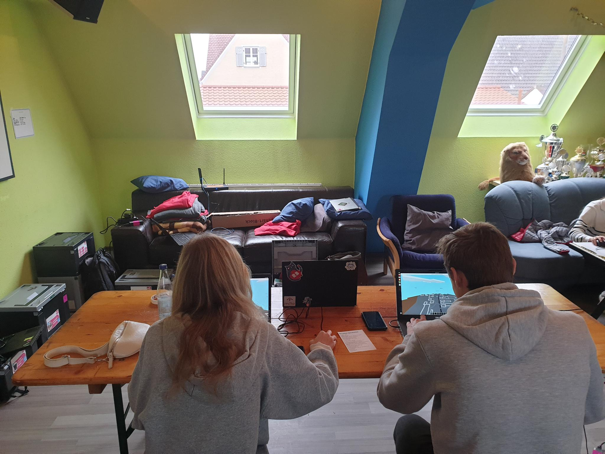
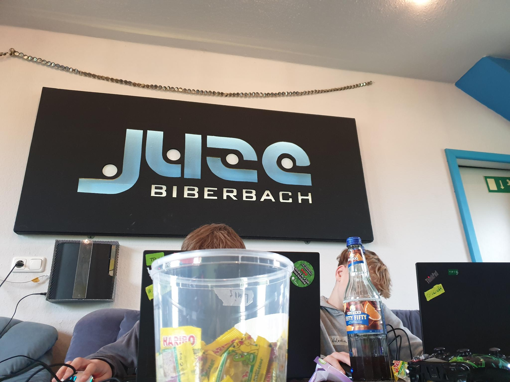
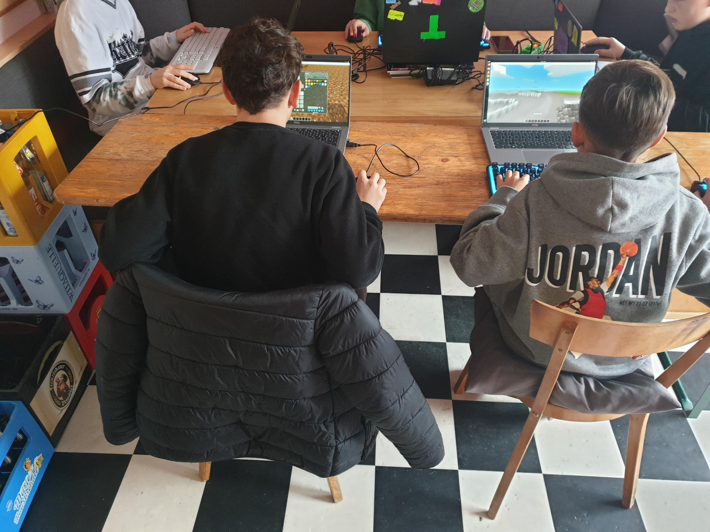
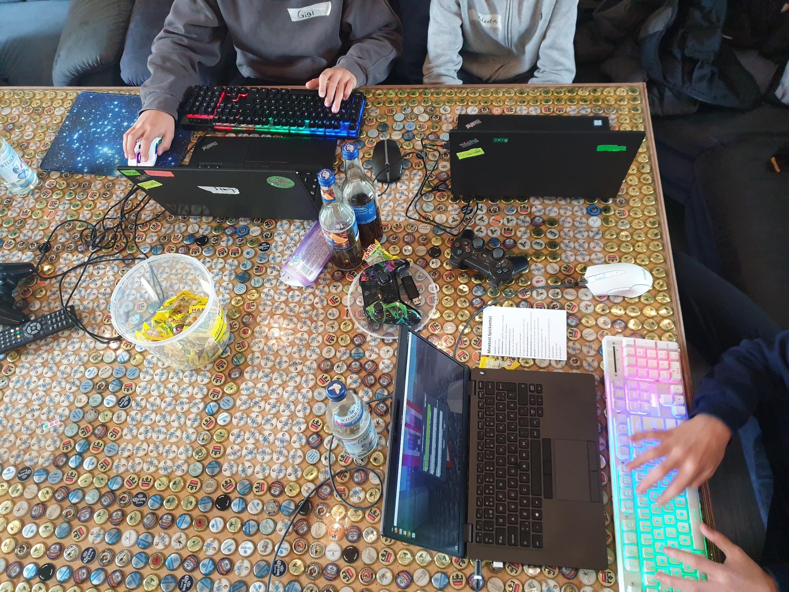
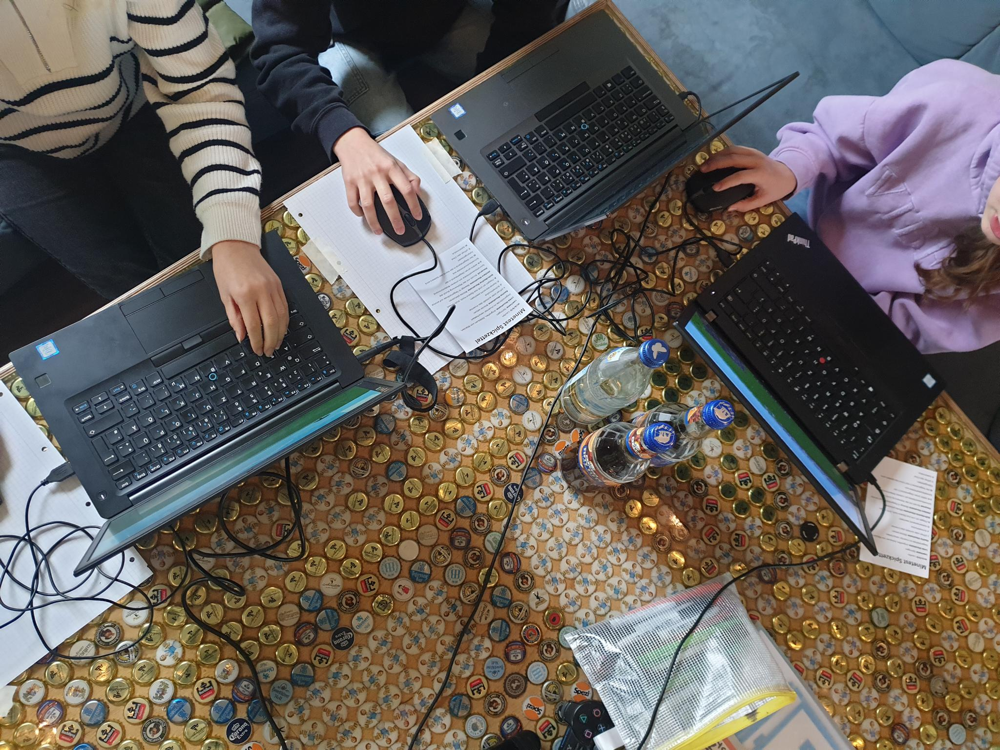
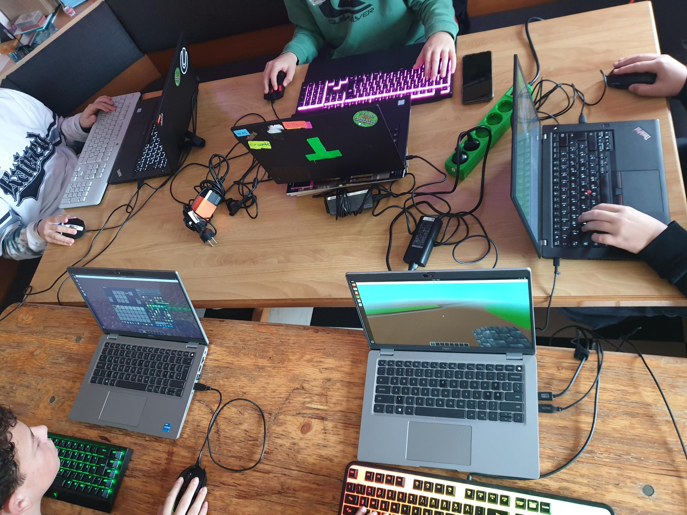
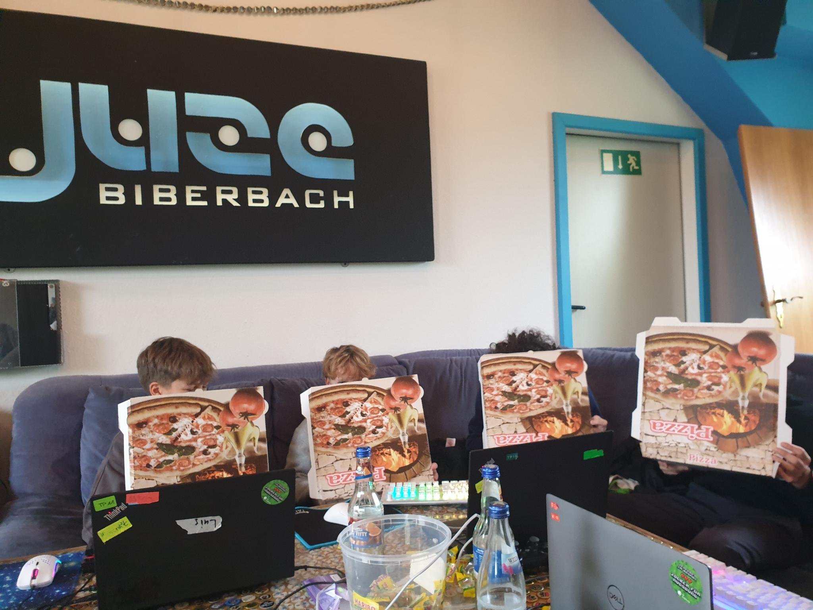
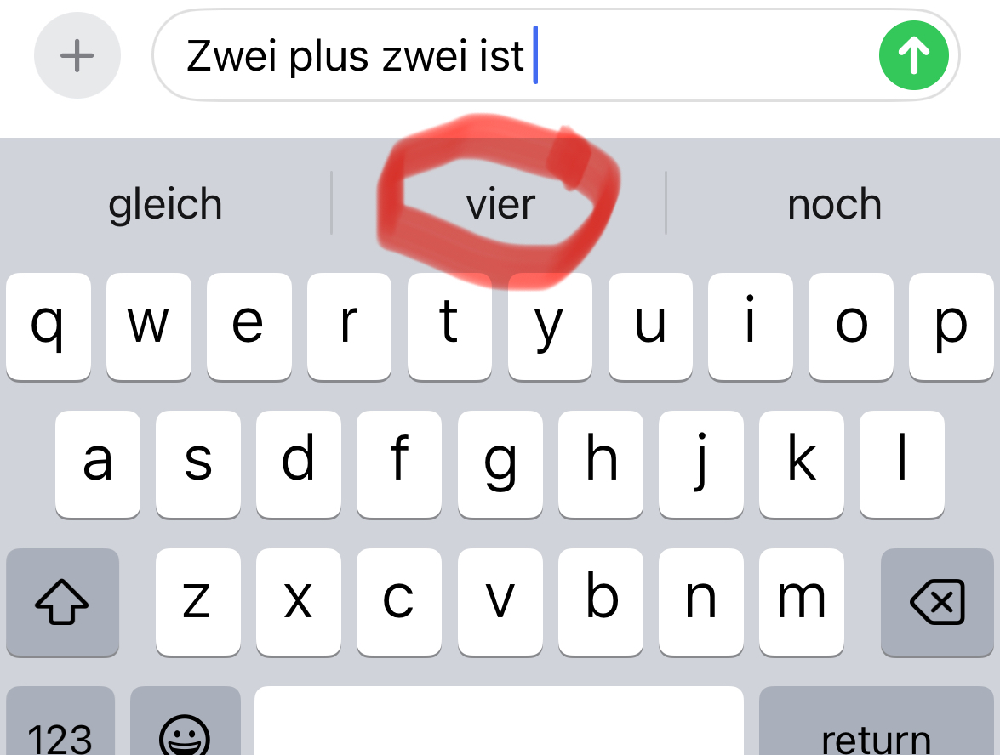
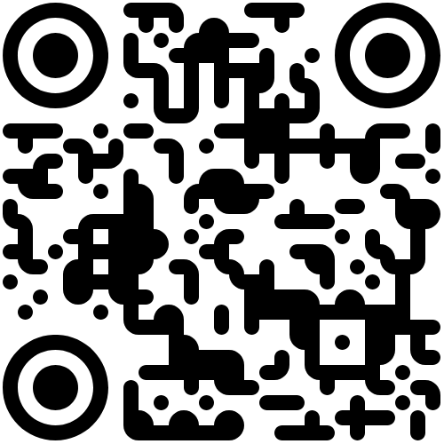

Am Samstag, dem 9. November 2024, fand in Biberbach die Veranstaltung <em>„Demokratie in der Minecraft-Welt“</em> statt, die sich als voller Erfolg erwies! Jugendliche hatten die Möglichkeit, ihre Visionen für die Zukunft von Biberbach in Minetest zu gestalten und zu präsentieren. Dadurch haben sie die Möglichkeit genutzt, aktiv und spielerisch an kommunalpolitischen Entscheidungen mitzuwirken! Unterstützt wurde das Event vom Landkreis, der Jugendbeauftragten des Gemeinderats und dem Jugendforum FAEMB.

Die Abschlusspräsentation, zu der auch der zweite Bürgermeister Klaus Gerstmayr erschien, bildete den Höhepunkt des Tages. Gemeinsam mit Gemeinderatsmitgliedern bewertete er als Teil einer Jury die vorgestellten Projekte. Die Jury zeigte sich beeindruckt von der Kreativität und dem Engagement der Teilnehmenden, die es schafften, ihre utopischen Ideen in umsetzbare Vorschläge für die Gemeinde zu verwandeln. Die Impulse aus den Projekten der Jugendlichen wurden dann in einem Zukunftsvertrag festgehalten, um deren Vorschläge auch tatsächlich umzusetzen.

Mit diesem offenen Austausch auf Augenhöhe setzte Biberbach ein starkes Zeichen für Jugendbeteiligung und diente als inspirierendes Vorbild für weitere Kommunen und Städte im Raum Augsburg.





