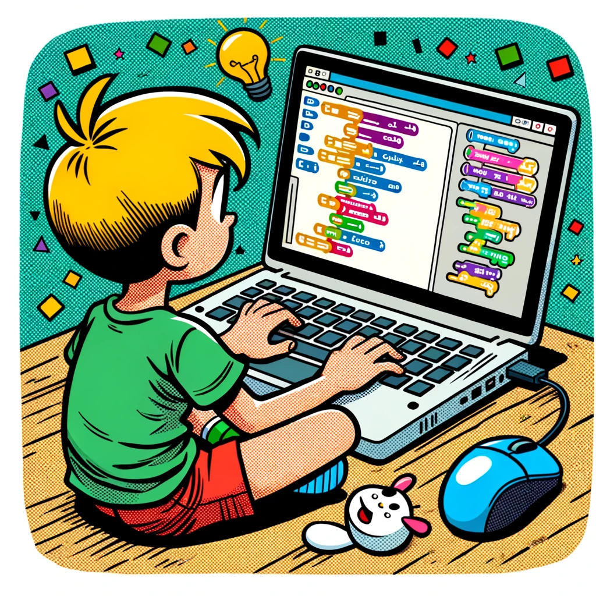
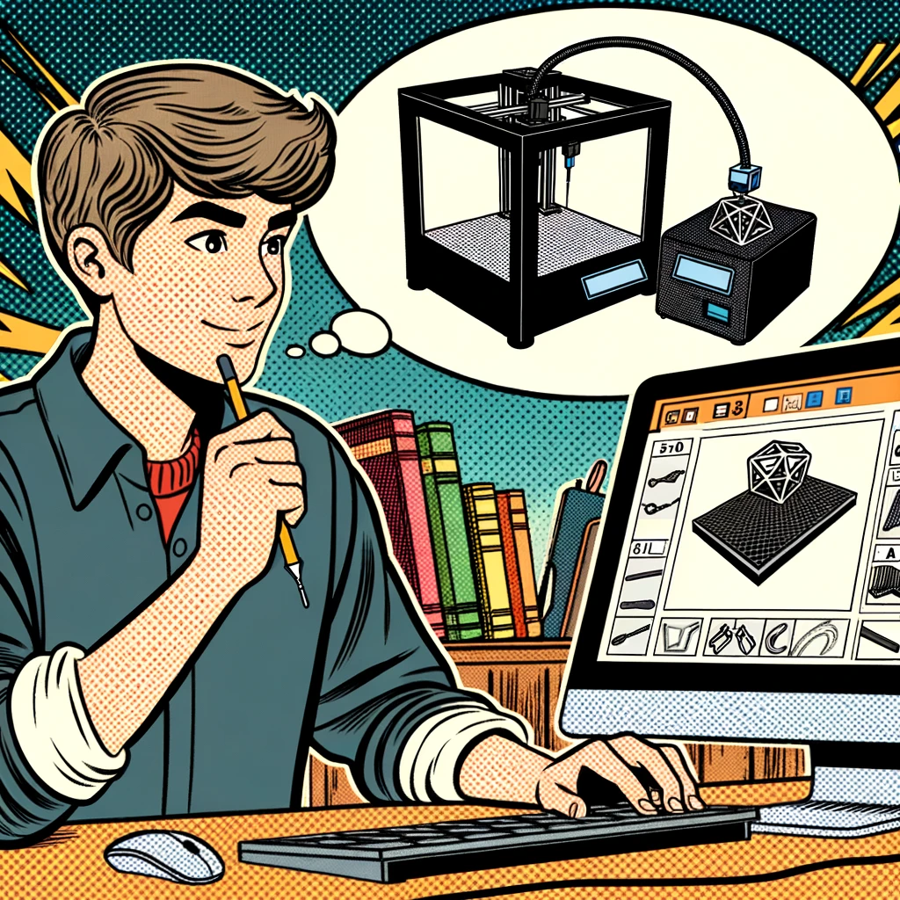
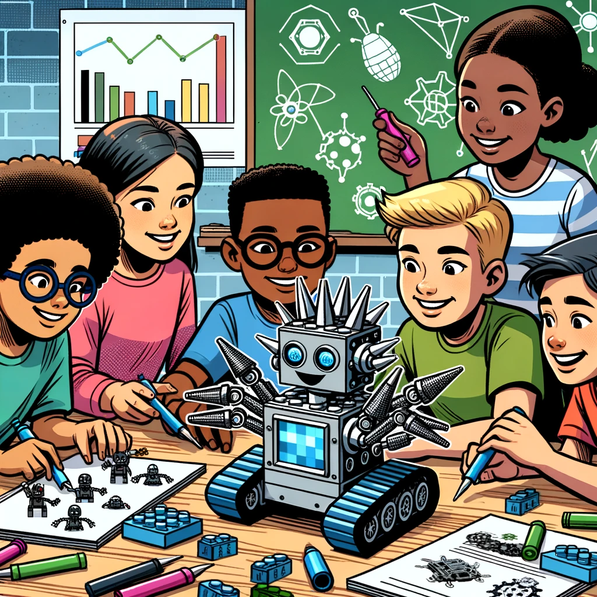
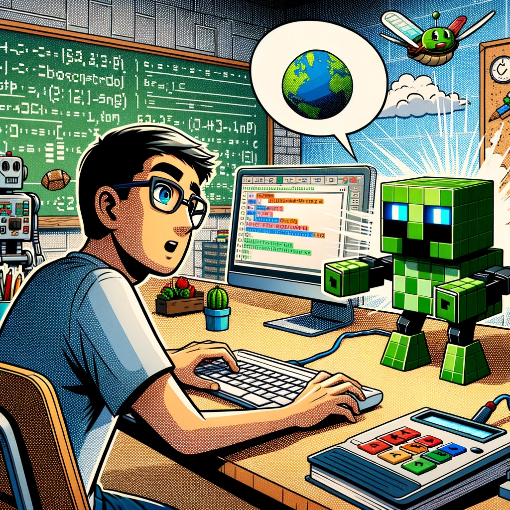
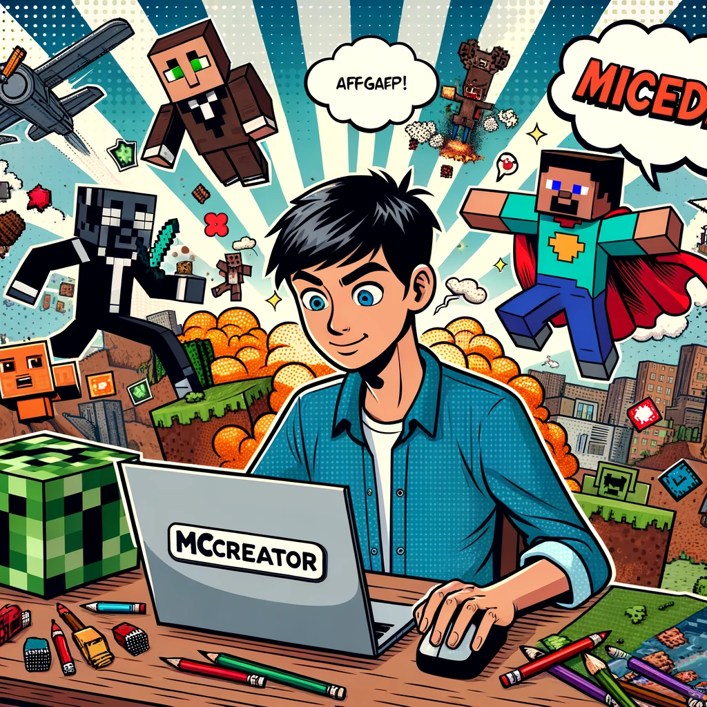

**Die besten Programmier-Tools für Kinder und Jugendliche**

Seit Jahren setzen wir bei KidsLab.de erfolgreich eine Reihe von Programmier-Tools für Kinder und Jugendliche ein. Unsere Erfahrungen haben gezeigt, dass diese Tools nicht nur lehrreich, sondern auch unterhaltsam sind und Kindern dabei helfen, ihre kreativen und technischen Fähigkeiten zu entwickeln. In der heutigen digitalen Welt ist es essentiell, dass junge Menschen die nötigen Fähigkeiten erwerben, um in der Technologiebranche erfolgreich zu sein. Eine dieser Fähigkeiten ist das Programmieren. Hier sind sechs der Tools, die wir am meisten schätzen und empfehlen:

**Scratch**
Scratch ist ein kostenloses, visuelles Programmierwerkzeug, das vom MIT entwickelt wurde. Es ist ideal für jüngere Kinder und ermöglicht es ihnen, interaktive Geschichten, Spiele und Animationen zu erstellen. Mit einer einfach zu verstehenden Drag-and-Drop-Oberfläche können Kinder Codeblöcke verschieben und anpassen, um ihre eigenen Projekte zu erstellen.

**TinkerCAD**
TinkerCAD ist ein Online-3D-Design- und CAD-Tool, das speziell für Bildungszwecke entwickelt wurde. Es bietet eine intuitive Benutzeroberfläche, mit der Kinder digitale Modelle erstellen und sogar einfache elektronische Schaltungen designen können. Und natürlich gibt es auch die Möglichkeit, zu programmieren?

**Lego Spike**
Lego Spike bietet Kindern die Möglichkeit, Roboter und andere mechanische Geräte aus LEGO-Teilen zu bauen und zu programmieren. Es kombiniert das physische Bauen mit einer digitalen Programmierumgebung, die es den Kindern ermöglicht, ihre Kreationen zum Leben zu erwecken.

**Calliope**
Calliope ist ein Mikrocontroller-Board, das speziell für den Bildungsbereich entwickelt wurde. Mit Calliope können Kinder einfache elektronische Projekte erstellen und programmieren. Es ist ein großartiges Einstiegstool für Hardware-Programmierung und Elektronik.

**ComputerCraftEDU**
ComputerCraftEDU ist ein Mod für das beliebte Spiel Minecraft. Es ermöglicht den Spielern, virtuelle Computer und Roboter innerhalb der Minecraft-Welt zu programmieren. Mit einer benutzerfreundlichen Schnittstelle können Kinder schnell lernen, wie sie ihre eigenen Programme schreiben.

**mCreator**
mCreator ist ein innovatives Tool, das es Benutzern ermöglicht, Mods für Minecraft zu erstellen, ohne tatsächlich Code schreiben zu müssen. Es bietet eine visuelle Programmierumgebung, mit der Benutzer ihre eigenen Spielinhalte hinzufügen und anpassen können.

Insgesamt gibt es viele großartige Ressourcen für Kinder und Jugendliche, die sich für das Programmieren interessieren. Diese Tools bieten eine Mischung aus visueller Programmierung, Hardware-Interaktion und Spiel-basiertem Lernen, um den Lernprozess sowohl lehrreich als auch unterhaltsam zu gestalten. Es war noch nie so einfach, mit dem Programmieren zu beginnen!
