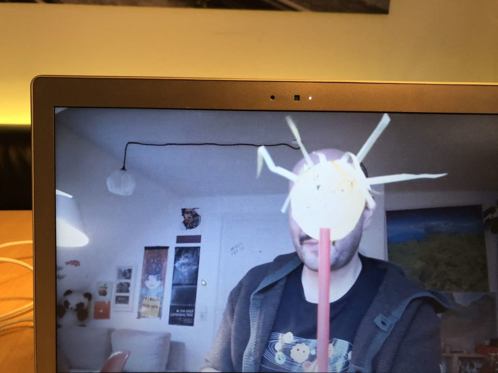
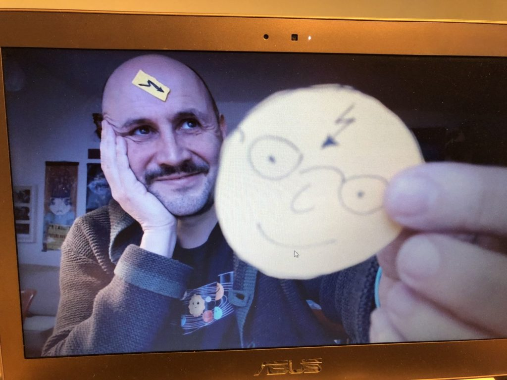
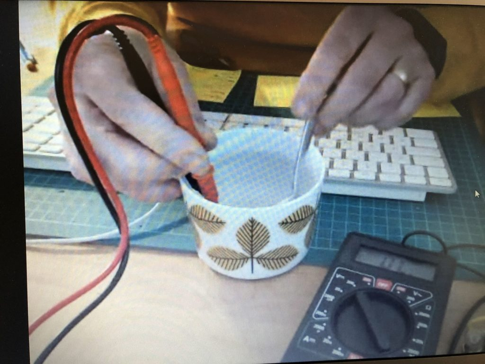
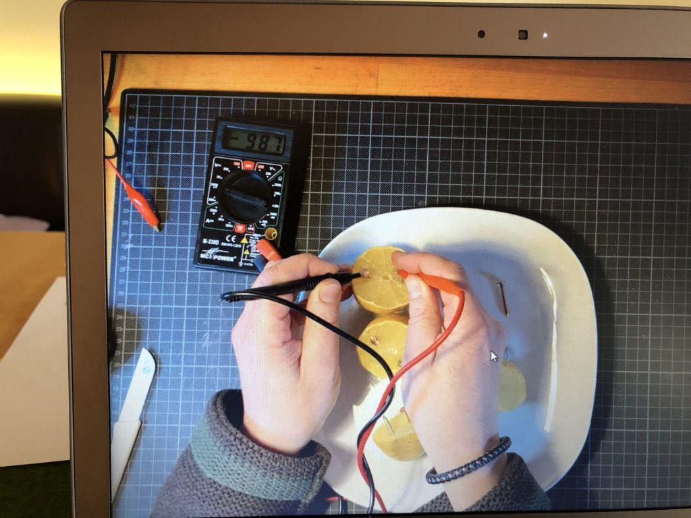
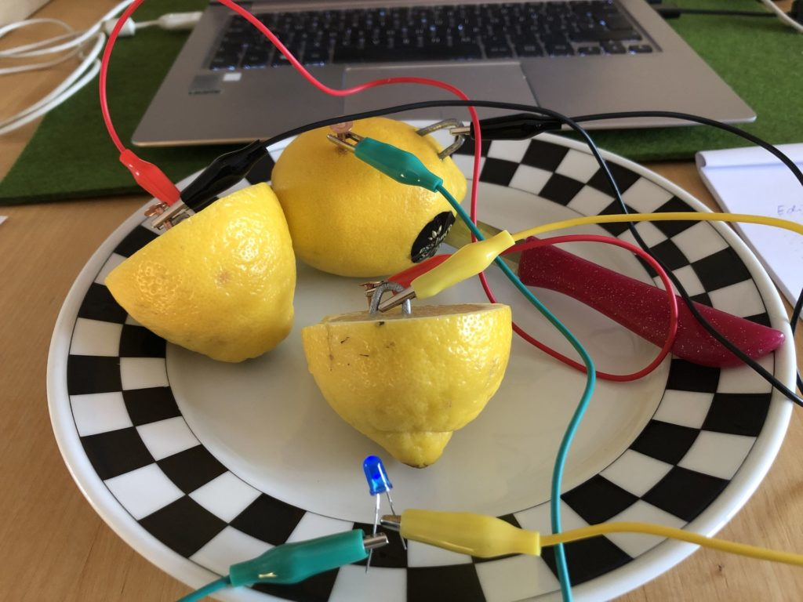
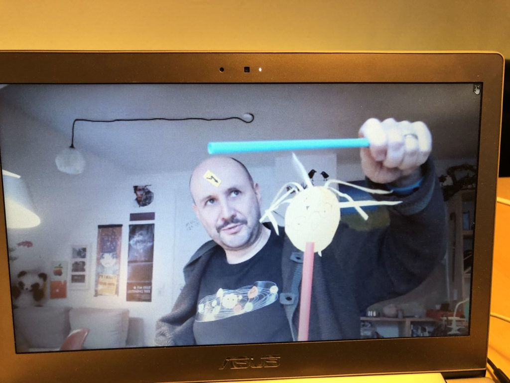

Im Januar hatten wir die Möglichkeit, in Kooperation mit dem IRMA e.V. / MintMacher.de einen Strom- und Elektro-Kurs online für die Kinder aus der Region Ingolstadt duchzuführen. Hier ein Auszug aus dem Blogeintrag der MintMacher:

> Auch im neuen Jahr sind die MINTmacher zunächst im Online Format unterwegs. In der ersten Januarwoche traf sich ein junges Forscherteam über die Online Plattform Big Blue Button, um gemeinsam mehr über die Themen Elektro & Strom zu erfahren. Jedes Kind hat dafür im Vorfeld des Kurses eine kleine Box mit allen im Kurs benötigten Materialien nach Hause geschickt bekommen, sodass alle problemlos von zu Hause aus die Experimente durchführen konnten. Am ersten Tag wurden nach einem kurzen theoretischen Einführungsblock auch schon die ersten Stromkreise aus einer Batterie, verschiedenen Klemmen und einem Glühlämpchen geschlossen. In den folgenden Tagen wurden die einzelnen Komponenten des Stromkreises immer wieder verändert oder erweitert, sodass zum Beispiel mithilfe einiger Zitronen eine galvanische Zelle geschaffen wurde, die ganz alleine die Batterie ersetzen und das Lämpchen zum Leuchten bringen kann. Mithilfe eines Schalters konnte der Stromkreis unterbrochen und mehrere Lämpchen in Reihen- oder Parallelschaltung eingesetzt werden. Ein besonderes Highlight des Kurses war das Entwickeln des kleinsten Roboters der Welt, dem sogenannten BürstiBot, der nicht nur so klein wie der Kopf einer Zahnbürste ist, sondern auch aus einem Teil des Kopfes besteht. Zum Abschluss erfuhren die acht NachwuchsforscherInnen noch, wie man die Ausrichtung eines Kompasses beeinflussen kann. Mithilfe eines herkömmlichen Eisennagels und einem Draht mit einer Kunststoffisolierung bastelten die TeilnehmerInnen einen Magneten, der später in einen Stromkreis eingebunden wurde. Je nachdem in welche Richtung der Strom nun durch den Draht und Nagel fließt, schlägt die Nadel des Kompasses aus.

<cite>https://www.mintmacher.de/fuer-schueler-innen/mintmacher-aktionstage/vergangene-veranstaltungen</cite>

Vielen Dank für die tolle Zusammenarbeit und Unterstützung an das Team des IRMA e.V. 🙂

<figure >

</figure>
