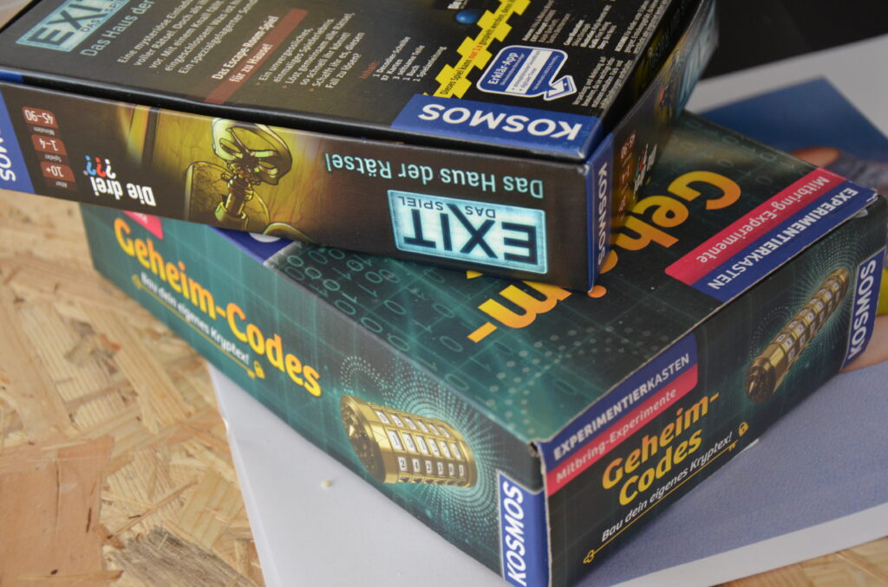
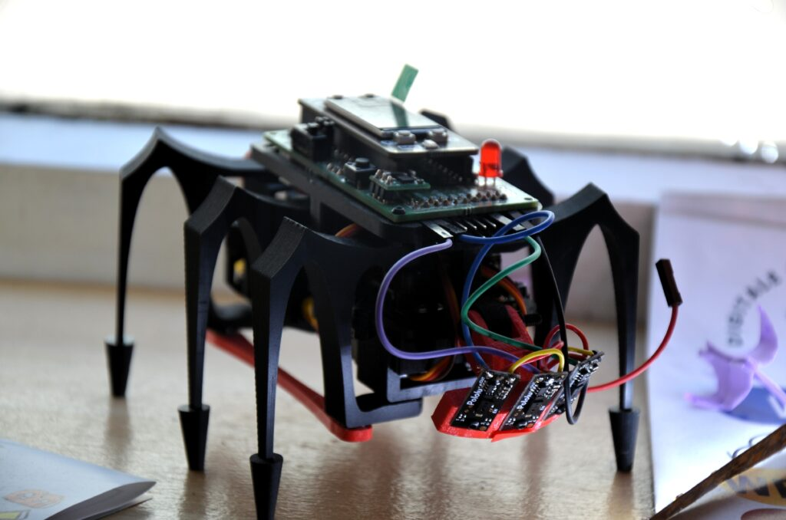
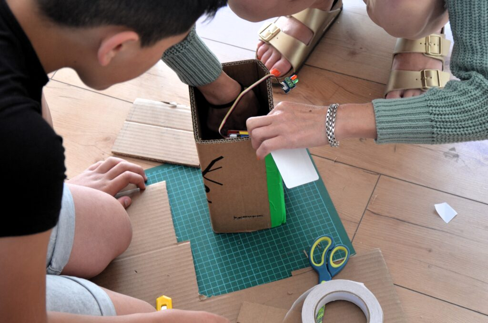
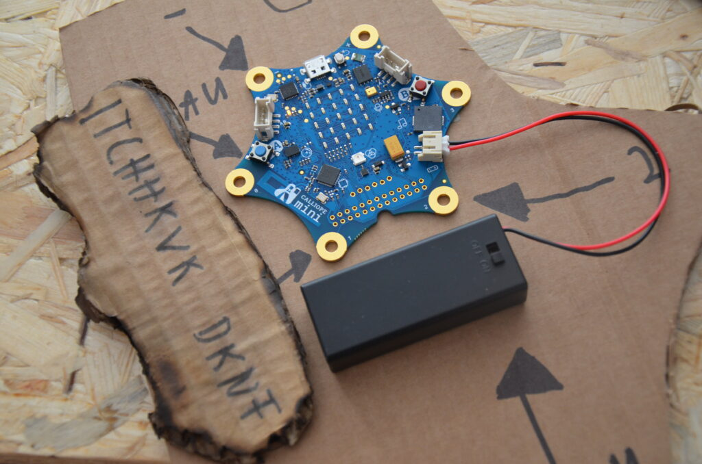
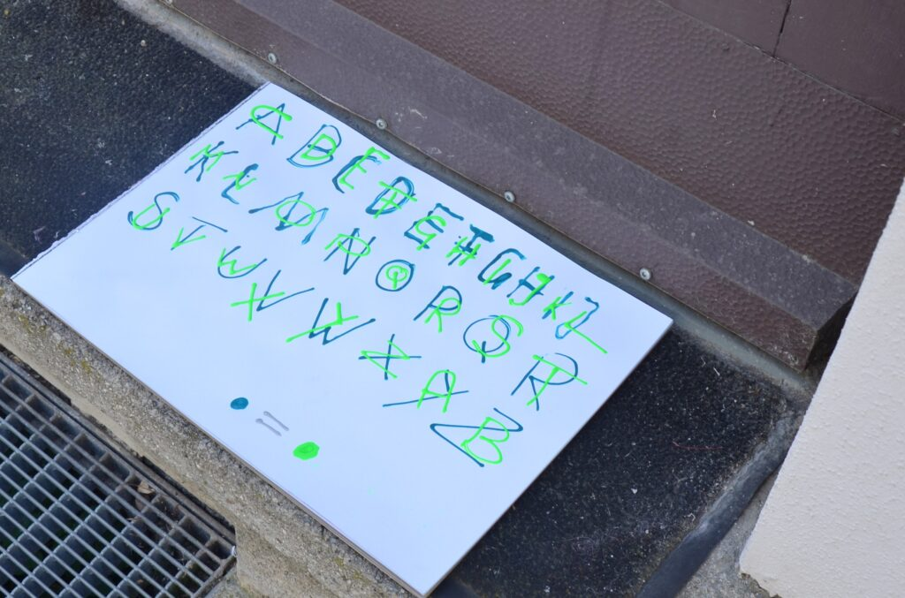
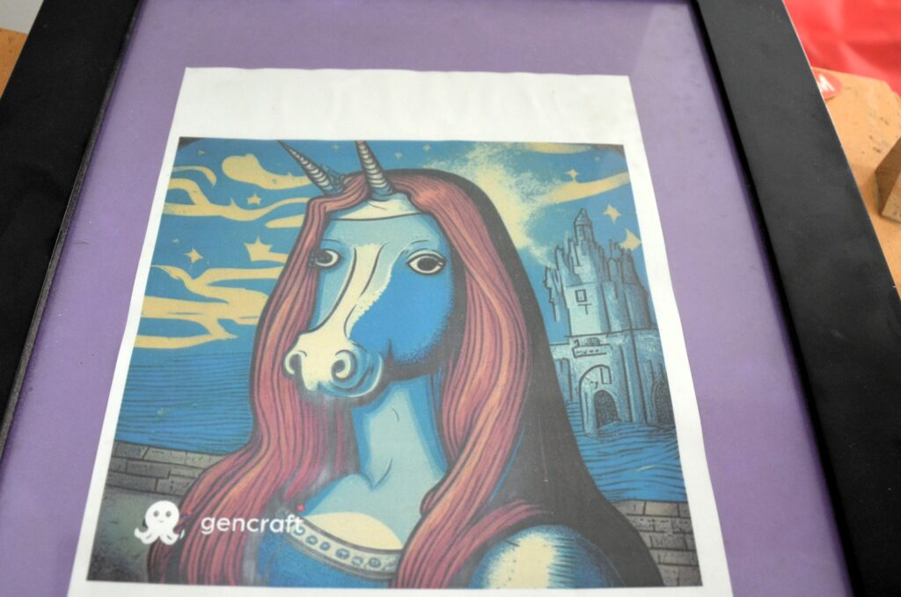
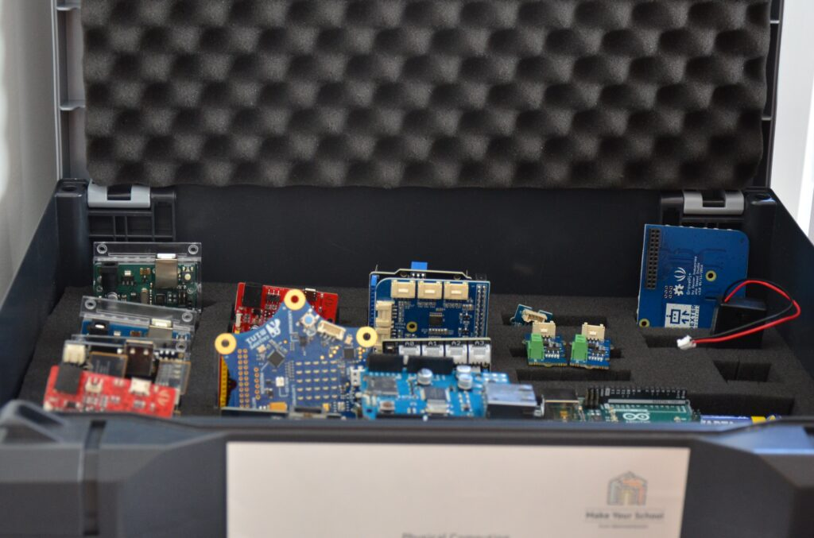

# (https://github.com/KidsLabKids/EscapeRoom/blob/main/story.md#kidslab-escape-room)KidsLab Escape Room

## Was passiert

Ein schwarzgekleideter Mann bot dir seine Hilfe aus der Armut an. Ein Überfall und 50% der Beute. Leider hast du dich damit in imense Schwierigkeiten gebracht. Denn wenn du es nicht schaffst, innerhalb von 30 min, das Bild ,,Das heilige Monahorn“ zu stehlen, wirst du im Gefängnis sitzen.

## Escape Room? Hä?

Ein Escape Room (dt. Fluchtraum ) ist einer, oder mehrere Räume aus denen es zu Flüchten gilt. Doch das ist nicht so einfach: Viele Rätsel stehen zwischen dir und deinem Ziel. Und du hast nur wenig Zeit!

## Location

KidsLab Herrenhäuser 17 86152 Augsburg

## Wer hat’s gemacht?

Leo, Florian, Nico, Jonathan, Egor, Aaron, Gregor, Regine, Daniel, Helena

- 
- 
- 

## Jugendliche bauen Escape Rooms

- 
- 
- 

## Im Kidslab am Fischertor ausprobieren!!!

- 
- 
- 

