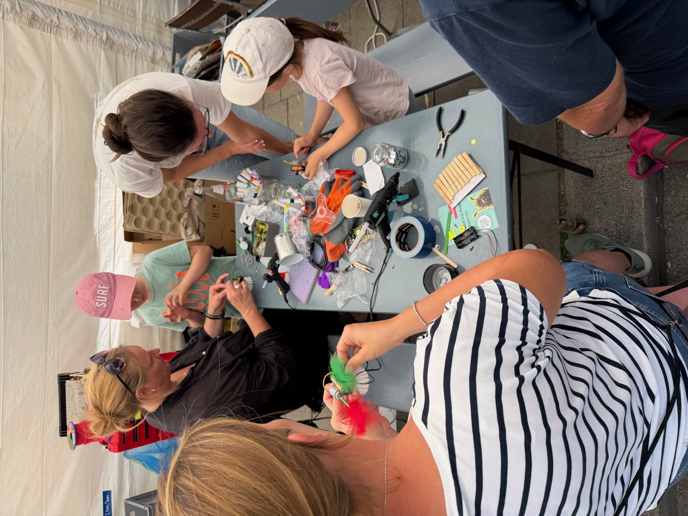
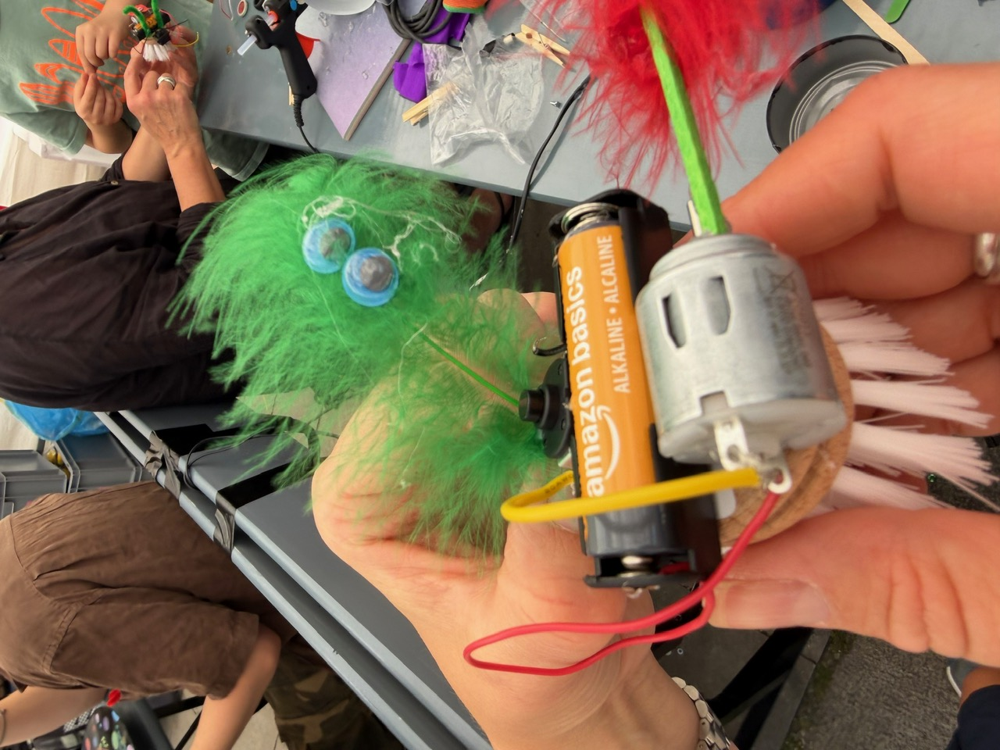
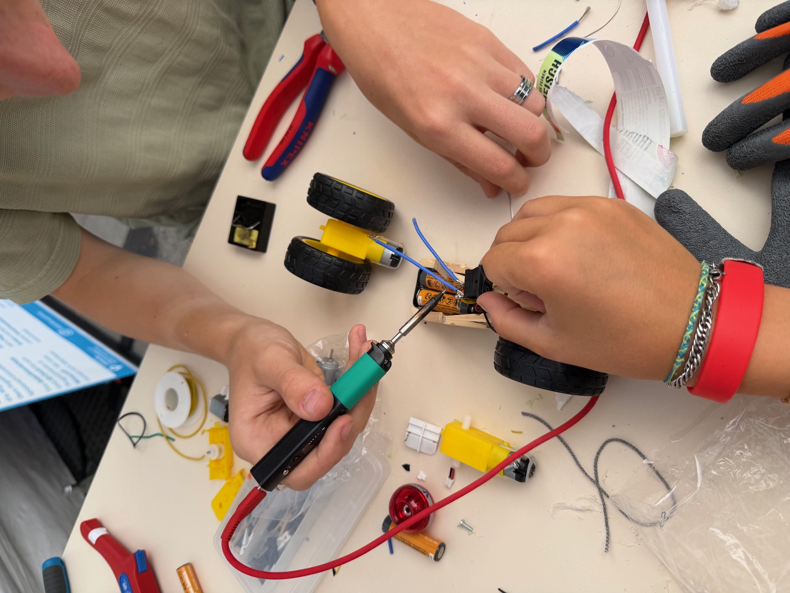
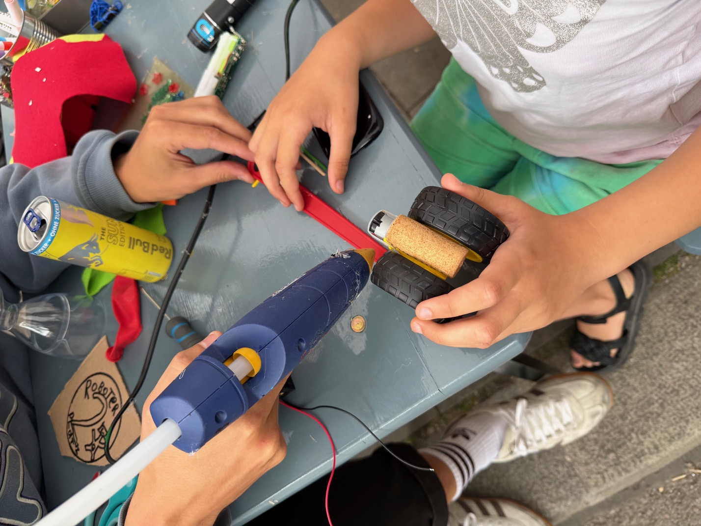
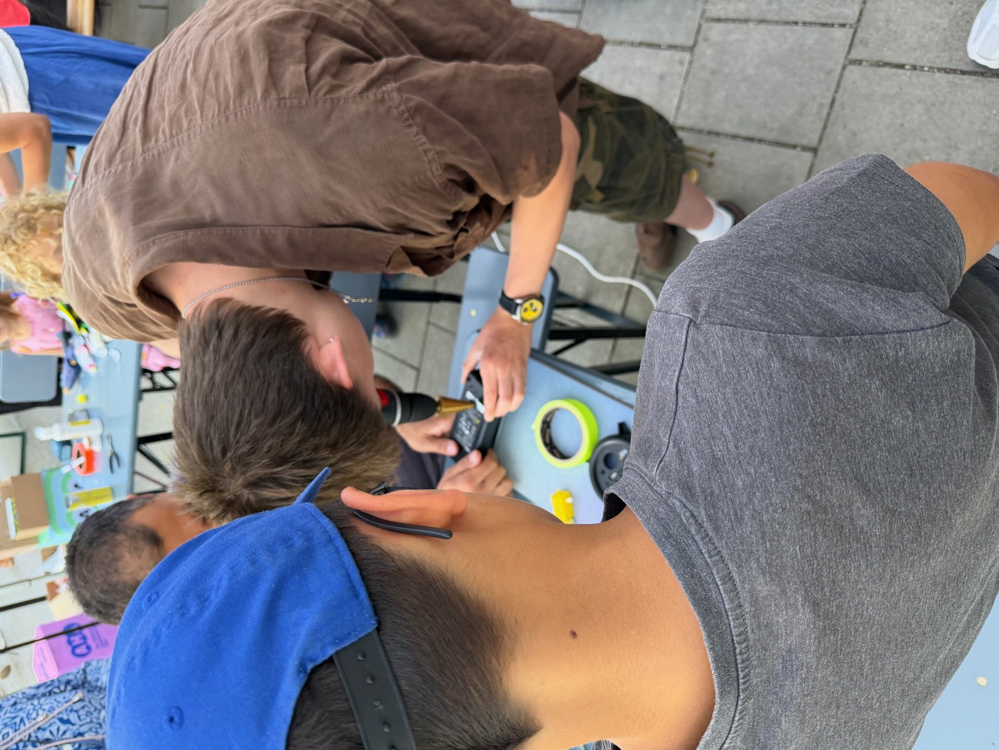
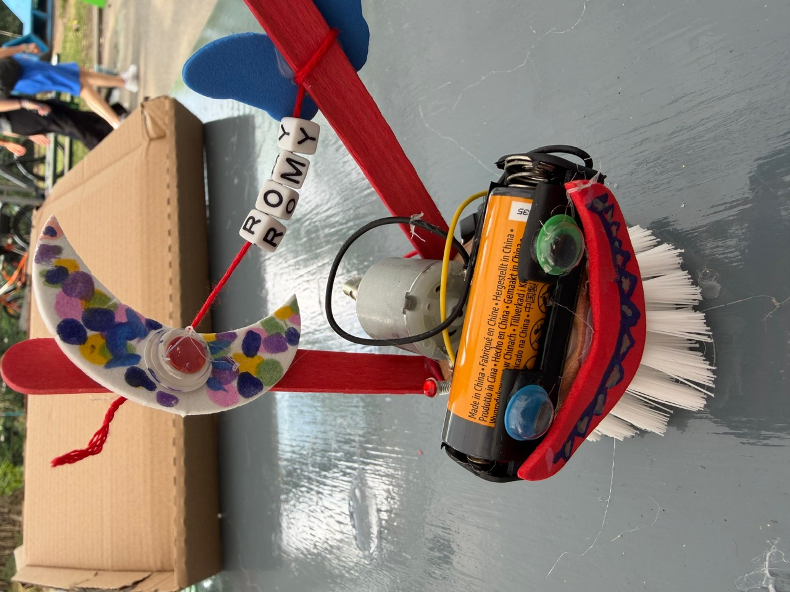
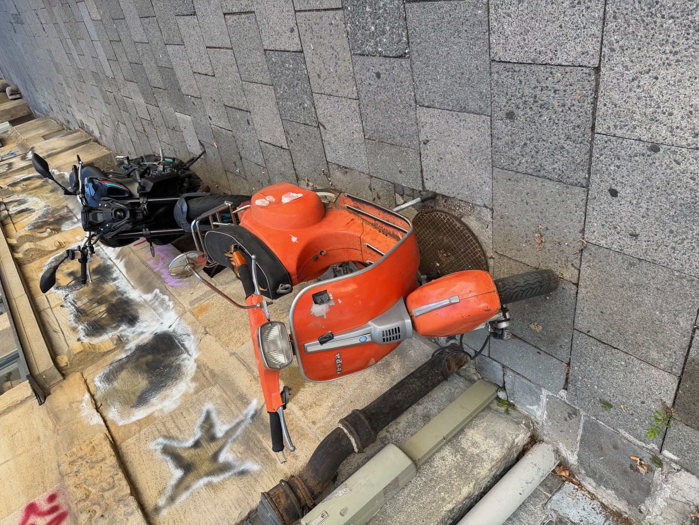
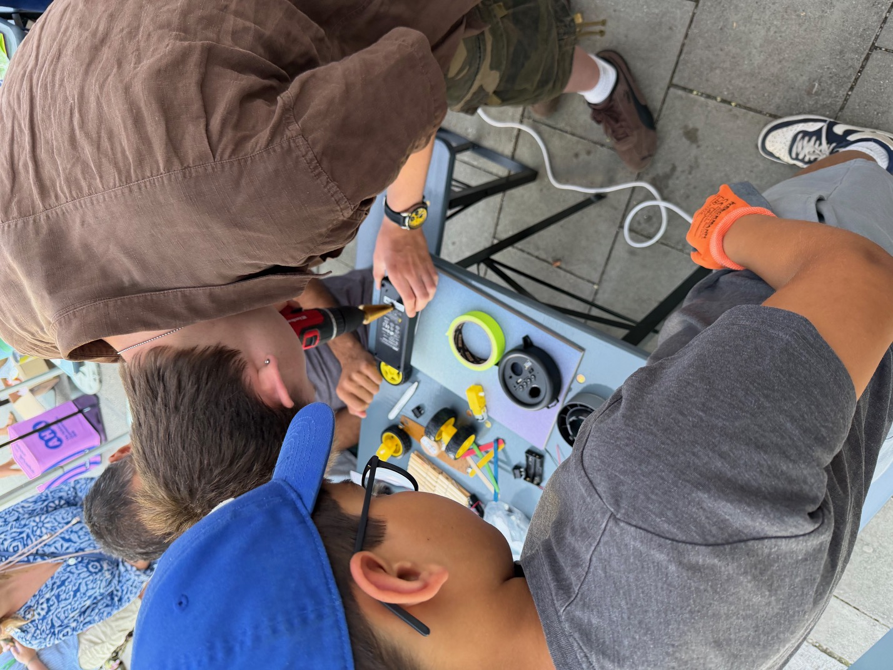
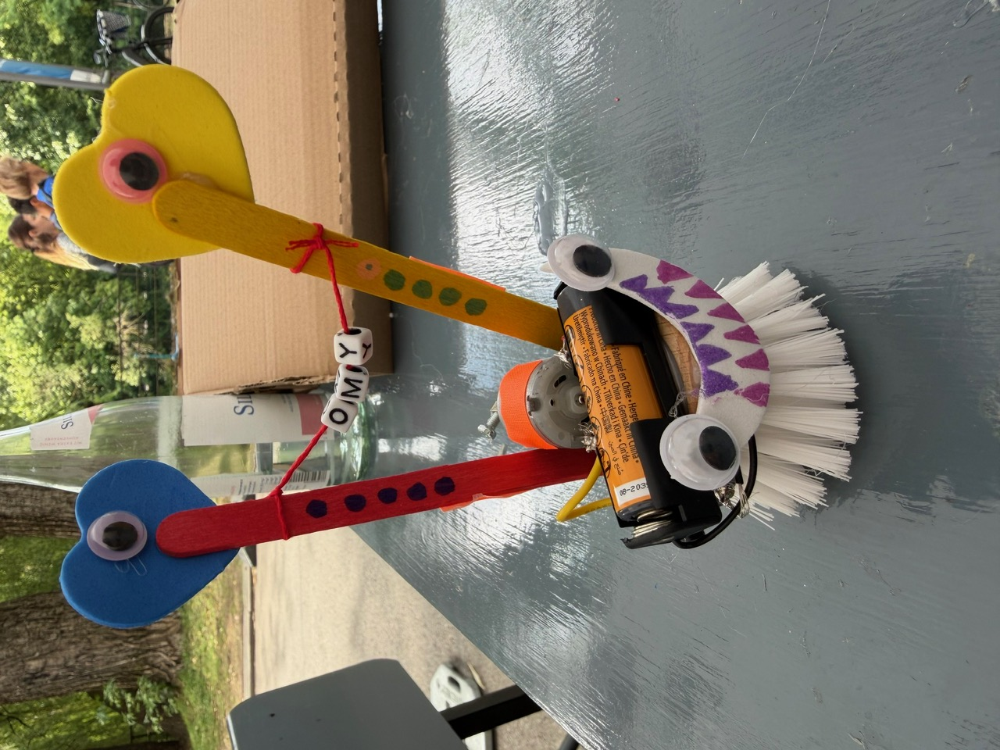
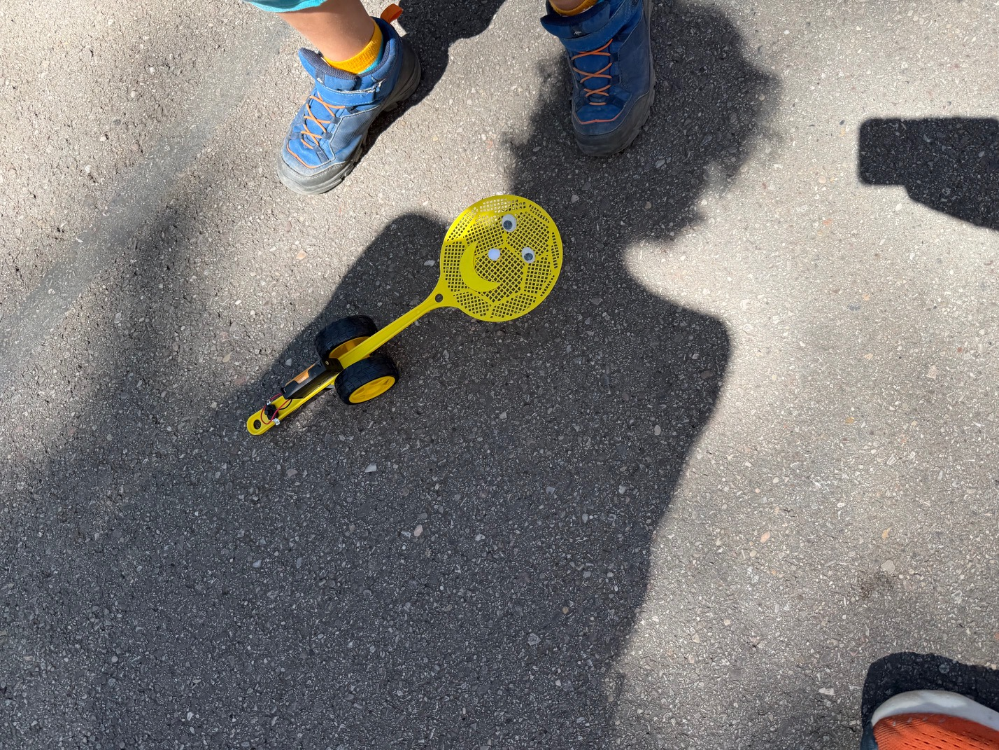

Vom alten Toaster zum Rennchampion – und das alles aus echtem Schrott. 

Beim **Festival der Zukunft** im Deutschen Museum in München haben wir gezeigt, dass man für echte Robotik keine High-End-Labs braucht, sondern oft ein bisschen Mut zum Chaos und eine Menge Kreativität. Unter dem Motto „Shitty Robots“ luden wir Kinder dazu ein, aus Restmaterialien funktionierende Roboter zu bauen, die dann in einem epischen Finale gegeneinander antraten.

---

### Bauen, Tüfteln, Scheitern (und wieder aufstehen)

Die Idee war simpel: Weg von der perfekten Anleitung, hin zum experimentellen Basteln. Über zwei Tage hinweg gab es einen stetigen Strom an Kindern – Tag 1 allein besuchten uns ca. 60 bis 70 Teilnehmende. In einem stündlichen Slot-System konnten die Teams in Ruhe an ihren Konstruktionen arbeiten.

Dabei ging es nicht nur um die Technik, sondern vor allem um das Problemlösen: Warum fährt der Roboter im Kreis? Warum fällt der Motor ab? Die Lösung lag meistens in einer weiteren Lage Heißkleber oder einem strategisch platzierten Gummiband.





### Das Team hinter dem Chaos

Ein solches Event funktioniert nur mit einem starken Team, das jedem Kind den Rücken stärkt und gleichzeitig den Überblick behält. Ein riesiges Dankeschön an: 
**MatzE, Leo, Leno, Basti, Danilo, Alexander und Hannah**, die mit vollem Einsatz dabei waren.

Besonderen Dank gilt auch **Q3 (qdrei.info)**, die uns unterstützt haben und dafür gesorgt haben, dass die technische Infrastruktur hielt. In diesem Zuge konnten wir auch wieder auf **ZeFix.org** aufmerksam machen – ein wichtiges Projekt für den offenen Umgang mit technischen Daten.

---


**Was ist eigentlich ein „Shitty Robot“?**
Es geht nicht darum, dass das Ergebnis schlecht ist, sondern dass die Zutaten es sind. Der Reiz liegt im Kontrast zwischen dem wertlosen Material und der funktionierenden Technik.


### Fazit: Lernen durch Machen

Das Finale war laut, chaotisch und absolut ehrlich. Wir haben gesehen, wie Kinder mit Stolz ihre aus Schrott zusammengebauten Maschinen präsentierten. Genau das ist der Kern von KidsLab: Empowerment durch echtes Tun. Wenn ein Roboter aus einer Plastikdose und einem alten Spielzeugmotor fährt, ist das ein Erfolgserlebnis, das kein Tutorial der Welt ersetzen kann.

Wir freuen uns schon auf die nächsten Shitty-Robots-Edition!

---


Du willst wissen, wie unsere Roboter-Events funktionieren? Schau dir hier die [Details zum Hebocon-Format](/events/hebocon) an.

