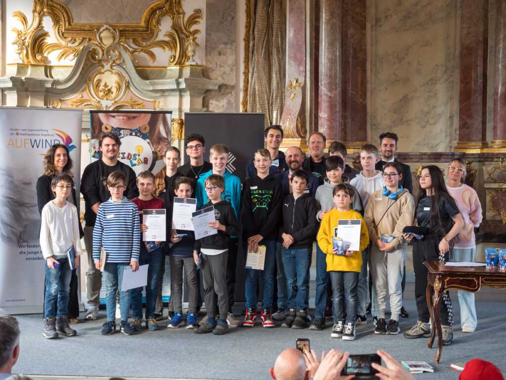
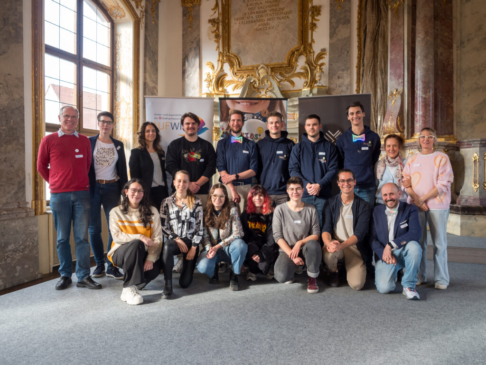

## Der GamesPreis!

**Verleihung des 1. Augsburger GamesPreis im Kleinen Goldenen Saal**

Augsburg, 24. April 2024

Im Kleinen Goldenen Saal in Augsburg ist die Aufregung unter den jungen Augsburger Nachwuchs-Programmierern sowie deren Familien und Freunden deutlich zu spüren. Denn es geht um nichts Geringeres als um die Verleihung des 1. Augsburger Games-Preises, der von der gemeinnützigen KidsLab GmbH ins Leben gerufen wurde. 

Die Games-Preis-Gala ist dabei der Höhepunkt des Augsburger GamesLab, dem kreativen Spiele-Studio, das Anfang des Jahres in der Augsburger “Zwischenzeit” stattgefunden hat (die AZ berichtete). Kinder und Jugendliche wurden dort kostenlos in die Welt der Spieleprogrammierung mit Scratch eingeführt, um fortan eigene Spielideen verwirklichen zu können. 

Und das, was die jungen Bewerber des GamesPreis an selbst entwickelten Spielen eingereicht hatten, beeindruckte die Geschäftsführer der KidsLab gGmbH Gregor Walter und Regine Scheyer sowie die dreiköpfige Jury enorm. Auch wenn es schwerfiel, mussten drei Hauptgewinner gefunden werden. Ausgezeichnet für besonders herausragende Leistungen im Bereich Spieleentwicklung und -design wurden Johannes Kistler mit dem 1. Platz für sein Spiel “Gravity Glide”, Dominik Gößler mit dem 2. Platz (“Water Facility”) und Tonia Krüger mit dem 3. Platz (“Immerson 2009”). 

Die sichtlich stolzen Gewinner freuten sich über ihre Pokale und die von AUFWIND, die Kinder und Jugendstiftung der Stadtsparkasse Augsburg, gespendeten, hochwertigen Preise (Steam Deck OLED, Meta Quest 2 VR-Brille sowie Wacom Grafik-Tablett). Aufgrund der durchweg positiven Resonanz steht für die Macher des GamesLab bereits jetzt fest, dass das Projekt nächstes Jahr in die 2. Runde gehen wird.

# Die Gewinner

<figure ><figcaption >Photo: Stefan Winterstetter</figcaption></figure>

## Platz 1 – Gravity Glide

<iframe loading="lazy" src="(scratch: 971388807)embed" allowtransparency="true" width="485" height="402" frameborder="0" scrolling="no" allowfullscreen></iframe>

(scratch: 971388807)

## Platz 2 – Water Facility

<iframe loading="lazy" src="(scratch: 966666194)embed" allowtransparency="true" width="485" height="402" frameborder="0" scrolling="no" allowfullscreen></iframe>

(scratch: 966666194)

## Platz 3 – Immersion 2009

<iframe loading="lazy" src="(scratch: 964668818)embed" allowtransparency="true" width="485" height="402" frameborder="0" scrolling="no" allowfullscreen></iframe>

(scratch: 964668818)

## Kategorie-Gewinner

### Kategorie Health – Legend of Apples

(scratch: 957960718)

<iframe loading="lazy" src="(scratch: 957960718)embed" allowtransparency="true" width="485" height="402" frameborder="0" scrolling="no" allowfullscreen></iframe>

### Kategorie Knickers Only – Taxi in Paris

(scratch: 964387808)

<iframe loading="lazy" src="(scratch: 964387808)embed" allowtransparency="true" width="485" height="402" frameborder="0" scrolling="no" allowfullscreen></iframe>

### Kategorie Mix – Schattenbrecher

(scratch: 971395834)

<iframe loading="lazy" src="(scratch: 971395834)embed" allowtransparency="true" width="485" height="402" frameborder="0" scrolling="no" allowfullscreen></iframe>

### Kategorie Fun – Die große Igelfütterung

<iframe loading="lazy" src="(scratch: 970859947)embed" allowtransparency="true" width="485" height="402" frameborder="0" scrolling="no" allowfullscreen></iframe>

### Kategorie 8-Bit – The BeeGame

<figure >
(scratch: 971662940)embed

</figure>

<iframe loading="lazy" src="(scratch: 971662940)embed" allowtransparency="true" width="485" height="402" frameborder="0" scrolling="no" allowfullscreen></iframe>

## Danke, Danke, Danke!

1000 Dank an unsere Sponsoren (https://blog.sska.de/aufwind-die-kinder-und-jugendstiftung/) und (https://xitaso.com/)! Und natürlich alle unseren fleißigen, kreativen und inspirierenden Mentorinnen und Mentoren!

Photo: Stefan Winterstetter
