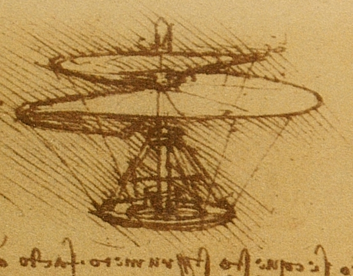
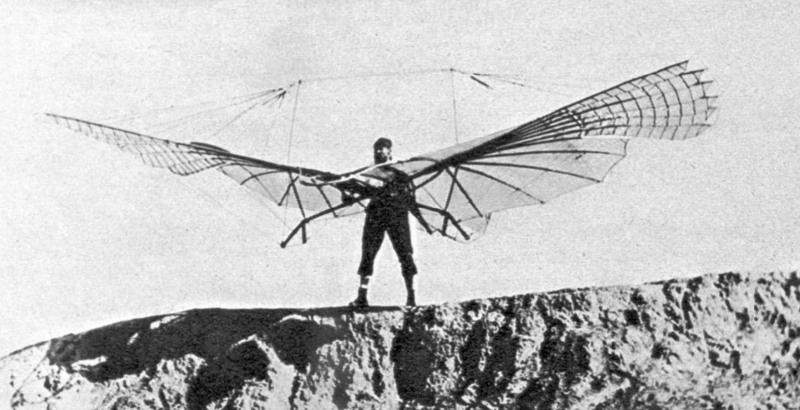
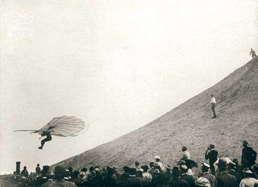
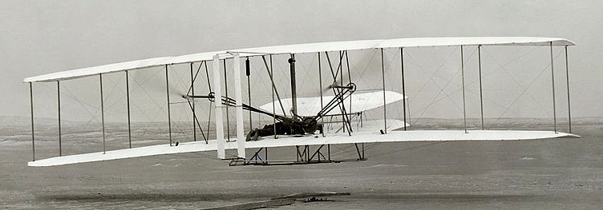
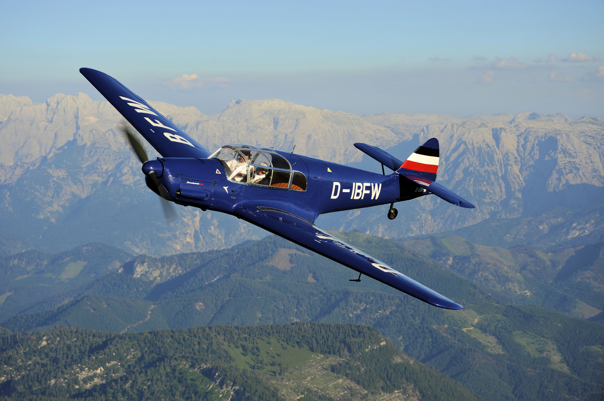

<figure ><figcaption>Leonardo Da Vinci</figcaption></figure>

<figure ><figcaption>Otto Lilienthal</figcaption></figure>

<figure ><figcaption>Otto Lilienthal</figcaption></figure>

<figure ><figcaption>Brüder Wright</figcaption></figure>

<figure ><figcaption>Willy Messerschmitt</figcaption></figure>
