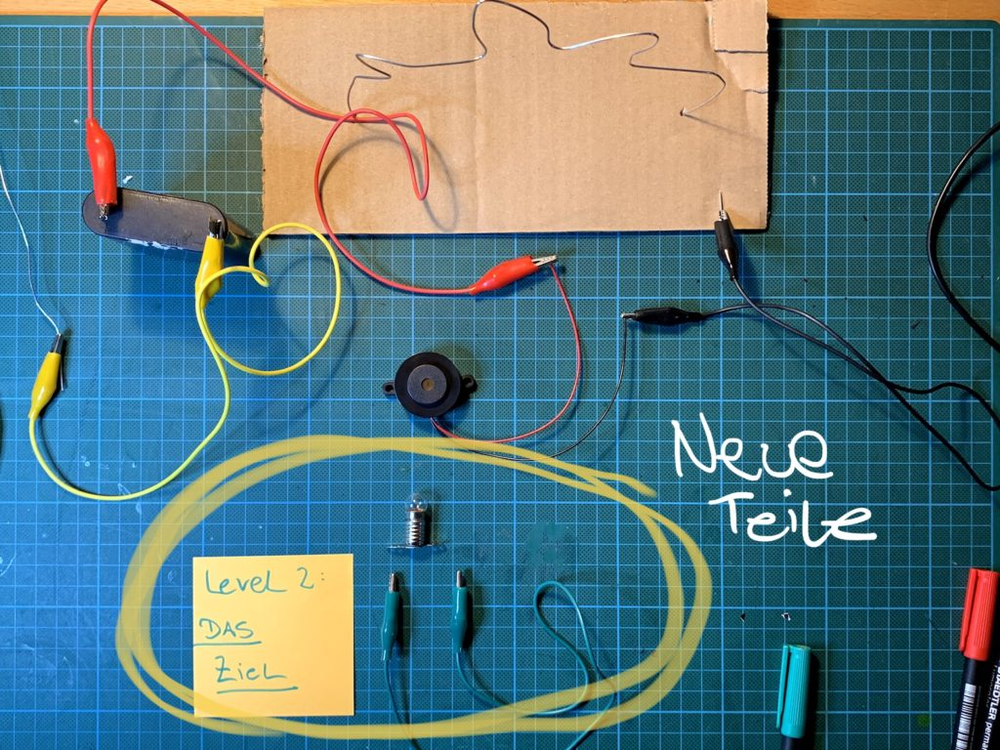
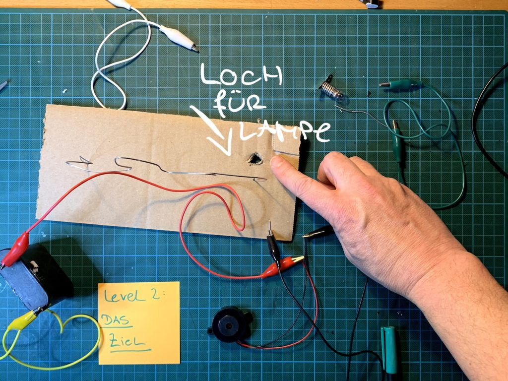
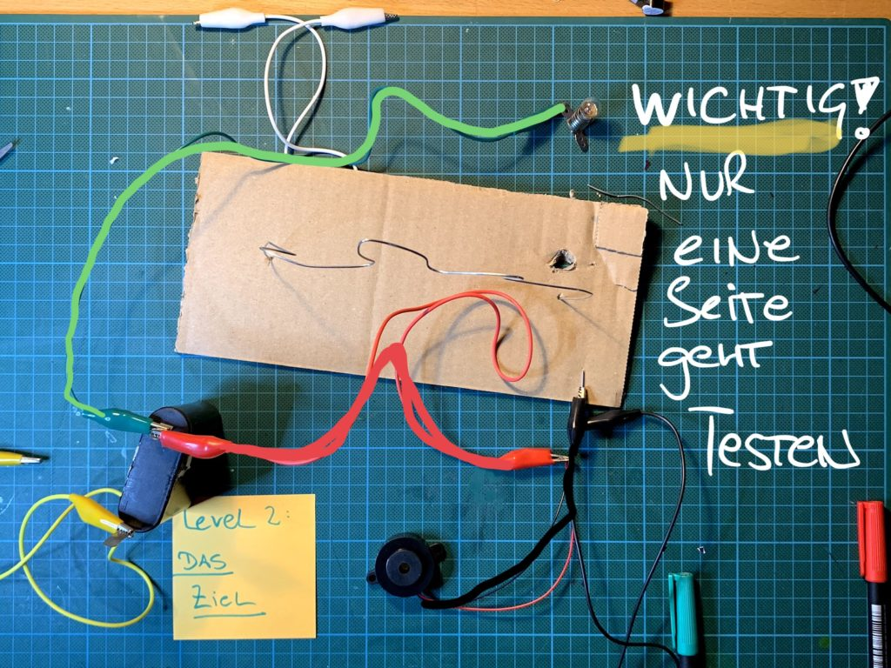
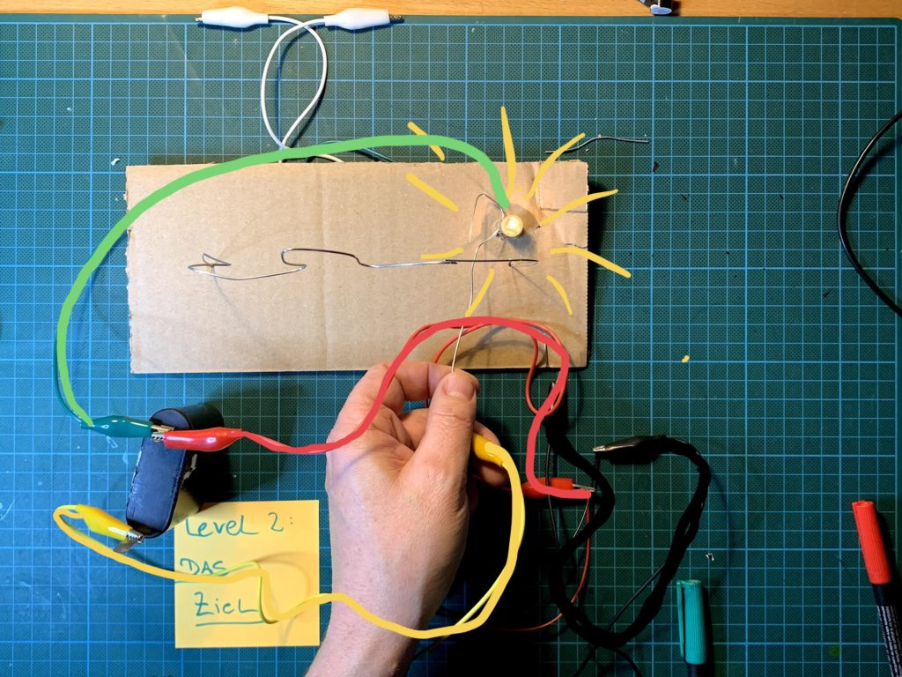

Im [ersten Teil](/blog/bastelanleitung-heisser-draht-spiel/) hast Du ein cooles Spiel gebaut – in zweiten Teil erweitern wir das ganze noch um ein Lampe, die anzeigt, dass die Bombe erfolgreich entschärft wurde!

Du brauchst zusätzlich:

- eine weitere Krokoklemme
- ein Lämpchen oder LED

Als erstes machst Du ein Loch für unsere „Gewonnen“-Lampe:

Am besten mit einer Schere – ungefähr so groß wie das Lämpchen

Jetzt zum essentiellen Teil: der Schaltung!

Verbinde die grüne Krokoklemme mit dem **Plus-Pol der Batterie **und mit der **Lampe**.

**Wichtig: es geht nur ein Kontakt der Lampenfassung – probier es am besten aus, welcher der Richtige ist!**

Fertig!

Wenn du alles richtig gemacht hast, brennt die Lampe, wenn die Sie am Ende mit deinem Joystick berühst – **Gewonnen!**
