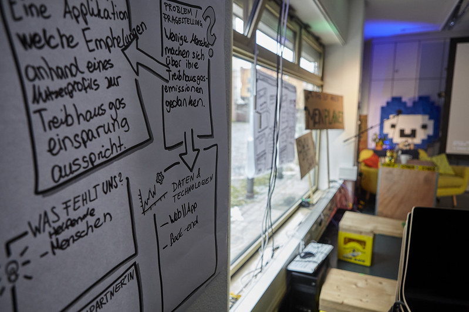
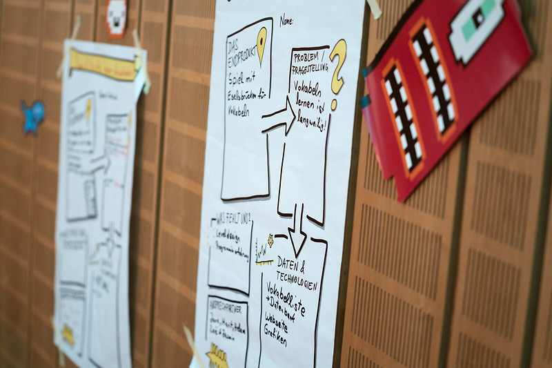
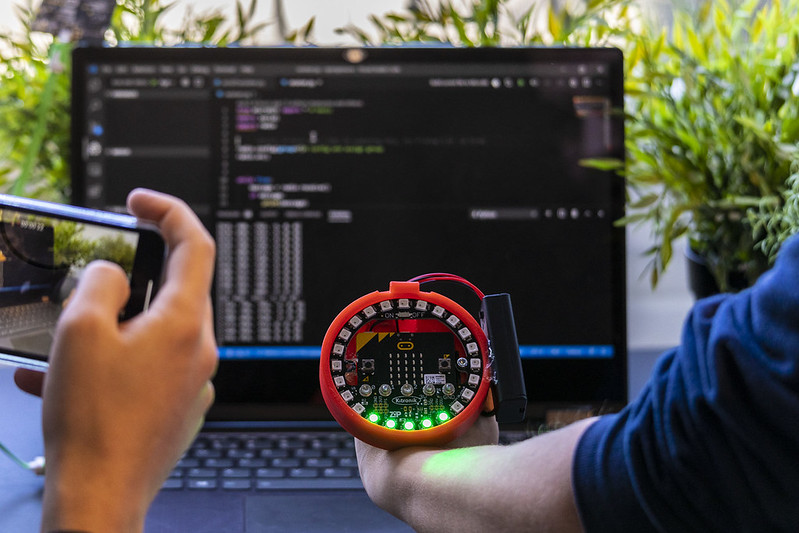
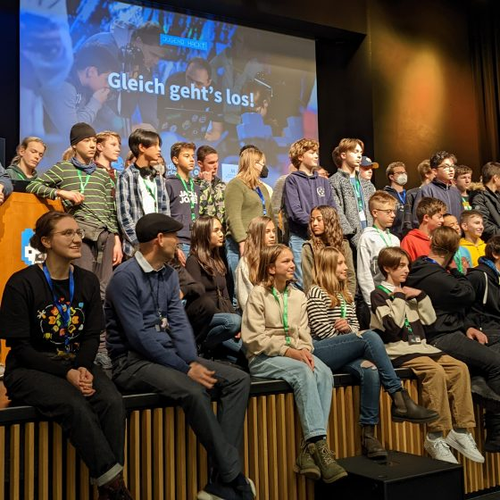

## Jugend hackt München 2025: Code and Culture - 10. bis 12. Oktober 2025





<h2>Ein Wochenende voller Ideen, Technik &amp; Kreativität! 🚀</h2>
Du hast Lust zu <strong>coden</strong>, zu <strong>tüfteln</strong>, zu <strong>gestalten</strong> – und dabei die Welt ein Stück besser zu machen? Dann sei dabei, wenn Jugend hackt unter dem Motto <strong>„Code and Culture"</strong> nach München kommt!

Drei Tage lang kannst du mit anderen Jugendlichen an Projekten arbeiten, die dir am Herzen liegen. Dabei ist es egal, ob du schon Profi bist oder gerade erst anfängst – ehrenamtliche Mentor:innen unterstützen dich bei deinen Ideen und zeigen dir, wie du deine Vision umsetzen kannst. Du wirst nicht nur viel erleben, sondern auch neue Leute kennenlernen und ein tolles Wochenende verbringen.
<h3>Was dich erwartet:</h3><ul><li>
✨ <strong>Eigene Projekte entwickeln</strong> – alleine oder (besser) im Team
</li><li>
🤝 <strong>Unterstützung durch erfahrene Mentor:innen</strong>
</li><li>
💬 <strong>Austausch mit anderen technikbegeisterten Jugendlichen</strong>
</li><li>
🎯 <strong>Raum für deine Ideen, Kreativität und gesellschaftliches Engagement</strong>
</li></ul><h3>📍 Veranstaltungsort</h3>
<strong>Amerikahaus München</strong> Das Amerikahaus bietet Beratung und Programme rund um internationale Bildung und Austausch. <a href="https://www.amerikahaus.de">Mehr Infos...</a>
<h2>🎨 Workshops vor der Eröffnung</h2>
Vor der offiziellen Eröffnung um 18:30 Uhr bieten dir das <strong>Museumspädagogische Zentrum (MPZ)</strong> und der <strong>Bezirksjugendring Oberbayern</strong> verschiedene Workshops an:
<h3>Workshop 1: Technik trifft Kunst – Unterwegs mit dem „Museumsbuddy"</h3>
🕓 <strong>16:00 – 18:00 Uhr</strong> im Museum Brandhorst 📍 <em>Treffpunkt: 15:30 Uhr im Amerikahaus</em>
<h3>Workshop 2: Hinter den Kulissen – Einmal Kurator*in sein!</h3>
🕔 <strong>17:00 – 18:00 Uhr</strong> im Museum Brandhorst 📍 <em>Treffpunkt: 16:30 Uhr im Amerikahaus</em>
<h3>Workshop 3: „Drum rum – ein Stadtspaziergang rund ums Amerikahaus"</h3>
🕔 <strong>17:00 – 18:00 Uhr</strong> im Amerikahaus 📍 <em>Treffpunkt: 16:45 Uhr im Amerikahaus</em>

Du willst am Wochenende mehr sehen als nur Hostel und Workshopraum? Dann komm mit auf unseren kurzen Stadtspaziergang. Zwischen Königsplatz und Odeonsplatz gelegen und in der Nähe von zahlreichen Museen und der LMU (Universität) bieten das Amerikahaus und seine unmittelbare Umgebung sicher für alle etwas Interessantes.
<h3>Über unsere Partner</h3><ul><li>
<strong>Das MPZ</strong> macht Kultur erfahrbar und wird auch bei Jugend hackt mit zwei spannenden Workshops dabei sein. <a href="https://www.mpz-bayern.de">Weitere Infos zum MPZ...</a>
</li><li>
<strong>Der Bezirksjugendring Oberbayern</strong> ist eine Interessenvertretung für die Jugendverbandsarbeit in Oberbayern, die die Zusammenarbeit von Jugendorganisationen fördert und Projekte zur Stärkung der Jugendbildung unterstützt. <a href="https://www.jugend-oberbayern.de">Weitere Infos...</a>
</li></ul><h2>💡 Wichtig: Digitale Bildung ohne Hürden!</h2>
Uns von <strong>Jugend hackt</strong> ist wichtig: <strong>Digitale Bildung sollte keine Hürden kennen!</strong>

Im Sinne der Chancengleichheit bieten wir euch daher an:
<h3>💰 Flexible Preisgestaltung:</h3><ul><li>
<strong>Normal-Preis:</strong> 100€ (inkl. Hostel und Essen)
</li><li>
<strong>Soli-Preis:</strong> 50€ (50% reduziert)
</li><li>
<strong>Kostenlose Teilnahme:</strong> Für alle, die sich auch den Soli-Preis nicht leisten können
</li></ul>
<strong>Jede:r kann selbst entscheiden!</strong> Nachweise sind nicht erforderlich. Wir setzen auf Vertrauen. 🤝
<h3>🚆 Reisekostenerstattung</h3>
Auch die Anreise soll kein Hindernis sein! Wenn du dir die Fahrtkosten nicht leisten kannst, übernehmen wir diese gerne für dich. Sprich uns einfach an!

<strong>Sei dabei und mach mit uns die Welt ein Stück besser – mit Code and Culture!</strong> 🌟





Anmeldung
