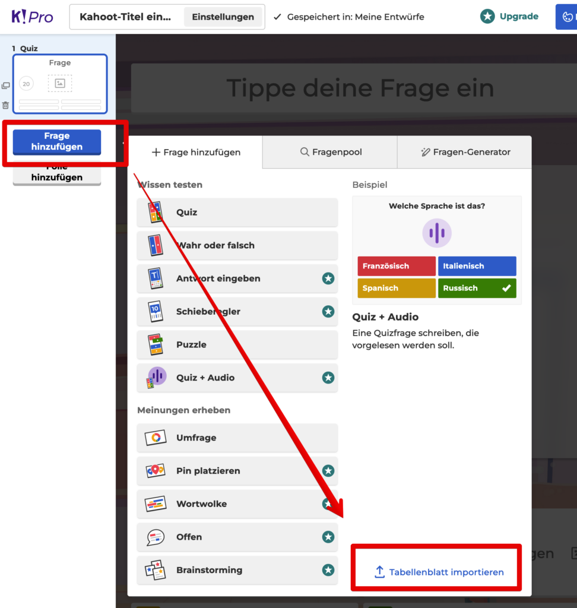
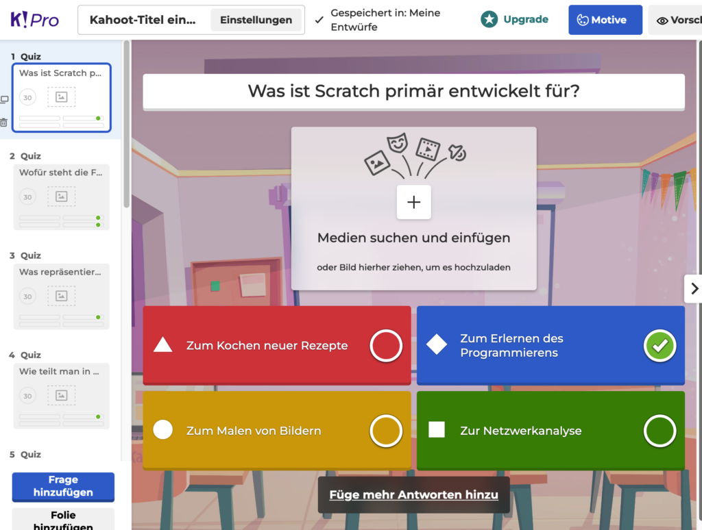

In diesem kleinen Tutorial möchte ich Ihnen einen effizienten Weg der Quiz-Erstellung vorstellen! Sie sind bereits mit ChatGPT vertraut, einem leistungsstarken Tool, das das Potenzial hat, Ihren Unterricht zu revolutionieren. In diesem Artikel zeige ich Ihnen, wie Sie ChatGPT in Kombination mit Kahoot! nutzen können, um das Erstellen von unterhaltsamen und lehrreichen Quizzen zu einem Kinderspiel zu machen.

Lassen Sie uns gemeinsam erkunden, wie ChatGPT Sie dabei unterstützen kann, ansprechende und auf Ihren Lehrplan zugeschnittene Quizfragen zu generieren – und das ohne den üblichen Zeitaufwand und das endlose Copy&Paste. Tauchen Sie ein in die Welt der innovativen Quizgestaltung und erleben Sie, wie einfach und effizient Ihre Unterrichtsvorbereitung mit der Kombination von ChatGPT und Kahoot! sein kann!

### Wie kann man Fragen in Kahoot improtieren?

Man kann in Kahoot Fragen nicht nur manuell erstellen, sondern diese auch aus einem Excel-Dokument direkt importieren. Eine Anleitung zum Importieren findet sich hier:

(https://support.kahoot.com/hc/en-us/articles/115002812547-Import-questions-from-a-spreadsheet)

Aber es geht noch einfacher:

# Schritt für Schritt – ChatGPT zu Kahoot!

## Schritt 1: ChatGPT per „System:“-Prompt vorbereiten.

Man kann ich aber den Schritt mit dem Verwenden des Templates von der Kahoot-Seite sparen, wenn man den richtigen Prompt verwendet:

`System: Erstelle mir Multiple-Choice-Fragen zum jeweilgen Thema für Schüler, mit vier möglichen Antworten. Erstelle die Fragen als Tabelle mit folgenden Spalten: 1 Spalte nummer der Frage, 2 Spalte Frage, 3 Spalte Antwort a, 4 Spalte Antwort b, 5 Spalte Antwort c, 6 Spalte Antwort d, 7 Spalte Zeit immer den Wert 30, 8 Spalte die korrekte Antwort für a=1, b=2, c=3 und d=4, wobei die Spalten 3 bis 6 nicht mehr als 75 Zeichen beinhalten und die Spalte 2 nicht mehr als 120 Zeichen. Die Namen der Spalten sind: "Number", "Question - max 120 characters", "Answer 1 - max 75 characters", "Answer 2 - max 75 characters", "Answer 3 - max 75 characters", "Answer 4 - max 75 characters", "Time limit (sec) – 5, 10, 20, 30, 60, 90, 120, or 240 secs", "Correct answer(s) - choose at least one". Es kann auch mehrere richtige Antworten geben. Gib die Tabelle jeweils für Excel zum Downloaden aus. Ich sage dir das Thema des Quizes im nächsten Schritt.`</pre>

Ich habe dafür ChatGPT 4 verwendet, man braucht für dieses Model aktuell noch ein Pro-Abo.

## Schritt 2: Das Quiz erstellen lassen

Danach muss man nur noch das Thema für das Quiz vorgeben und erhält die fertige Datei, die in Kahoot direkt importiert wenden kann:

`Bitte erstelle in Quiz mit insgesammt 10 Fragen für Schüler im Alter vom 10 bis 14 Jahren, es geht im Scratch. Ich möchte den Wissensstand feststellen. Es dürfen auch Trivia und Lustige Fragen dabei sein. Bitte jeweils auch eine lustige Antwort.`</pre>

## Schritt 3: Import in Kahoot!

Der Import in Kahoot geht mit wenigen Klicks:

## Schritt 4: Das fertige Ergebnis

Noch ein paar Bilder dazu – und fertig!

Und natürlich kontrollieren nicht vergessen – wie man hier sieht, sind alle Fragen nicht immer perfekt formuliert 🙂 Und auch den Inhalt natürlich – wie immer bei der Arbeit mit ChatGPT – auch prüfen!

#### Hinweis: Dieser Blogeintrag wurde mit Hilfe von ChatGPT erzeugt.
