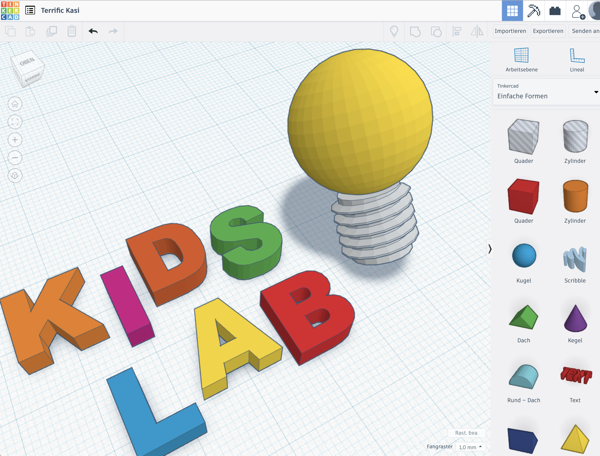
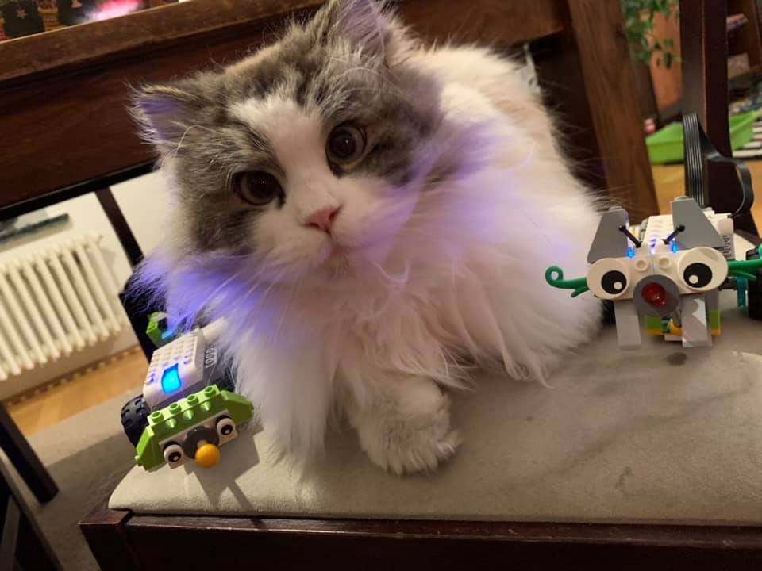

Dieses Jahr bieten wir in den ersten beiden Sommerferien-Wochen ein Ferienprogramm an – jeweils einzelne Tage.

Das Wichtigste in Kürze:

- 27. – 30. Juli und 3. – 6. August
- einzelne Tagesworkshops
- Zeit: 9:00 – 15:00 Uhr
- Kosten 58 Euro/Tag, 30 Euro für Geschwisterkinder
- Anmeldung und Übersicht über Tschamp *(Seite nicht mehr verfügbar)*

## Mein erstes Smartphone

Viele Kinder wechseln zum neuen Schuljahr in eine weiterführende Schule – und bekommen ihr erstes Smartphone. Gemeinsam entdecken wir sowohl die technischen Aspekte als auch soziale Themen. 

**Zusammen drehen wir abschließend einen Stop-Motion-Film.**

Am Abend gibt es noch ein Webinar für die Eltern, in dem wir einen Smartphone-Vertrag vorstellen, der die Grundlage für einen guten gemeinsamen Start in die Internet-Welt legt.

- Montag, 27. Juli
- Montag, 3. August

## 3D-Druck und -Design

Was ist ein 3D-Drucker und wie funktioniert er?
Was kann man damit machen?
Mit dem Programm „TinkerCAD“ eigene 3D-Sachen kreativ erstellen
Design-Erfindungen: Nach dem Kurs drucken wir Deine Kreation mit den 3D-Drucker aus.

- <s>Dienstag, den 28. Juli – für Kinder von 8 bis 12</s>
- Dienstag, den 4. August – für Teens (12-15 Jahre)

## Winkekatzenorchester mit dem Calliope



Wir bauen und basteln mit dem „Calliope Mini“ eine Upcycling-Winkekatze für ein gemeinsames Klopf- und Lärmorchester. [Calliope](/selber-machen/calliope-einfuhrung/) und Tablets werden während der Veranstaltung gestellt.

- Mittwoch, 29. Juli – für Teens (12 – 15 Jahre)
- Mittwoch, 5. August – für Teens (12-15 Jahre)

## Roboterkatze Einstein

Lego „WeDo“ ist ein Set, mit dem Kinder spielerisch einen ersten Einstieg ins Programmieren erhalten. Im Gegensatz zu den „größeren“ Roboter- und Programmier-Bausätzen von Lego – wie „MindStorms“ oder „Boost“ – sind die Kästen und auch die Modelle bewusst sehr einfach gehalten: Gerade das ermöglicht den spielerischen Einstieg in das Programmieren und hilft dabei, die Grundsätze zu verstehen. Mit Lego „WeDo“ bauen und programmieren wir an diesem Tag u.a. eine Roboterkatze und ein autonomes Auto.

- <s>Donnerstag. 30. Juli – für Kinder von 8 bis 12</s>
- <s>Donnerstag, 8. August – für Kinder von 8 bis 12 Jahren</s>
