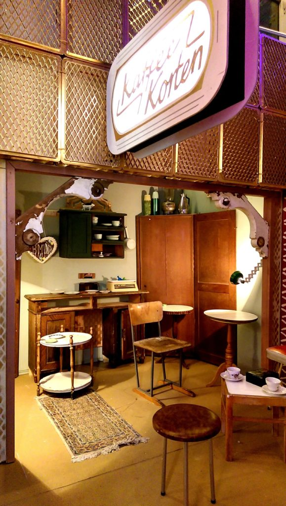
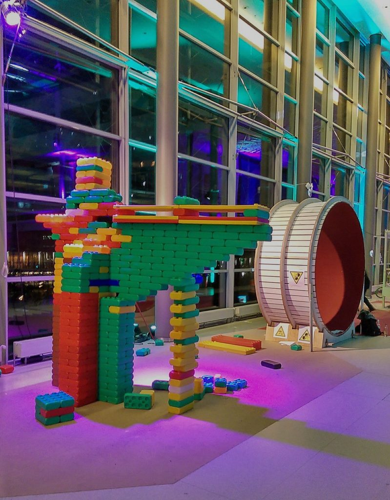
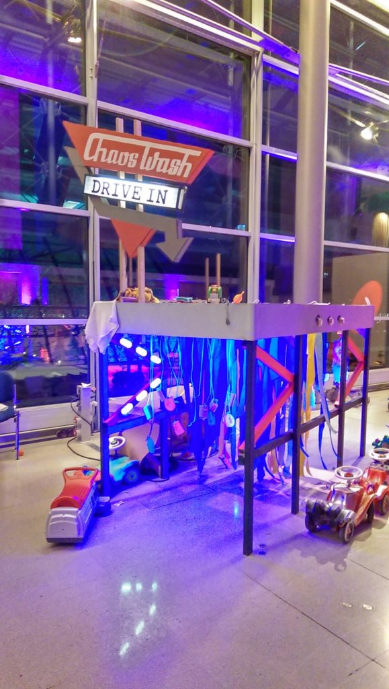
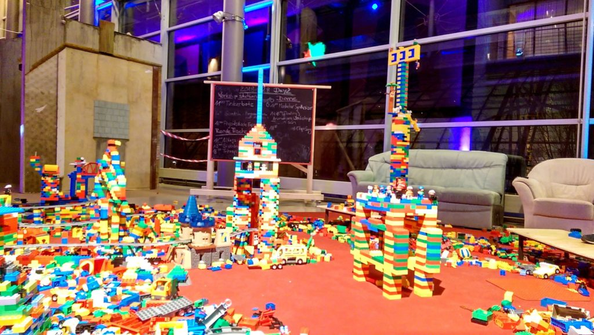

**Das Wichtigste in Kürze:**

- vom **27. bis 30. Dezember kostenlose Workshops und Events** im parallel zur (https://events.ccc.de/2020/09/04/rc3-remote-chaos-experience/) (in Zusammenarbeit mit dem c3-kidspace)
- Mach mit!
<li>Als **Kind – bei (#rc3-workshops) **
- Als **Erwachsener – (#cfp) an**

</li>

Wie jedes Jahr findet auch dieses Jahr der Congress des Chaos Computer Clubs statt – vom **Sonntag, 27. bis Mittwoch 30. Dezember**.

# Workshops für Kids

Letztes Jahr hatte ich auch die große Ehre, über [Minecraft auf dem 36C3](/blog/vortrag-zu-minecraft-auf-dem-36c3/) erzählen zu dürfen.

Das große Highlight für die jüngeren Besucher ist der (https://c3kidspace.de/) – hier einige Eindrücke der letzten Jahre:

<figure >

</figure>

Dieses Jahr ist natürlich alles anders: aus dem riesigen Treffen tausender kreativer Nerds wird dieses Jahr ein Online-Event.

Das stellt die Veranstalter vor ganz neue Herausforderungen – nicht nur technisch: da die rechtlichen Grundlagen gerade in Richtung Jugendschutz sehr schwierig sind, ist das Event nur für Erwachsene, also für Leute über 18 zugänglich.

Damit die Nachwuchs-Chaoten und computerbegeisterte Kinder und Jugendlichen sich währenddessen auch angemessen nerdig beschäftigen können, organisiere ich in Zusammenarbeit mit dem Team des c3-KidsSpace ein kleines Programm an kostenlosen Workshops und gemeinsamen Aktivitäten.

# Call for Participation

Hast auch du eine Idee für einen Workshop für Kinder? Egal ob technisch, kreativ oder gemeinsames Abhängen oder Spielen? Melde dich!

Wir helfen dir:

- Tipps und Tricks für coole online Events für Kinder
- Technische Infrastruktur (Video-Räume etc)
- Zentrale Anmeldung und Buchung der Events über diese Seite

Mail an: (mailto:rc3-orga@c3kidspace.de)
