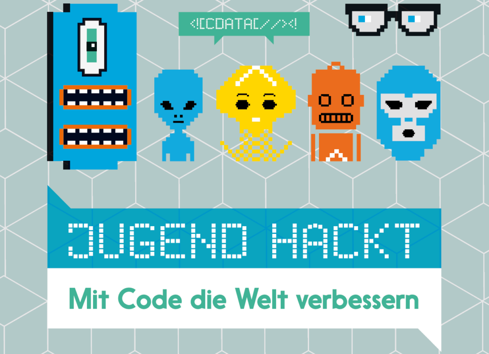

Wir haben uns beworben, das „Jugend Hackt Lab“ in Augsburg zu organisieren und veranstalten – und freuen uns sehr über die Aufnahme in die Gruppe der (https://jugendhackt.org/labs/).

Es wird also in Zukunft kostenlose Angebote für Jugendliche zwischen 12 und 18 Jahren geben – seid gespannt! Wir sind mit einer Riesen-Ladung von Ideen und Workshops-Anleitungen aus Berlin zurückgekommen und freuen uns auf den Start!

Wir hatten eine sehr tolle Zeit in Berlin – danke an das Jugend-Hackt-Team und alle Beteiligten!

> Jugend hackt ist ein Programm für junge Menschen, die mit ihren technischen Fähigkeiten die Welt verbessern wollen. Unterstützt von ehrenamtlichen Mentor*innen entwickeln unsere Teilnehmer*innen digitale Werkzeuge, Prototypen und Konzepte für eine bessere Zukunft. Unser Angebot umfasst Hackathon-Events in vielen Städten, regionale Labs, eine Online-Community und internationale Austauschprogramme.

> **Jugend hackt ist ein Programm für Jugendliche zwischen 12 und 18 Jahren, die Lust haben, mit Code die Welt zu verbessern.**

<cite>https://jugendhackt.org/mitmachen/</cite>

