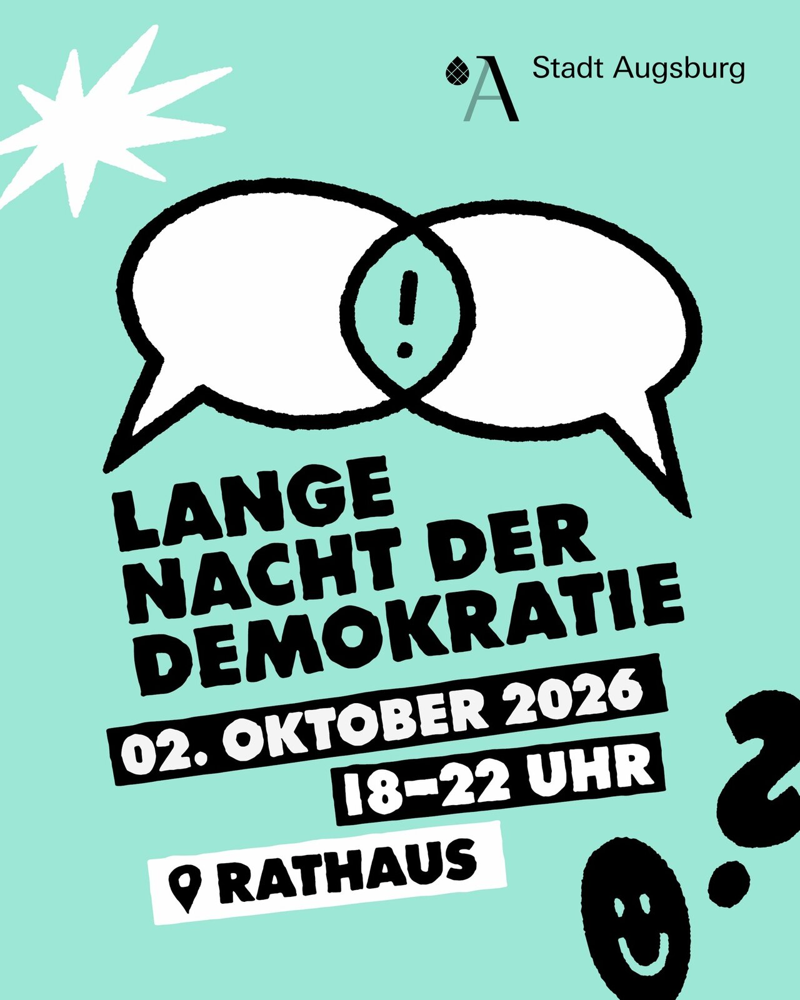

Gestern Abend war das Augsburger Rathaus voller Demokratie – und mittendrin stand unser **Konsensomat**. Bei der **Langen Nacht der Demokratie** durften wir die Demokratiemaschine aufbauen. Und was sollen wir sagen: Es war richtig voll! Vor dem Konsensomat bildeten sich den ganzen Abend lange Schlangen von Besucherinnen und Besuchern, die sich unbedingt einmal „konsensen“ wollten. 😄

## Die Lange Nacht der Demokratie

Am **2. Oktober 2026** gab es im Rathaus von 18 bis 22 Uhr (Kinderprogramm schon ab 17 Uhr) über 40 Angebote rund um Demokratie: Vorträge, Diskussionen, Musik, Mitmachaktionen und viele Gelegenheiten, miteinander ins Gespräch zu kommen. Organisiert wurde der Abend vom Büro für Kommunale Prävention, dem Stadtjugendring und der Volkshochschule Augsburg. Mehr Infos gibt es auf der [Seite der Stadt Augsburg](https://www.augsburg.de/lange-nacht-der-demokratie).

## Was ist der Konsensomat?

Abstimmen ist einfach – sich einigen ist schwerer. Beim Konsensomat treten zwei Personen an zwei Buzzer-Stationen an. Auf dem großen Bildschirm erscheint eine Frage, beide drücken **Ja** oder **Nein**. Gleiche Antwort? Punkt! Unterschiedliche Antwort? Dann tickt die Uhr: **zwei Minuten**, um sich durch Diskutieren, Argumentieren und Zuhören auf eine gemeinsame Antwort zu einigen. Klappt das nicht, ist das Spiel vorbei.

Zu Beginn sucht man sich eine Fragenkategorie aus – zum Beispiel *Alltag & Gesellschaft*, *Demokratie & Politik*, *Digitalisierung & KI* oder Fragen in *Einfacher Sprache*. So passt das Spiel für Jugendliche genauso wie für Erwachsene.

## Warum das so gut funktioniert

Das Schönste an diesem Abend: Die spannendsten Momente entstanden immer dann, wenn sich zwei Leute **nicht** einig waren. Plötzlich wird diskutiert, nachgefragt, abgewogen – und oft auch gelacht. Genau darum geht es uns: Demokratie heißt nicht, dass alle derselben Meinung sind, sondern dass man miteinander redet und gemeinsam eine Lösung findet. Ein Kompromiss ist kein Verlieren, sondern das Ergebnis von echtem Zuhören.

## Danke!

Vielen Dank an die Organisatorinnen und Organisatoren für die Einladung und an alle, die geduldig angestanden und mitgespielt haben. Es war ein toller Abend!


**Den Konsensomat zu euch holen?** Die Demokratiemaschine kann man für Events mieten – inklusive Aufbau, Betreuung und Fragenset. Alle Infos gibt es auf der [Konsensomat-Seite](/events/konsensomat/).

