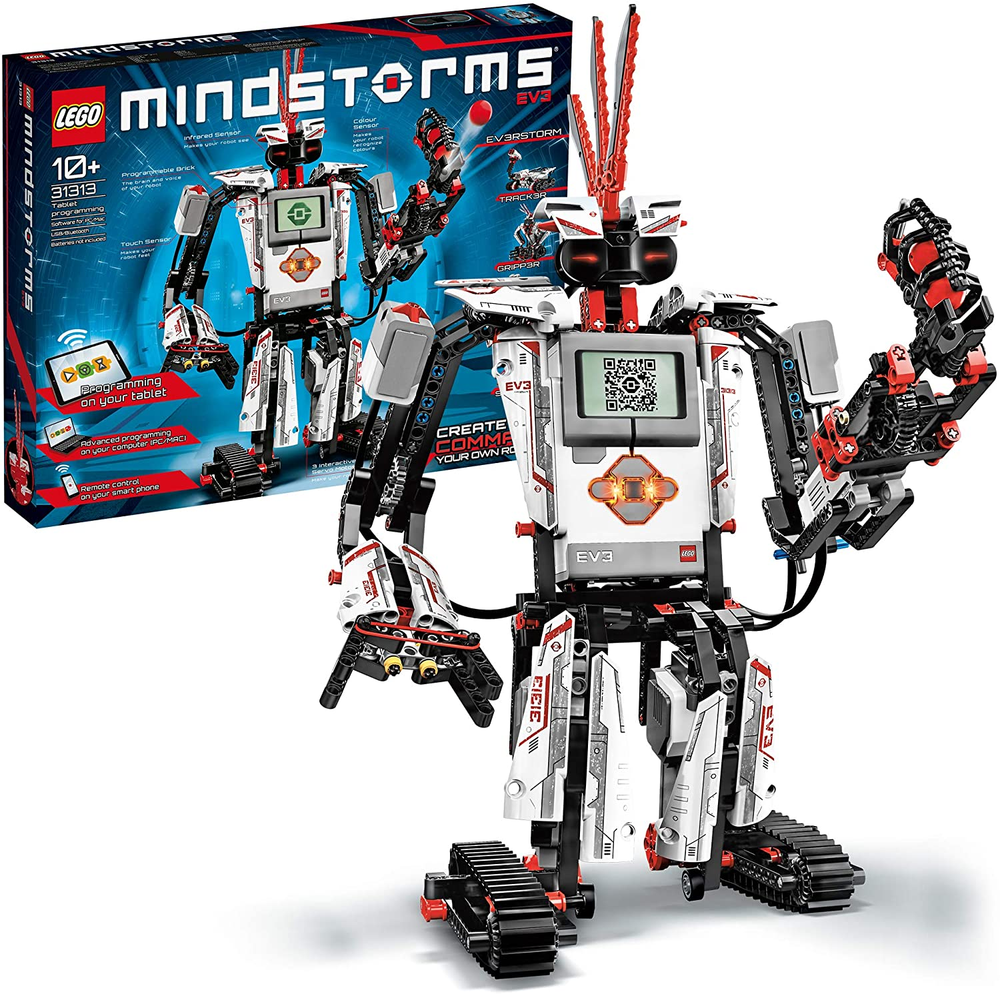

## LEGO Mindstorms bei KidsLab

LEGO Mindstorms ist quasi der große Bruder von LEGO WeDo 2.0 – und richtet sich an Kinder ab 10 Jahren, die schon ein bisschen Erfahrung mit Robotik mitbringen oder einfach Lust auf mehr haben. Während WeDo eher die Grundlagen vermittelt, geht es bei Mindstorms richtig zur Sache: komplexere Roboter, mehr Sensoren, mehr Möglichkeiten.

## Was macht Mindstorms so besonders?

Mit LEGO Mindstorms können Kinder Roboter bauen, die auf ihre Umgebung reagieren – mit Ultraschall-Sensoren, Farbsensoren und Gyroskop. Die Programmierung erfolgt blockbasiert, ist aber deutlich mächtiger als bei den Einsteigersets. Die Kids lernen dabei nicht nur, wie ein Roboter funktioniert, sondern auch grundlegende Konzepte wie Schleifen, Bedingungen und Variablen – ganz nebenbei und mit jeder Menge Spaß.

## Warum wir Mindstorms lieben

Bei uns im KidsLab nutzen wir LEGO-Robotik-Sets, um Kindern den Einstieg in die Programmierung so greifbar wie möglich zu machen. Es gibt kaum etwas Cooleres, als wenn der selbst gebaute Roboter zum ersten Mal losfährt, einem Hindernis ausweicht oder einer Linie folgt. Diese "Wow-Momente" sind es, die Kinder für Technik begeistern – und genau das ist unser Ziel.

Mittlerweile setzen wir in unseren [Lego Robotics Kursen](/kurse/lego-robotics/) vor allem auf LEGO Spike Prime, den Nachfolger von Mindstorms. Das Konzept bleibt aber das gleiche: Bauen, Programmieren, Staunen.
