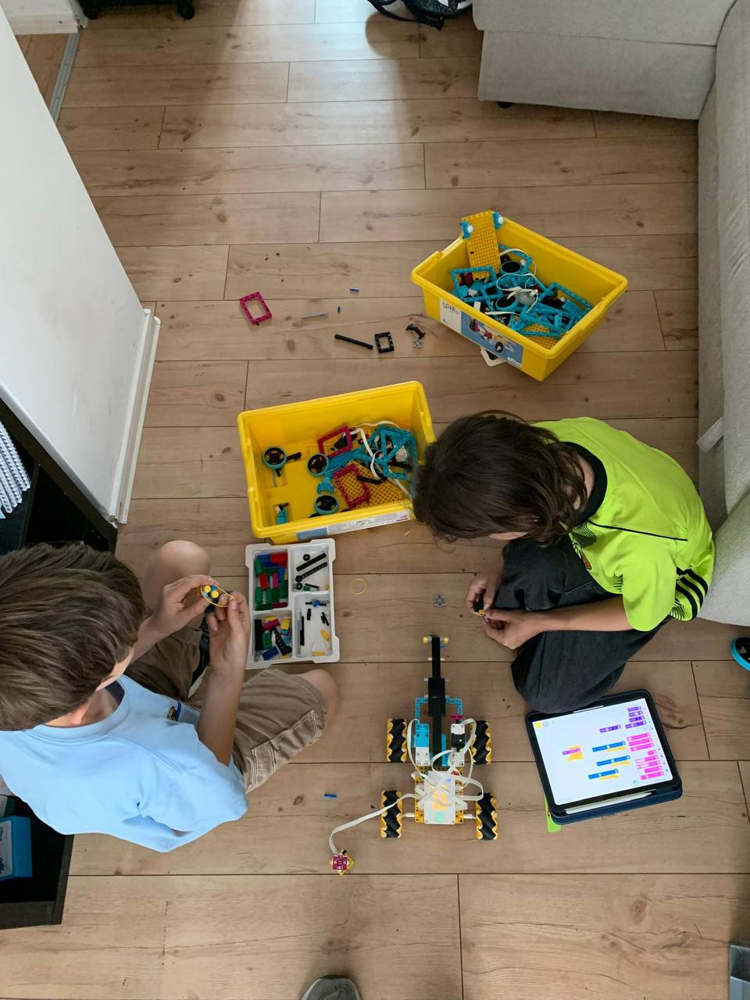
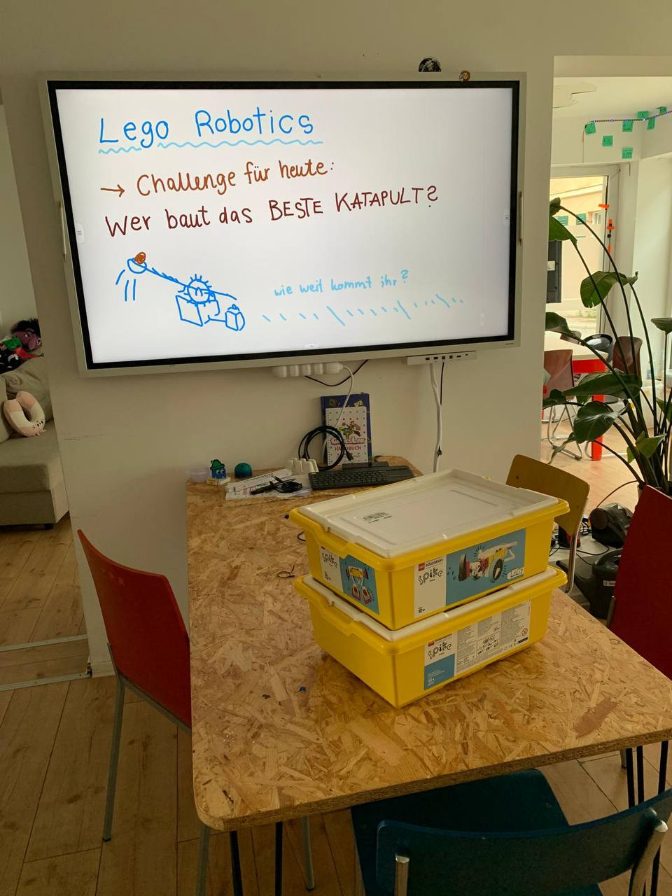

Heute gab es für unsere erfahrenen Maker eine besondere Herausforderung: **Wer baut das weitreichendste Katapult?**

Mit LEGO SPIKE Prime entwickelten die Teilnehmer eigene Konstruktionen, optimierten die Mechanik und programmierten die präzise Steuerung am Tablet. 

Nach einer Phase aus Bauen, Testen und Verfeinern folgte das Finale: Ein Wettbewerb um die maximale Weite. Physik, Programmierung und kreativer Konstruktionsgeist standen hier im Mittelpunkt.

Vielen Dank an Hannah und Konstantin sowie alle Teilnehmer für diesen spannenden Tag!


