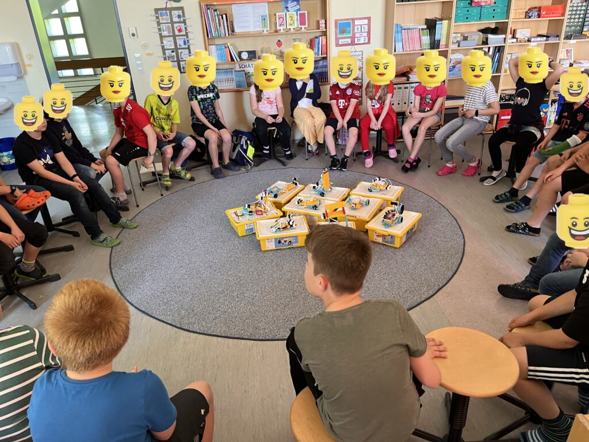
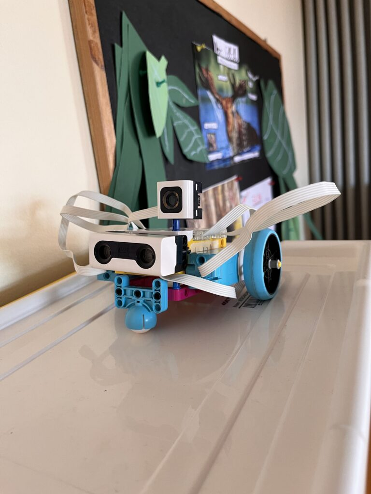
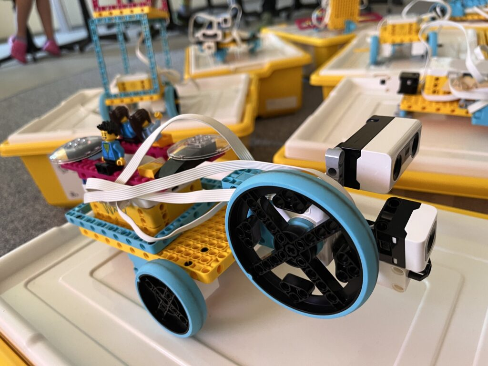
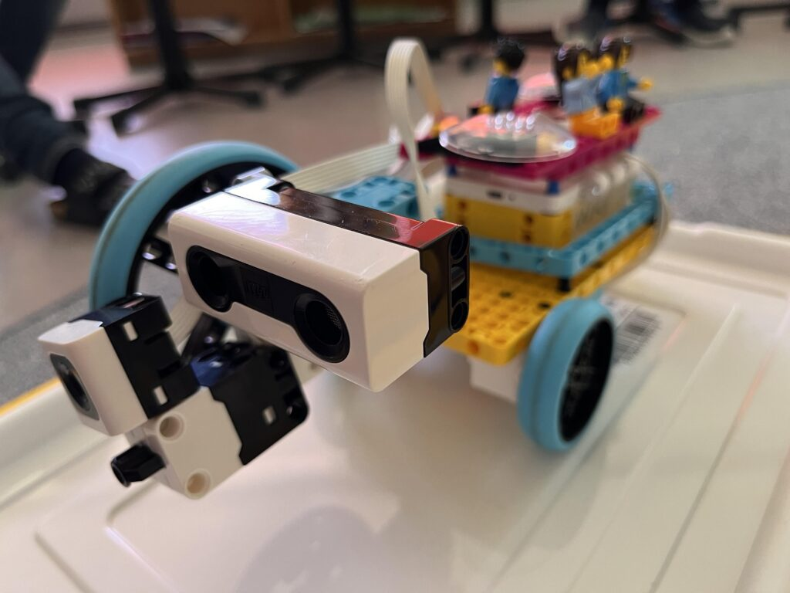
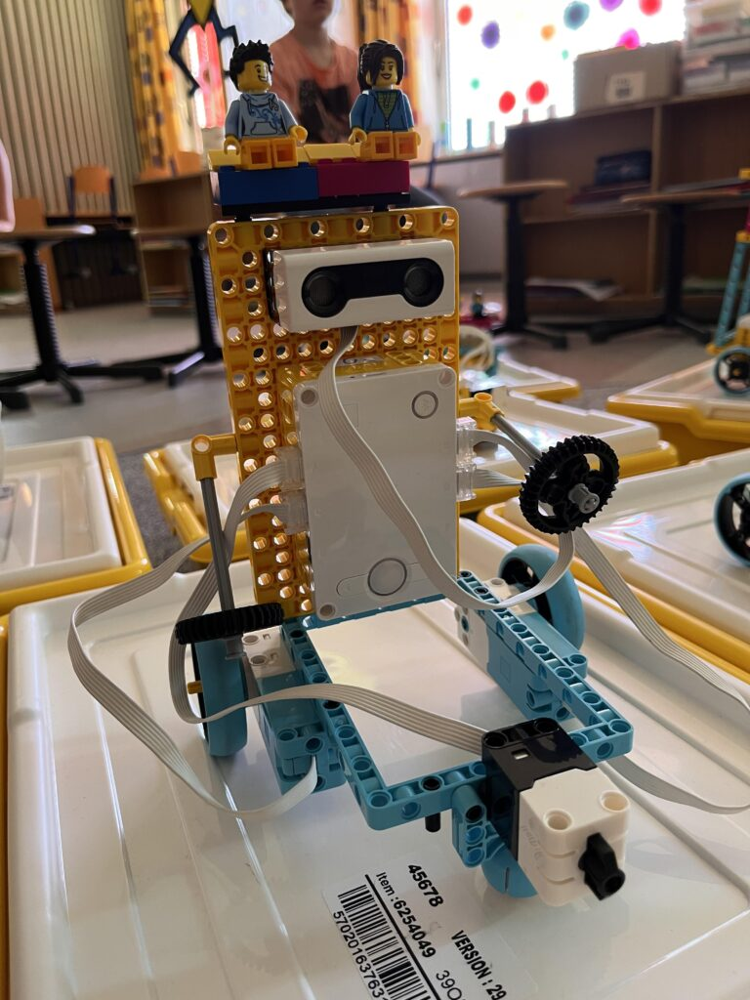
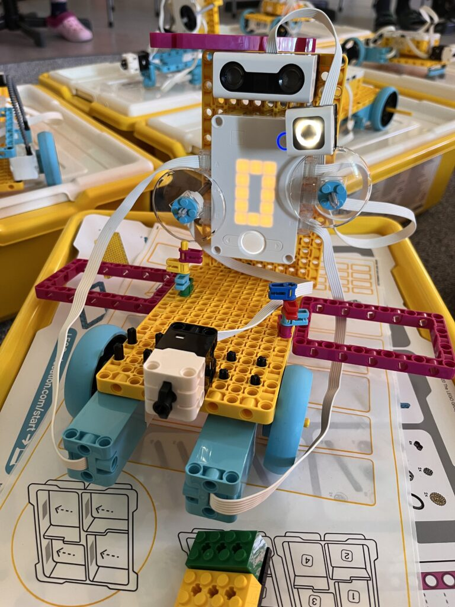

# Lego in der Grundschule Marxheim – mit Unterstützung der LEW / 3MalE

Gestern hatte ich das große Vergnügen zusammen mit der Schulleiterin und Leiterin der 4. Klasse, Frau Margraf, einen Lego-Robotics-Workshop an der Julian-Knogler-Grundschule in Marxheim durchzuführen.

Der Workshop war eigentlich nur für die 4. Klasse geplant, aber durch den Ausfall der Lehrerin der 3. Klasse haben wir spontan beide Klassen für einen großen Workshop zusammengeschmissen 🙂 so mussten sich zwar 2 statt 3 Kinder ein Lego-Set teilen, aber das hat super geklappt!

Nach einer kleinen Runde zum Thema Roboter und Programmieren sind wir dann gleich voll gestartet – die Lego-Spike Kästen kamen auf die Tische und die Kids haben den Inhalt untersucht und erforscht: Motoren, Sensoren (Entfernung, Druck, Farbe…) und natürlich das Herz (oder Gehirn?) der Roboter waren schnell gefunden und identifiziert.

Wir haben beschlossen, an diesem Tag ein autonomes Fahrzeug zu bauen: ganz Roboter, mit Sensoren und einem Programm, damit unser Roboter auch Entscheidungen treffen kann.

Ganz ungewohnt – es gab keine Anleitung! Mittlerweile besteht vieles Lego ja aus hunderten Seiten Anleitung, vielen speziellen Teilen – und die muss genau, Schritt für Schritt befolgt werden. Wir wollten den Kindern das freie Bauen, das freie Erfinden und Erkunden ermöglichen. Nach einem kurzen „Wie, ohne Anleitung?“ Haben dann doch alle losgelegt und einfach gebaut!

Das hat super geklappt, schon noch kurzer Zeit waren die ersten fahrbaren Roboter fertig und sind losgeflitzt.

Als nächsten Schritt haben wir dann noch den Abstandssensor verbaut und somit den Robotern beigebracht, Hindernissen automatisch auszuweichen und einen neuen Kurs einzuschlagen!

Zum Schluss hab es dann einen gemeinsamen Hindernis-Parcours….

Wichtig war für uns, dass die Kinder:

- Frei entdecken und versuchen können
- Die Grundlagen der Programmierung entdecken
- Verstehen, was Roboter sind und wie sie funktionieren
- … und das alles gar nicht merken, sondern dass das nebenbei passiert und sie einfach viel Spaß haben!

Herzlichen Dank an die LEW und Ihr Programm 3MalE – und natürlich an Frau Margraf für die tolle Begleitung des Programms! Die kommenden 2 Wochen können die Schülerinnen und Schüler noch mit den Kästen arbeiten, forschen und erfinden – ich bin sehr gespannt, welche tollen Roboter da noch entstehen!

<figure >

</figure>

<figure >
> (https://www.gs-marxheim.de/)

<iframe loading="lazy" sandbox="allow-scripts" security="restricted" title="„Herzlich Willkommen“ — Grundschule Marxheim" src="https://www.gs-marxheim.de/embed/#?secret=XALmLuqoN4#?secret=oYSABScH7J" data-secret="oYSABScH7J" width="500" height="282" frameborder="0" marginwidth="0" marginheight="0" scrolling="no"></iframe>

</figure>

<figure >
https://www.3male.de/

</figure>
