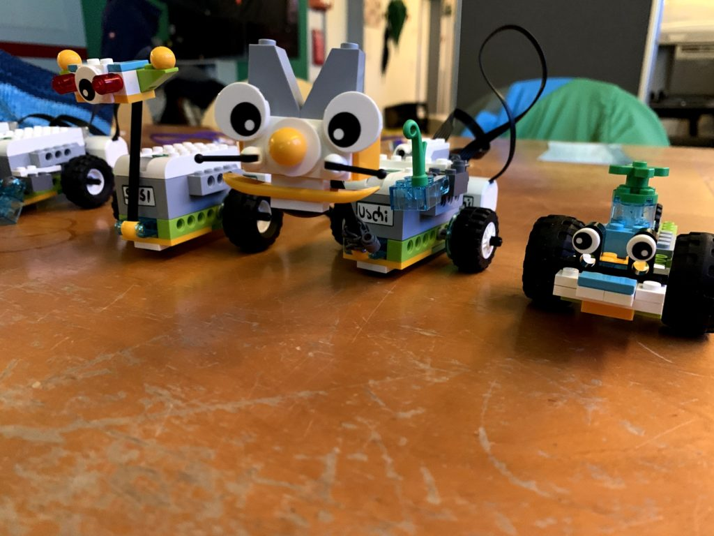
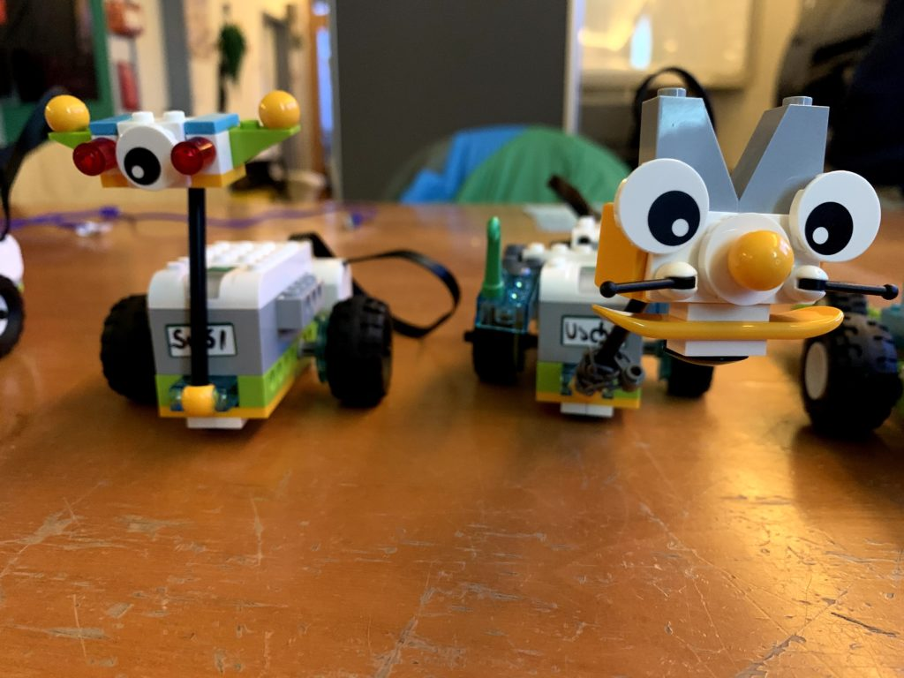
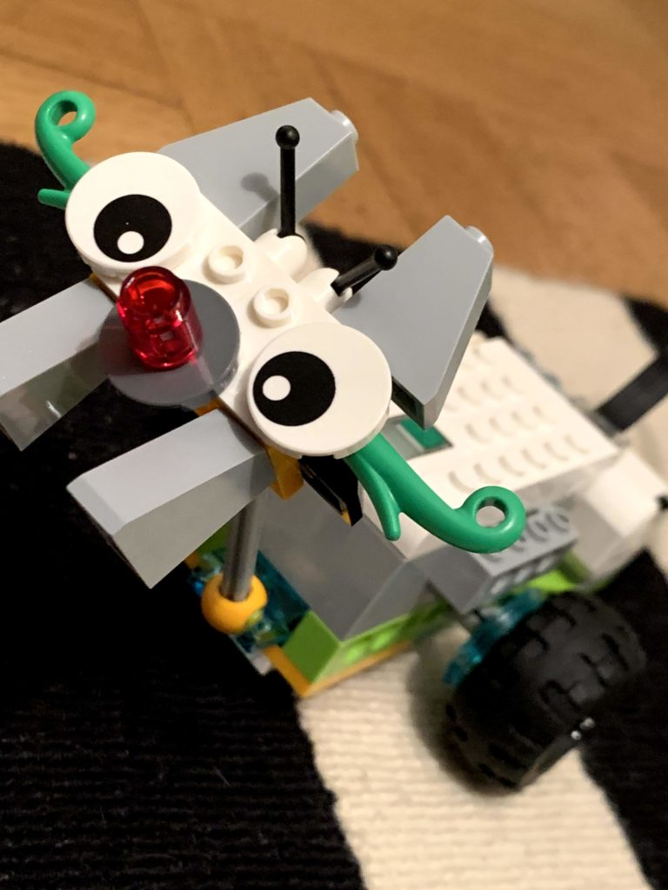
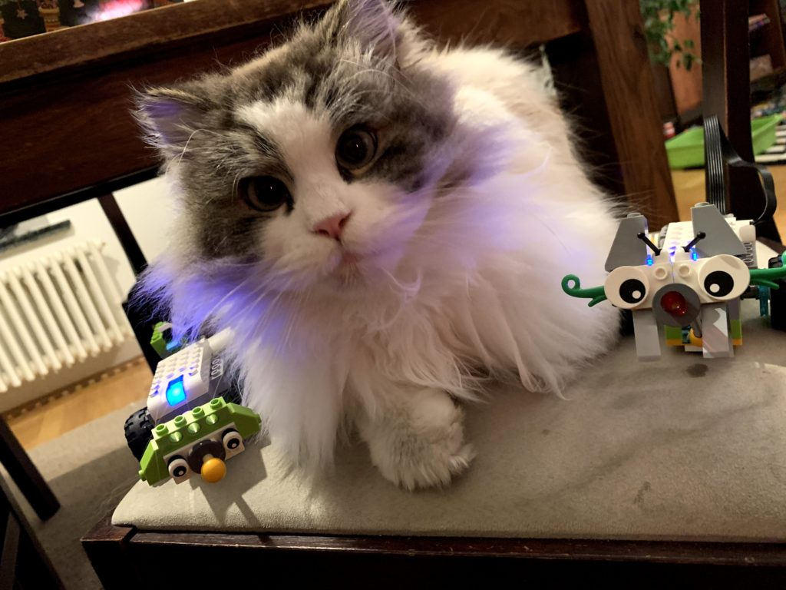
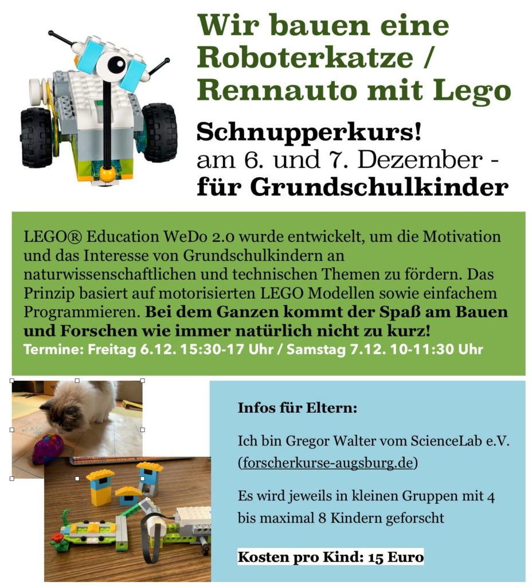
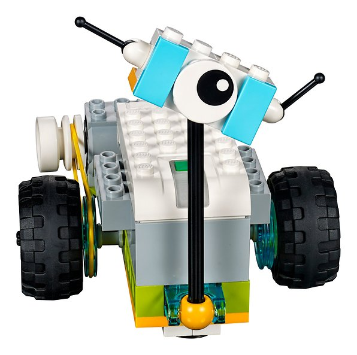

LEGO® Education WeDo 2.0 wurde entwickelt, um die Motivation und das Interesse von Grundschulkindern an naturwissenschaftlichen und technischen Themen zu fördern. WeDo 2.0 wurde für den Sachunterricht ab der zweiten bis zur vierten Grundschulklasse konzipiert. Das Prinzip basiert auf motorisierten LEGO Modellen sowie einfachem Programmieren.

Im Gegensatz zu den „größeren“ Roboter- und Programmier-Bausätzen von Lego wie MindStorms und Boost sind die Kästen und auch die Modelle bewusst sehr einfach gehalten: gerade das ermöglicht den spielerischen Einstieg in das Programmieren und hilft dabei, die Grundsätze zu verstehen.

<figure >
- 
- 
- 
- 
- 
- 

</figure>
