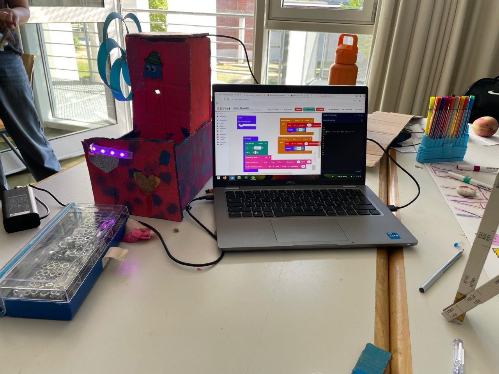
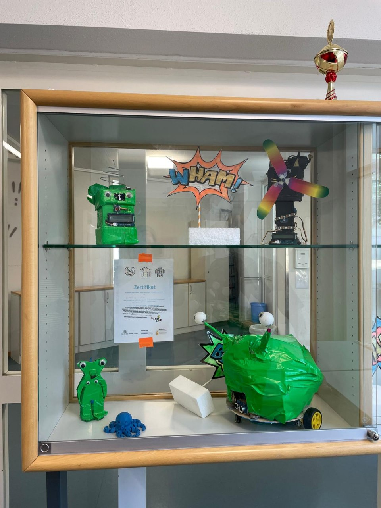
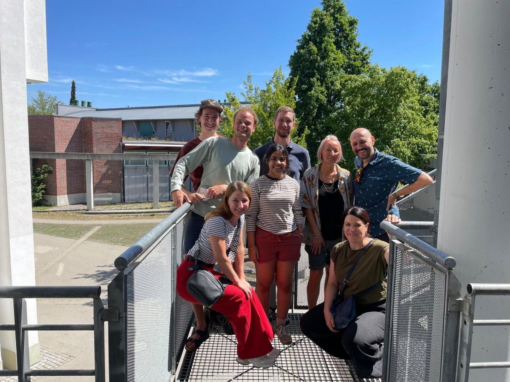
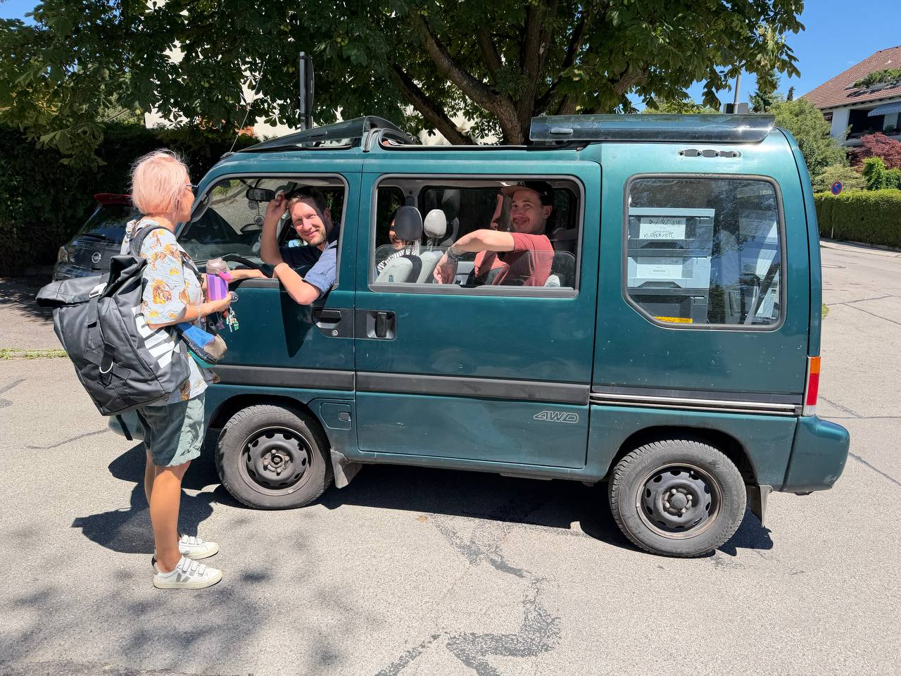

Kreativität kennt keine Grenzen – und das haben uns die Schülerinnen und Schüler an der Franziskus Schule in Gersthofen einmal mehr bewiesen. Im Rahmen von *MakeYourSchool* (MYS) waren wir wieder zu Gast, um gemeinsam zu tüfteln, zu löten und Dinge zu erschaffen, die es so vorher nicht gab.

Wir sind nun schon im dritten Jahr an der Franziskus Schule und freuen uns besonders darüber: Sie ist aktuell die einzige Förderschule in unserem gesamten MYS-Netzwerk. Dass wir hier jedes Jahr zurückkehren, liegt vor allem an einer Sache: der unglaublichen Energie, die in diesem Haus steckt.

## 17 Motivierte im Endspurt
Diesmal hatten wir 17 Schülerinnen und Schüler aus der Abschlussklasse dabei. Wer kurz vor dem Schulabschluss steht, lässt sich oft von Prüfungsstress anstecken – doch hier war das Gegenteil der Fall. Die Motivation war riesig! Mit einer Mischung aus Neugier und echtem Ehrgeiz haben die Jugendlichen an ihren Projekten gearbeitet.

Es ist faszinierend zu sehen, wie aus einfachen Materialien und ein paar Zeilen Code echte funktionierende Prototypen werden. Wenn man einen Blick auf die Projekte der letzten Jahre wirft, erkennt man erst richtig, welche Lernkurve und welche Begeisterung hier in den Räumen wohnt.

Besonders gefreut haben wir uns über den Besuch der **TÜV Süd Stiftung**, die sich ein Bild von den Fortschritten und der Begeisterung vor Ort gemacht hat. Schön zu sehen, dass solche inklusiven Initiativen Unterstützung finden und sichtbar werden.

## Teamwork macht den Dreamwork
Ein solches Event funktioniert nur, wenn das Umfeld mitzieht. Ein riesiges Dankeschön geht an die Lehrkräfte der Schule für die tolle Organisation und Vorbereitung. Und natürlich ein fettes Danke an unsere Mentoren, die mit viel Geduld, Fachwissen und Leidenschaft die Schüler unterstützt haben: **Daniel, Hille, Steff, Muntaha**. Ohne dieses Team wäre dieser Erfolg nicht möglich gewesen! Und herzlichen Dank an **Kristina und Karoline** von den TÜV SÜD Stiftung für Ihren Besuch!

## Das Highlight auf vier Rädern: Unser „neues“ (altes) Mobil
Neben den technischen Hacks gab es dieses Mal ein ganz besonderes Highlight in Sachen Hardware. Zum ersten Mal war unser neues – beziehungsweise sehr altes – Kidslab Mobil im Einsatz: Ein **Subaru Libero**!

Das gute Stück ist stolze 30 Jahre alt und bringt einen ganz eigenen Retro-Charme auf den Schulhof. Er hat bewiesen, dass er nicht nur ein nostalgischer Blickfang ist, sondern auch als perfekter Begleiter für unsere Werkzeug- und Materialtransporte funktioniert. Wer braucht schon modernste Logistik, wenn man einen Subaru Libero hat?

**Fazit:**
Es war wieder ein fantastisches Erlebnis in Gersthofen. Die Kombination aus motivierten Jugendlichen, einem starken Mentor-Team und einem kultigen Auto hat den Tag perfekt gemacht. Wir sind stolz darauf, die Franziskus Schule in unserem Netzwerk zu haben und freuen uns schon auf alles, was noch kommt!

**Stay creative!**
**Euer Kidslab-Team**
