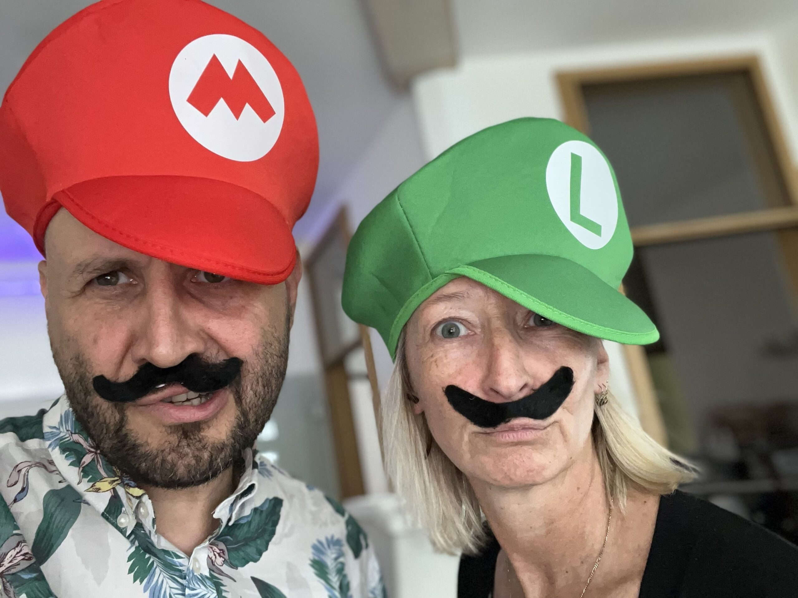

## Mario Kart – aber in echt!

Das Ulrichsfest findet direkt in der Nachbarschaft des KidsLab / OpenLab statt, beim Roten Tor in Augsburg. Und wir sind dabei – mit einer ganz besonderen Aktion: **Mario Kart Live!**

## Was ist Mario Kart Live?

Wer kennt es nicht – Mario Kart auf der Konsole macht schon riesig Spaß. Aber was, wenn man echte kleine Karts durch einen echten Parcours steuern könnte? Genau das machen wir! Mit ferngesteuerten Karts und einer selbst aufgebauten Rennstrecke bringen wir das Spielgefühl von Mario Kart in die reale Welt. Die Kinder steuern die Karts und erleben das Rennen hautnah – inklusive Kurven, Hindernissen und jeder Menge Jubel.

## KidsLab unterwegs

Aktionen wie diese sind für uns besonders wichtig: Wir wollen Kinder dort erreichen, wo sie sind – auf Stadtteilfesten, bei Veranstaltungen und mitten im Leben. Nicht jedes Kind findet den Weg in einen Programmierkurs, aber wenn plötzlich ein Mario-Kart-Parcours auf dem Straßenfest steht, ist die Neugier geweckt. Und genau das ist der erste Schritt.

Das Ganze ist natürlich **kostenlos** – einfach vorbeikommen und mitmachen. So soll es sein!
