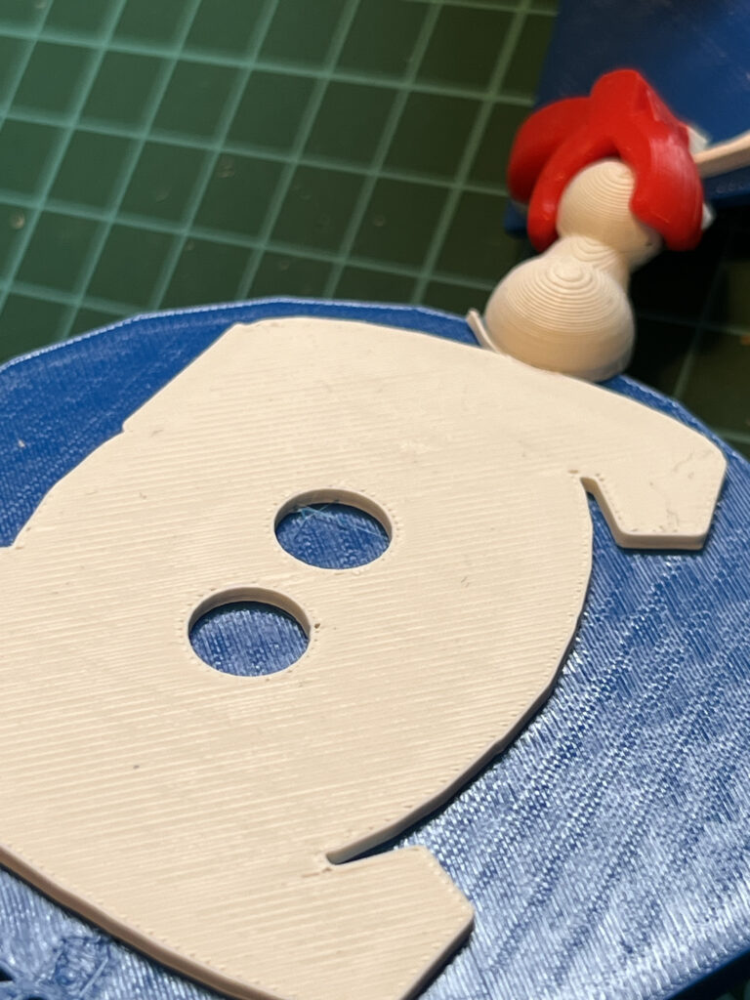
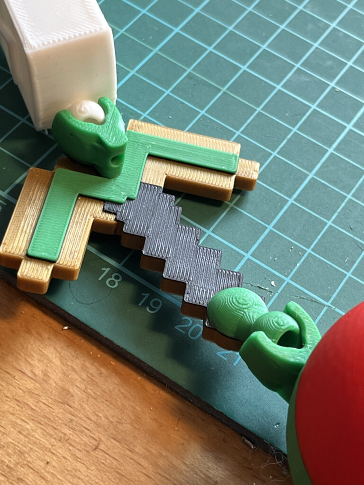
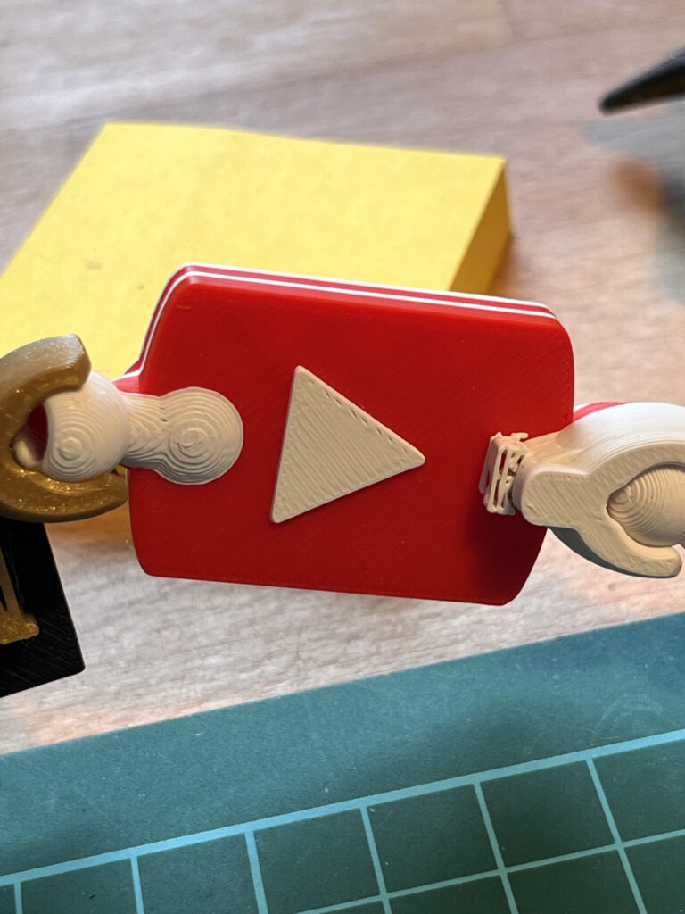
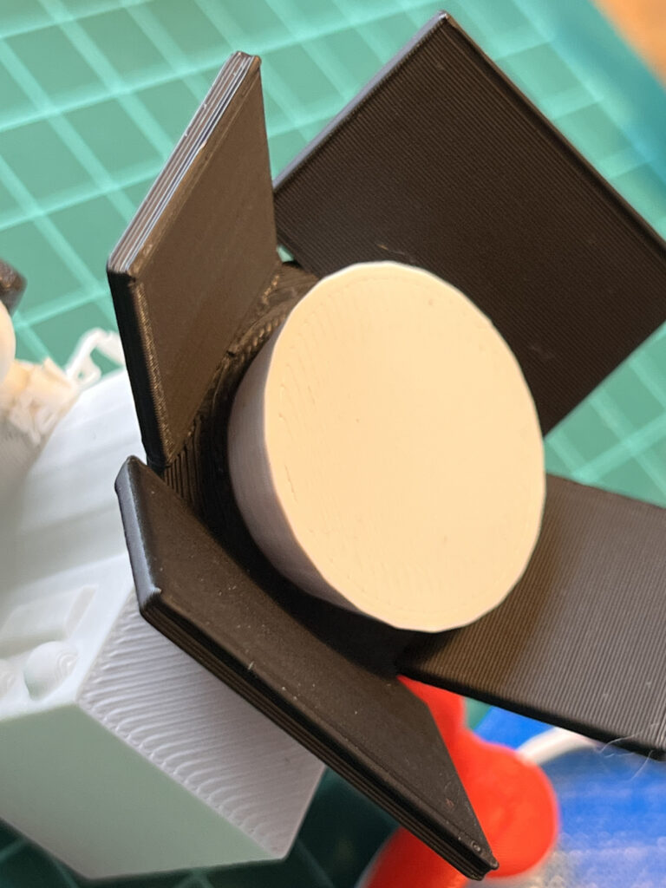
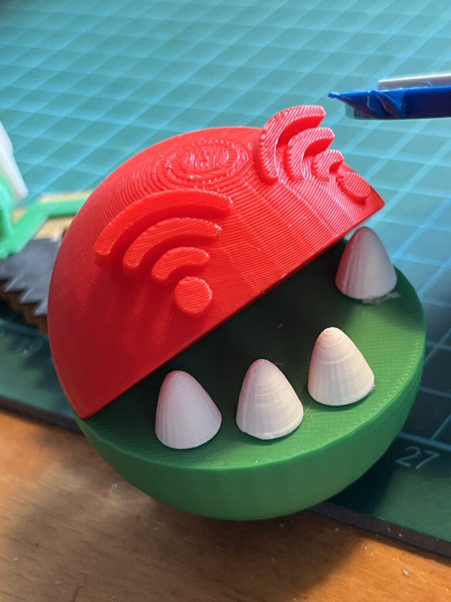
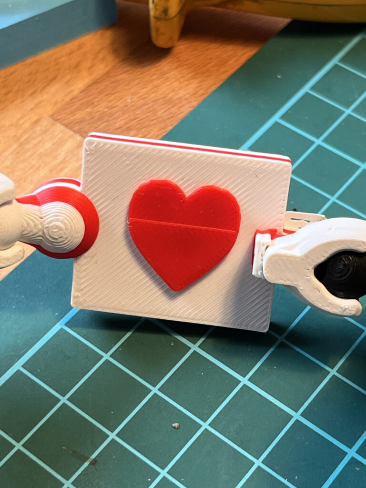
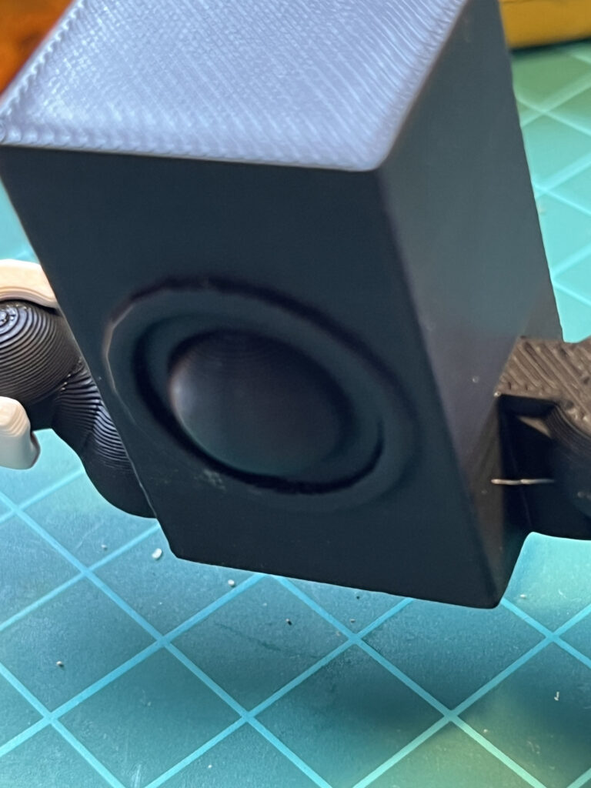
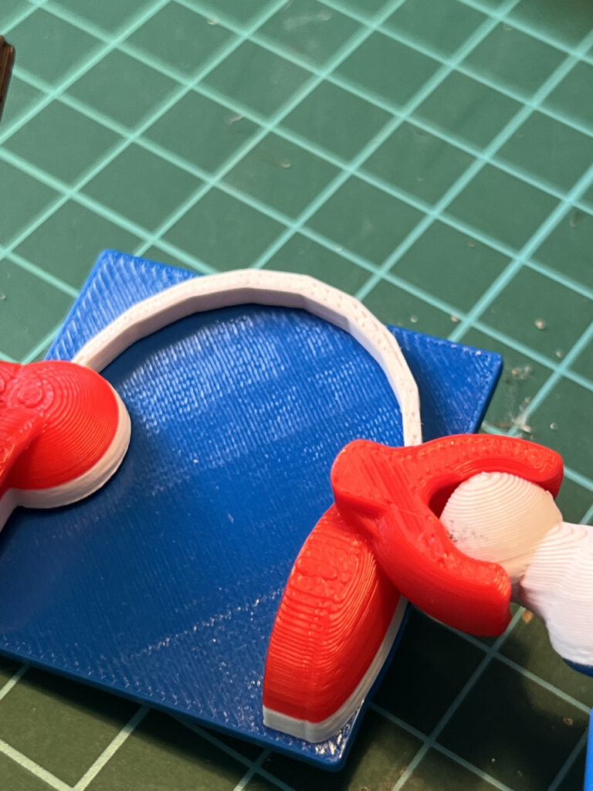

Idee für einen Workshop mit TinkerCAD und 3D-Druck: gemeinsam ein Fabeltier designen und drucken!

Gemeinsam geht’s besser! Gemäß dieses Mottos möchte ich hier eine Idee vorstellen, wie aus vielen einzelnen 3D-Entwürfen ein großes gemeinsames Kunstwerk wird. Die Idee entstand für einen Maker-Bereich auf einer kleinen Messe : Kinder und Jugendliche sollten eine Einführung in 3D-Design und -Druck erhalten. Aber was könnte man entwerfen, was den gemeinsamen Charakter und die Idee der Messe trägt? Es wurde ein Fabeltier – der [Augsburger Medienscouts](https://www.augsburg.de/umwelt-soziales/kinder-und-jugendliche/medienpaedagogik/augsburger-medienscouts)-Drache.

Eine Anleitung um diesen Workshops selber durchzuführen gibts wie immer im KidsLab-Handbuch:

(https://handbuch.kidslab.de/tinkercad/3d-team-drachen)

<figure >

</figure>
