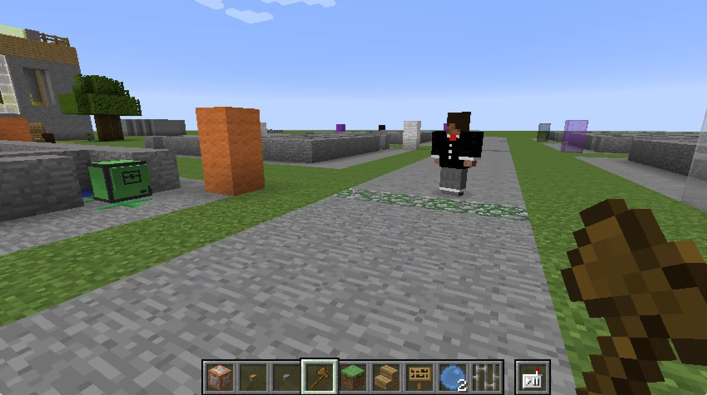
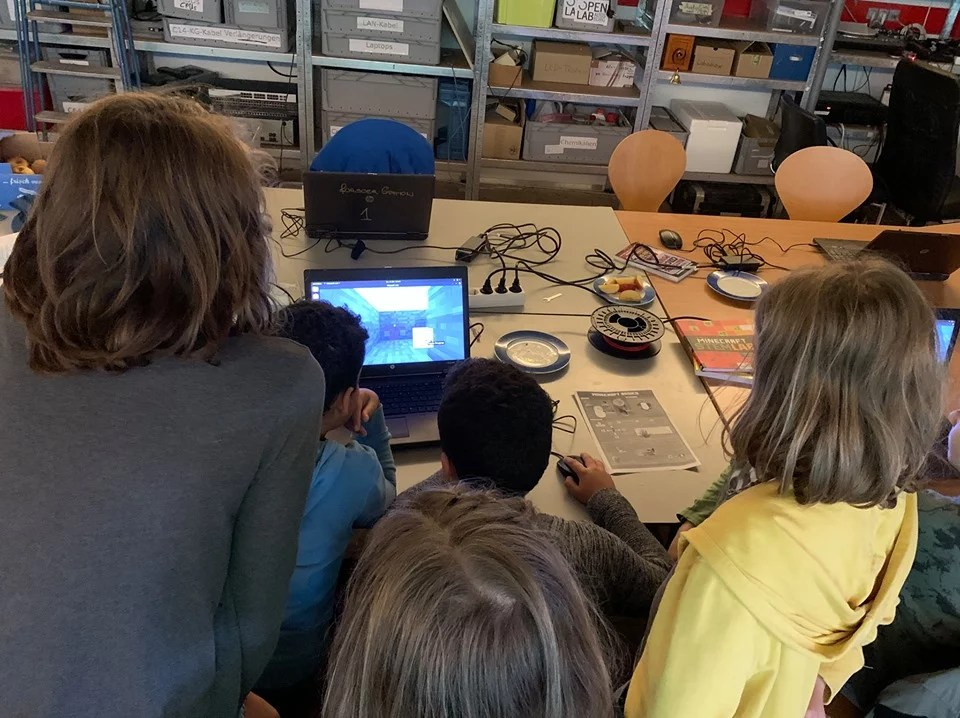
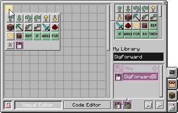

„Minecraft, das ist doch ein Spiel, da kann man doch nichts lernen?“ mag der eine oder andere wohl denken.

Das Computerspiel „Minecraft“ begeistert viele Jungen und auch Mädchen! Was die Wenigsten wissen: Mit dem Spiel kann man weit mehr, als nur bunte Klötzchen aufeinanderstapeln. 

Viele Kinder lieben „Minecraft“ – sie sind oft richtige Experten in der Welt von Alex und Steve! **Diese** **Begeisterung kann man nutzen, um Neues zu lernen**! Das geht nämlich dann am besten, wenn man gar nicht merkt, dass man was lernt, sondern einfach nur etwas Tolles baut und dabei Spaß hat!



## Installation KidsLab-Modpack

Alles nötige zum Programmieren habe ich in einem Modpack zusammengefasst. Mod-was? Wie Du den kostenlos installieren kannst erkläre ich [hier](https://handbuch.kidslab.de/minecraft/allgemeines/installation).

[Installation KidsLab-Modpack](https://handbuch.kidslab.de/minecraft/allgemeines/installation)

## Youtube-Tutorial und Live-Kurs

Auf YouTube findest Du eine Reihe von Videos, die Dir genau erklären, wie Du mit dem Programmieren beginnen kannst.

Alternativ gibt es einen Online-Live-Kurs, bei dem wir gemeinsam das Programmieren lernen.

[Online Programmieren in Minecraft](/kurse/online-programmieren-in-minecraft/)

Zu diesem Thema durfte ich Ende 2019 in Leipzig beim jährlichen Congress des CCC einen Vortrag halten:

<figure >
<iframe loading="lazy" sandbox="allow-scripts" security="restricted" title="Programmieren Lernen für Kids - in Minecraft" src="https://media.ccc.de/v/36c3-104-programmieren-lernen-fr-kids-in-minecraft/oembed#?secret=JTOpTA6MvE" data-secret="JTOpTA6MvE" width="640" height="360" frameborder="0" scrolling="no"></iframe>

</figure>

Um in Minecraft zum Beispiel Programmieren zu lernen, habe ich ein „ModPack“ erstellt, in dem einige nötigen Erweiterungen, sogenannte Mods, zusammengefasst sind. Am wichtigsten dabei ist die ComputerCraftEDU Mod, die eine programmierbare Schildkröte für die Spieler zur Verfügung stellt:

(https://www.technicpack.net/modpack/kidslab-coding-fur-kids.1713421)

