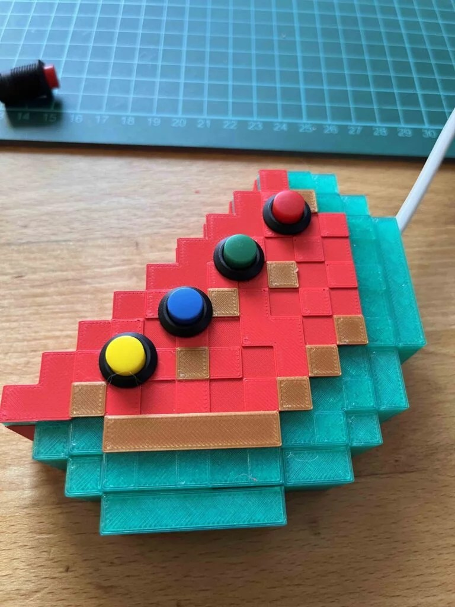
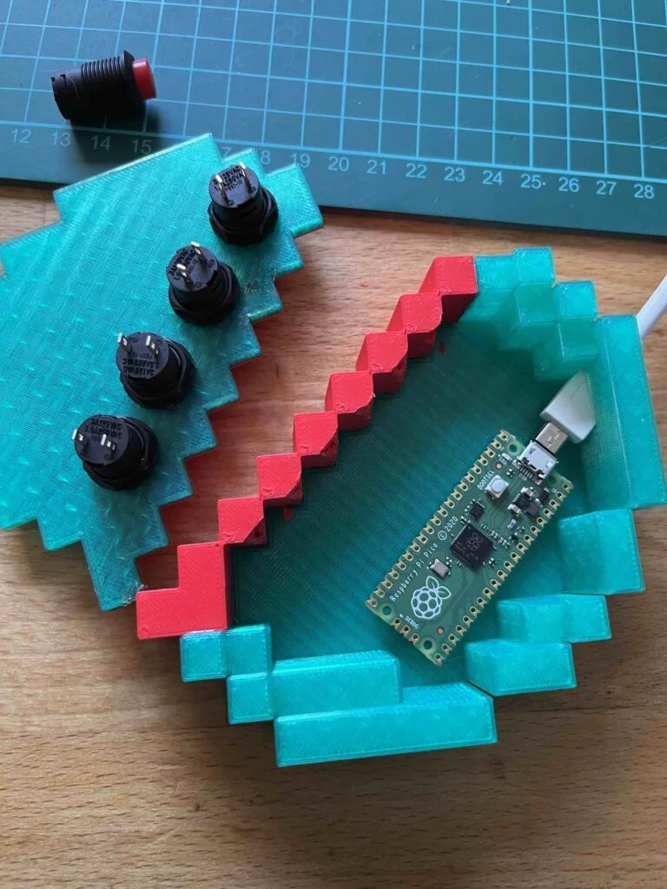
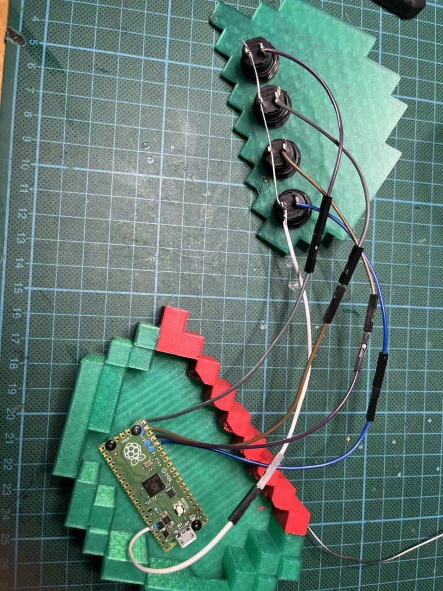
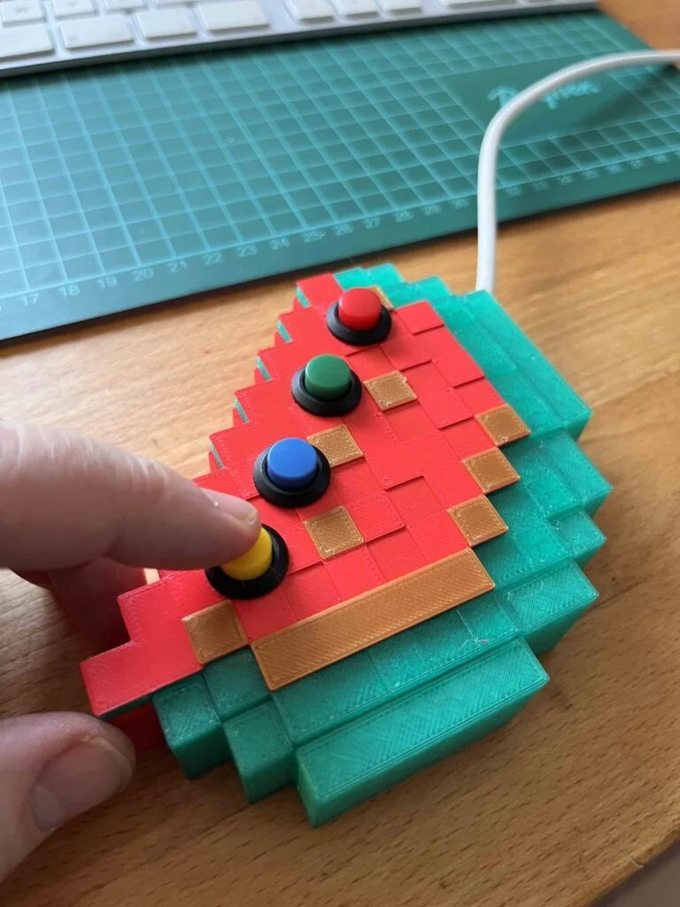
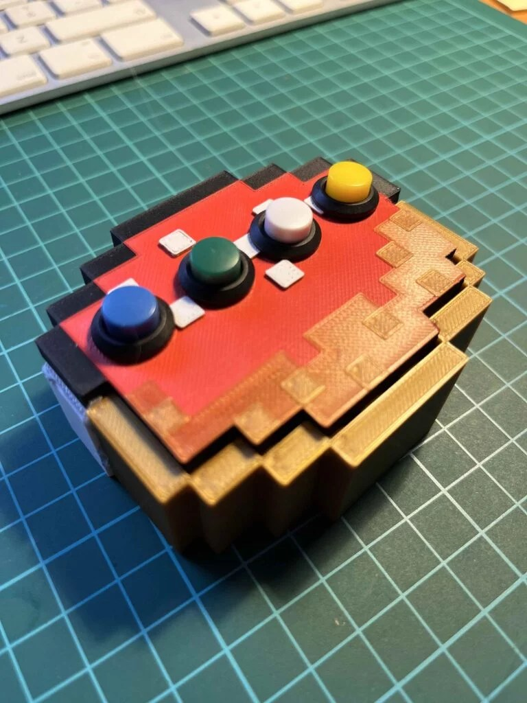

Ein kleines Wochenendprojekt für Eltern mit Ihren Kids:

- **Sei kreativ!** Entwerfe deine eigene Minecraft-Tastatur!
- **Schaltungen & Elektronik** – vorsicht, heiß! Nicht die Finger am Lötkolben verbrennen 🙂
- **Programmieren** – mit Python auf dem Raspberry Pico das passende Programm hinzufügen.

Die komplette Anleitung mit 3D-Dateien, Programm und mehr gibts auf Github:

(https://github.com/KidsLabDe/MinecraftKeyboard)



Gerne kann ich Euch beim 3D-Druck unterstützen, wenn Ihr keinen 3D-Drucker zuhause habt. Oder besucht Euren lokalen Maker- oder Hack-Space à la (http://openlab-augsburg.de/)
