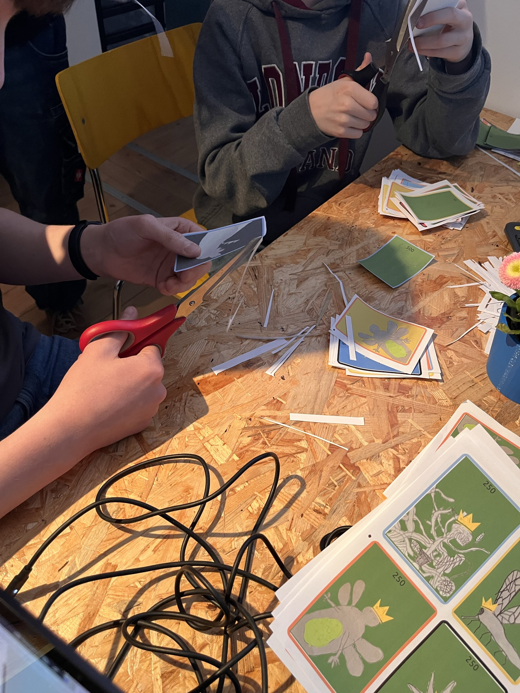
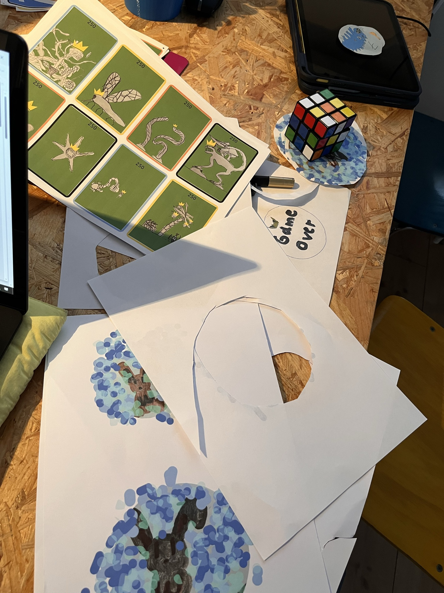
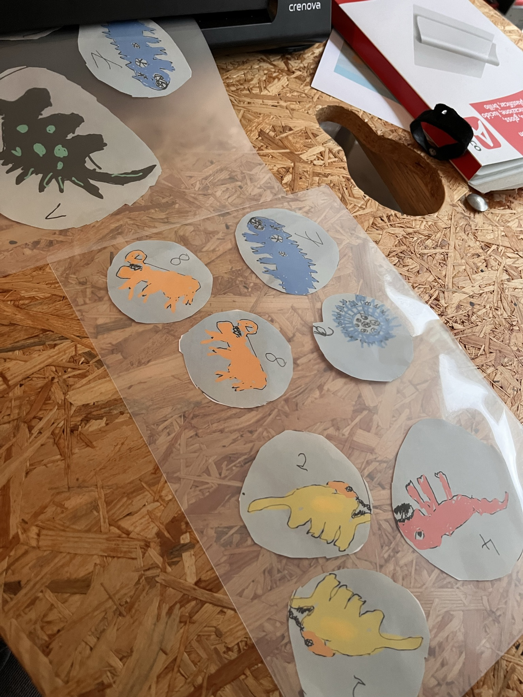
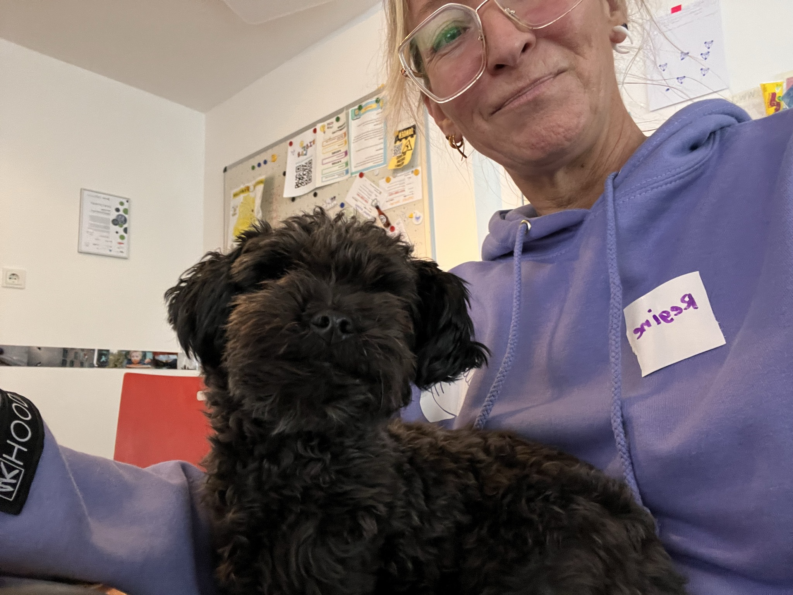

Gestern war es soweit: Der dritte **MiniMaker-Nachmittag** hat seinen krönenden Abschluss gefunden! Die Kinder hatten in den vergangenen Wochen fleißig an ihren eigenen Spielkarten gearbeitet – erst von Hand entworfen, dann digital nachbearbeitet. Jetzt endlich konnten sie die fertigen Ergebnisse in den Händen halten.

## Analog trifft Digital

Das Besondere an diesem Projekt: Es war eine echte Kombination aus **Handwerk und Digitaler Nachbearbeitung**. Die Kinder haben ihre Figuren, Monster und Spielelemente zunächst von Hand gezeichnet und gestaltet – mit Stiften, Farben und jeder Menge Kreativität. Danach wurden die Entwürfe digital überarbeitet und verfeinert, bevor sie in den Druck gingen.

Das Ergebnis: Wunderschöne, individuelle Spielkarten, die sich kein Kind alleine hätte kaufen können – weil es sie so einfach nicht zu kaufen gibt. Jede Karte ist ein Unikat, erdacht und gestaltet von den Kindern selbst.

## Ausdrucken, Laminieren, Ausschneiden!

Am Abschlusstag kam dann die aufregendste Phase: Die Karten wurden **ausgedruckt und laminiert**. Mit Scheren und viel Sorgfalt schnitten die Kinder ihre Kreationen aus – voller Stolz auf das, was sie erschaffen hatten.

Die Vielfalt der Ideen war beeindruckend: Von fantastischen Monstern über Dinosaurier bis hin zu abstrakten Wesen – die Fantasie der Kinder kannte keine Grenzen.

## Ein besonderer Gast: Hund Nero!

Für extra gute Laune sorgte ein besonderer Gast: Regine brachte ihren kleinen, süßen Hund mit ins KidsLab! Der flauschige Vierbeiner hat das Herz aller im Sturm erobert und für wohlige Pausen zwischen dem Ausschneiden und Laminieren gesorgt.

## Ein voller Erfolg!

Der MiniMaker-Nachmittag zeigt einmal mehr, wie kreativ Kinder sind, wenn man ihnen den richtigen Rahmen gibt. Das Projekt verbindet analoge Gestaltung mit digitaler Technik – und die Kinder nehmen am Ende etwas nach Hause, das wirklich von ihnen stammt: ihr eigenes Kartenspiel.

Wir freuen uns schon auf den nächsten MiniMaker-Nachmittag!
