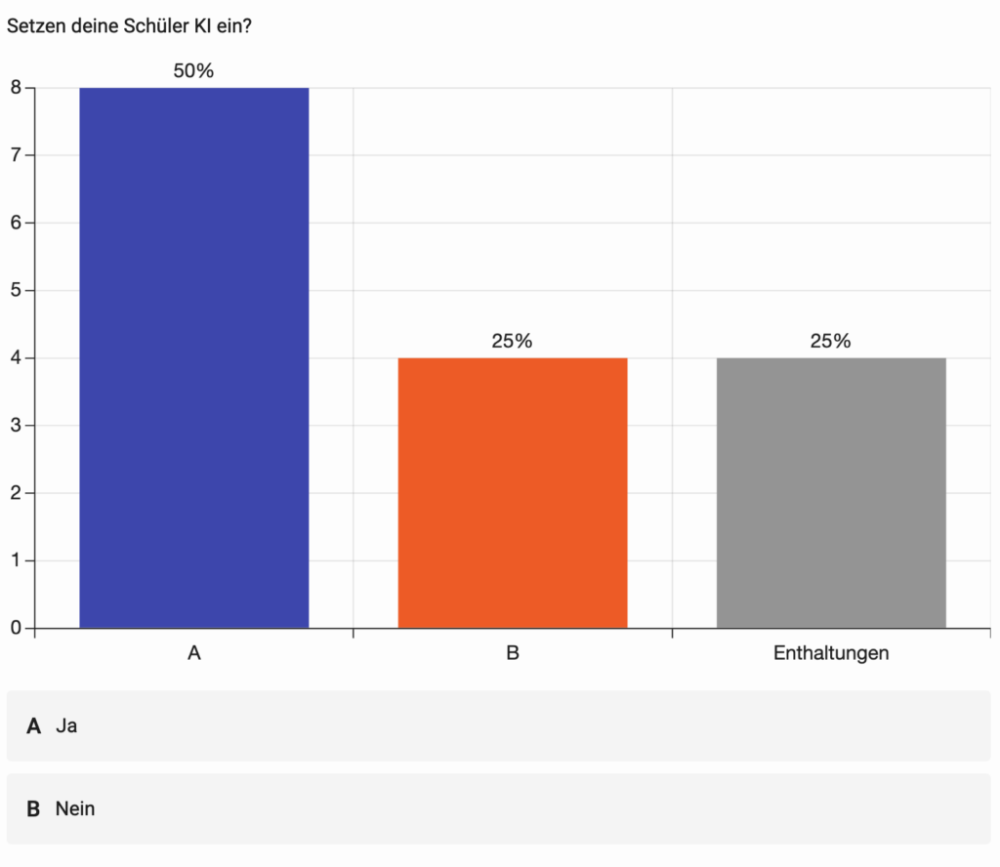
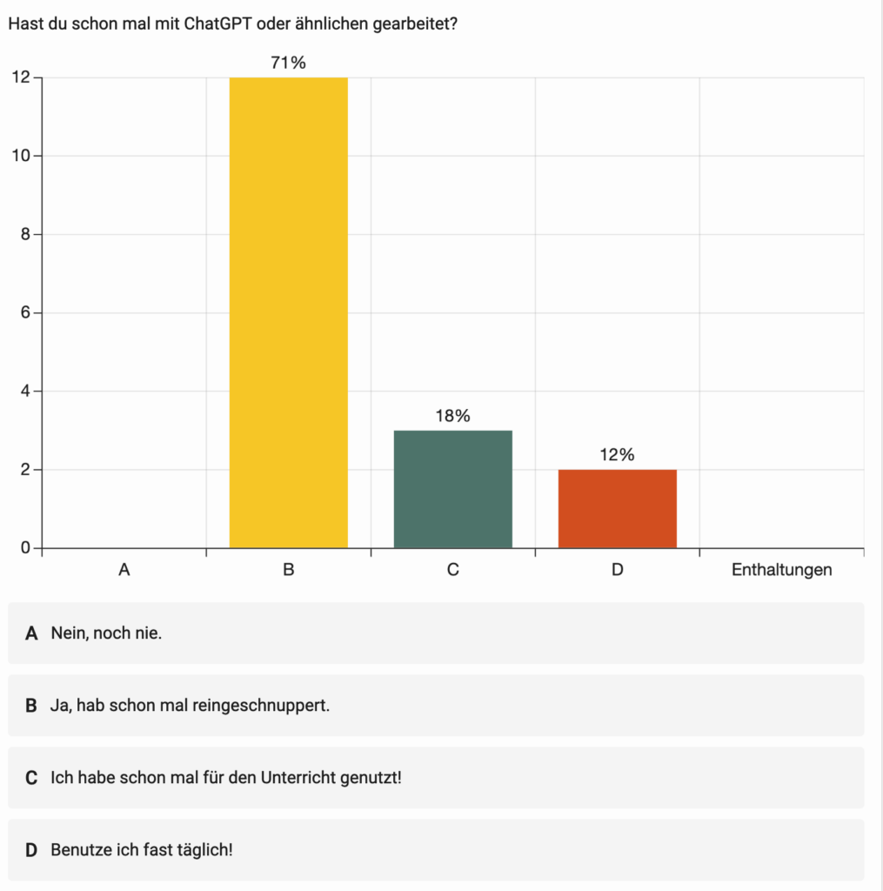
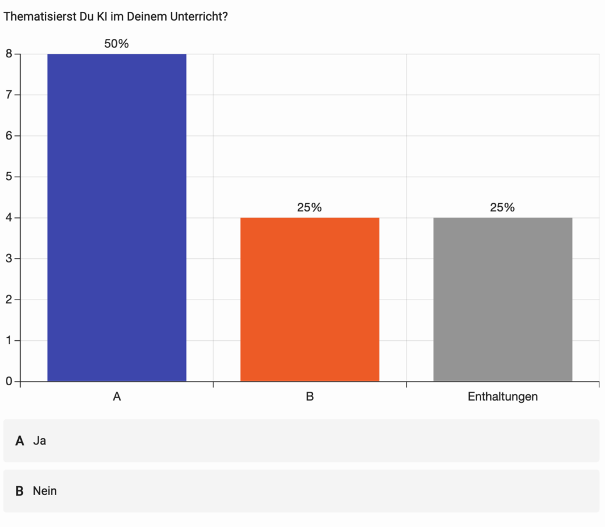
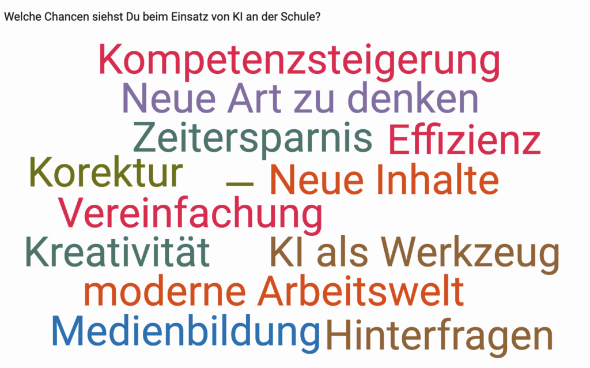
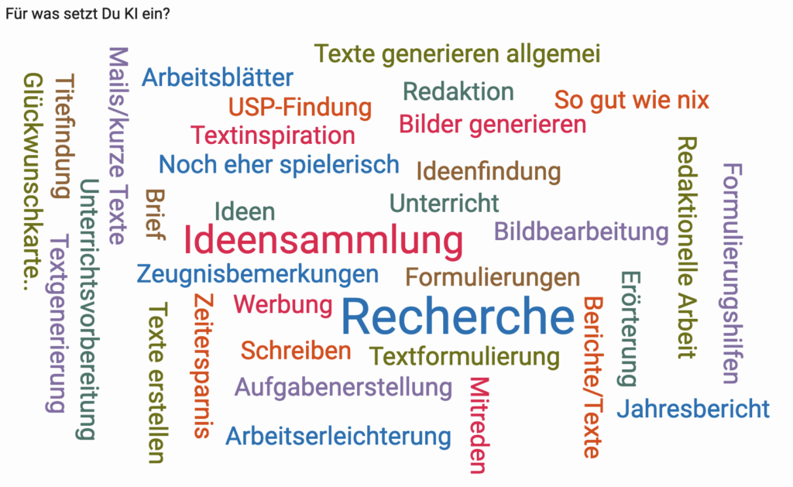
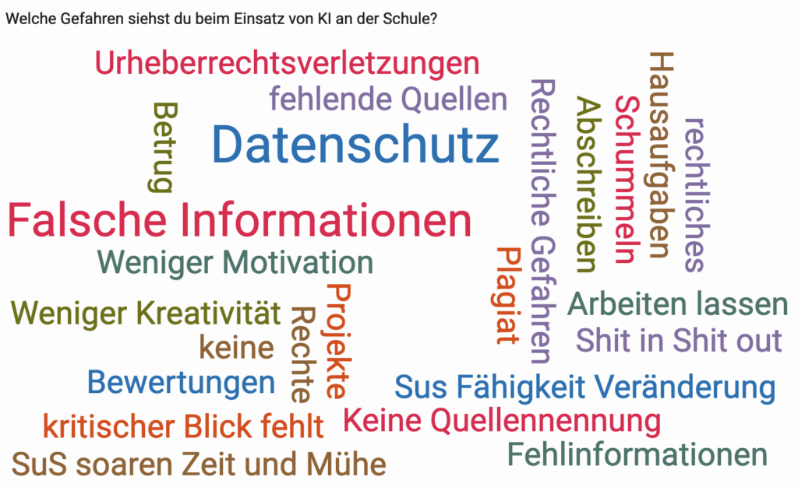

Der technologische Fortschritt hat das Potenzial, das Bildungswesen zu revolutionieren. Künstliche Intelligenz (KI) steht an der Spitze dieser Revolution, indem sie Lehrkräften Werkzeuge an die Hand gibt, **die Zeit sparen und den Unterricht effektiver gestalten**. In unserem kürzlich durchgeführten Workshop haben wir uns genau damit beschäftigt: *Wie kann KI im Schulalltag eingesetzt werden, um Lehrerinnen und Lehrer zu unterstützen?*

## **Zeitersparnis durch KI-Tools**

Wir beleuchten verschiedene KI-Tools, die Lehrkräfte bei der V**orbereitung und Durchführung ihres Unterrichts unterstützen**. Viele Lehrer schrecken noch vor der Nutzung von KI-Systemen zurück: einerseits gibt es Berührungsängste, andererseits Unsicherheiten bezüglich der rechtlichen Lage und des Datenschutzes.

## **Verbesserung des Unterrichts durch personalisiertes Lernen**

KI ermöglicht personalisiertes Lernen, das auf die Bedürfnisse und Fähigkeiten jedes einzelnen Schülers zugeschnitten ist. Wir diskutieren, wie KI-basierte Werkzeuge Lehrkräften helfen können, individuelle Lerninhalte erstellen können und den Unterricht damit individueller zu gestalten.

## **Praktische Anwendung von KI im Schulalltag**

Anhand von Fallbeispielen und Erfahrungen aus unserem Workshop zeigen wir auf, wie Lehrkräfte KI-Tools praktisch im Unterricht einsetzen können. Wir teilen Erfolgsgeschichten und Herausforderungen, die beim Einsatz dieser Technologien in realen Bildungsumgebungen aufgetreten sind. Wir sprechen über persönliche Erfahrungen und Ideen der Lehrkräfte.

## **KI im Klassenzimmer – Ein offenes Gespräch statt ein Tabuthema**

In diesem Teil des Workshops befassen wir uns mit der Wichtigkeit der **offenen Kommunikation über KI im Bildungsbereich**. Es ist essenziell, dass Lehrkräfte und Schülerinnen und Schüler gemeinsam über die Rolle und die Auswirkungen von KI im Unterricht und darüber hinaus diskutieren. Wir geben Tipps und Methoden an die Hand, wie Lehrkräfte das Thema KI auf eine zugängliche und interessante Weise in den Unterricht integrieren können, um eine fundierte und kritische Auseinandersetzung mit dieser Technologie zu fördern.

Wir denken, dass es sehr wichtig es ist, Mythen und **Missverständnisse über KI zu entkräften und eine Kultur der Offenheit und Neugier zu schaffen**. Dieser Abschnitt enthält auch **Vorschläge für interaktive Projekte und Diskussionen**, die Lehrkräfte nutzen können, um das Thema KI in den Unterricht einzubinden und ein Bewusstsein für dessen ethische und gesellschaftliche Implikationen zu schaffen.

## **Rechtliche Betrachtungen beim Einsatz von KI im Bildungsbereich**

Ein weiterer wichtiger Aspekt, den unser Workshop beleuchtet, ist die rechtliche Dimension des Einsatzes von KI in Schulen. Dieser Teil behandelt wichtige Gesetzgebungen und Datenschutzbestimmungen, die bei der Implementierung von KI-Technologien im Bildungsbereich berücksichtigt werden müssen.

**Wichtige rechtliche Aspekte:**

- **Datenschutz und Schutz persönlicher Informationen:** Wie sichergestellt wird, dass KI-Systeme im Einklang mit Datenschutzgesetzen wie der DSGVO (Datenschutz-Grundverordnung) arbeiten.

- **Transparenz und Zustimmung:** Die Bedeutung der Transparenz bei der Verwendung von KI-Tools und die Notwendigkeit, Zustimmungen von Eltern und Erziehungsberechtigten einzuholen.

- **Ethik und Nichtdiskriminierung:** Richtlinien zur ethischen Nutzung von KI, einschließlich der Vermeidung von Voreingenommenheit und Diskriminierung.

- **Verantwortlichkeit und Kontrolle:** Wer trägt die Verantwortung für Entscheidungen, die von KI-Systemen getroffen werden, und wie Lehrkräfte die Kontrolle über den Einsatz dieser Technologien behalten.

Wir behandeln diese Themen nicht nur theoretisch, sondern bieten auch praktische Leitlinien und Ressourcen, um Schulen dabei zu unterstützen, diese rechtlichen Anforderungen zu erfüllen und verantwortungsvoll mit KI umzugehen.

Besonders hier zu empfehlen ist die Handreichung „Künstliche Intelligenz im Unterricht“:

(https://digitale-schule.hessen.de/unterricht-und-paedagogik/handreichung-kuenstliche-intelligenz-ki-in-schule-und-unterricht)

# **Bringen Sie den KI-Workshop an Ihre Schule**!

Wir sind überzeugt von der Bedeutung und dem Nutzen unseres Workshops zum Thema KI im Bildungsbereich und möchten diese wertvolle Erfahrung mit so vielen Schulen wie möglich teilen. Deshalb bieten wir an, diesen Workshop auch an Ihrer Schule durchzuführen. Dies ist eine hervorragende Gelegenheit für Lehrkräfte, Schulleiter und Bildungspersonal, sich tiefgreifend mit den Möglichkeiten von KI im Unterricht auseinanderzusetzen.

### **Was bietet der Workshop?**

- Detaillierte Einblicke in die Anwendung von KI im Bildungsbereich.

- Praktische Demonstrationen von KI-Tools, die im Unterricht eingesetzt werden können.

- Interaktive Übungen, um das Potenzial von KI für personalisiertes Lernen zu erkunden.

- Diskussionen über ethische Überlegungen und die Zukunft der Bildung mit KI.

- Unterstützung für Lehrkräfte, um KI als offenes Gesprächsthema im Unterricht zu integrieren.

### **Warum sollten Sie den Workshop an Ihre Schule holen?**

- Erhöhen Sie das Bewusstsein und Verständnis für KI unter Lehrkräften und Schülern.

- Fördern Sie eine proaktive Haltung gegenüber neuen Technologien im Bildungsbereich.

- Nutzen Sie die Gelegenheit, sich mit Experten auszutauschen und individuelle Fragen zu klären.

- Ermöglichen Sie Ihrer Schule, an der Spitze der Bildungsinnovation zu stehen.

Für weitere Informationen und zur Buchung des Workshops kontaktieren Sie uns bitte. Wir freuen uns darauf, mit Ihrer Schule zusammenzuarbeiten, um die Bildung für die Zukunft zu gestalten.

## Ergebnisse einer Umfrage

Während des Workshops haben wir eine anonyme Umfrage unter den Teilnehmern durchgeführt, um den aktuellen Stand, Ideen, Befürchtungen und Chancen auszuleuchten.

>
Feedback zum Workshop einer Teilnehmerin

Der Lehrer-Workshop „K.I. – nützliche Tools für Lehrer im Unterricht“ mit Gregor Walter, ausgerichtet vom Auer Verlag in der AAP Lehrerwelt, war eine bereichernde Erfahrung. Die präsentierten Tools erwiesen sich als äußerst nützlich für den Unterrichtsalltag. Besonders herausragend waren die praktischen Einheiten, in denen wir das Erstellen von Rätseln, das Verfassen von kreativen Geschichten sowie das Schreiben von Berichten und kurzen Texten intensiv behandelt haben. Diese praxisnahen Inhalte ermöglichen später im Unterrichtseinsatz den Schülern ein eigenständiges Arbeiten und schaffen auch für Lehrkräfte  eine interaktive Lernerfahrung.

Darüber hinaus war es erfreulich zu erleben, dass vor allem wir Lehrkräfte großen Spaß daran hatten, das theoretisch Gelernte in die Praxis umzusetzen. Diese praktische Anwendung half dabei, eventuelle Hemmungen gegenüber K.I. abzubauen und ein positives Verhältnis zu diesen neuen Technologien aufzubauen. Insgesamt war die Veranstaltung am 8. November in den Räumlichkeiten der Lehrerwelt nicht nur informativ, sondern auch inspirierend für die zukünftige Integration von K.I.-gestützten Tools in meinen Unterricht. Diese Fortbildung kann ich jedem nur wärmstens empfehlen.

<cite>Anina Scheel</cite>

#### Hinweis: Dieser Blogeintrag wurde mit Hilfe von ChatGPT erzeugt.
