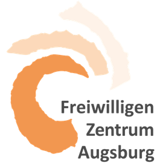
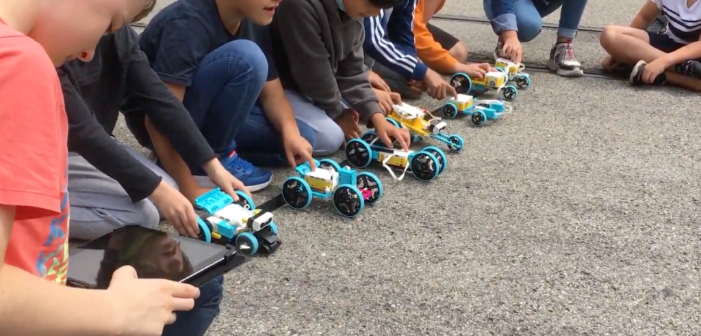
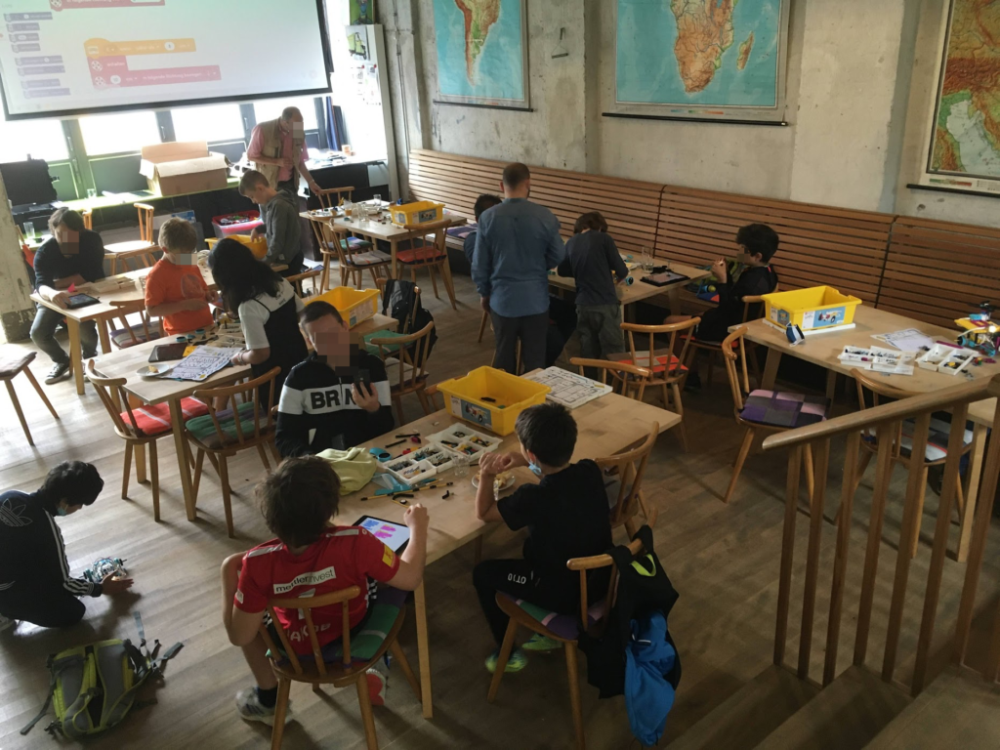

In den Sommerferien 2021 bot die KidsLab gGmbH in Kooperation mit(https://tuerantuer.de/), dem(https://www.fill.de/), dem (https://www.freiwilligen-zentrum-augsburg.de/) und ehrenamtlichen Helfern aus der Region Augsburg ein Feriencamp für Kinder und Jugendliche an.

![https://lh3.googleusercontent.com/Igzaz2MCGeWRmepT_TgYQnmLuNx1a--Ljt16jsEWQYZK9nr4JjXBV2ePBeFmAAHB-L0NkwudNV2EtNwfbxnCMesHDS21pavvw1VYDmaBfOqBe-mQc0xi-knvM9AqEZ_5OyHMtvx_Ye1CuGpx4zOzDYmYYNbOZl_TSmn2UkC2psWrAw3d5Qq-K0jVFA7eYk10zv0SOaFPOc-qYUoeDcEMeb7ScQd6W6rFUfLbMWclINsl_H6TTOrjVOJK1mbM5syFhH05wZeCnGy4Jyl8zqCNzMyM_u3yJcrfqYQ6SgGOKTkiUZ__2aehi3b57Zi6Ixtsb_HOeGRIVaIKsyeRY9Nd14EL1Jnx0NZZHON-YLLM1Sb3sW3bPsXRUeGNnzw_ST6TuCbQtXDJL7fK4zoJyHz3QstfQmenuCaFZ8x9JLsv8VwTpHVjMq1dui7AaoDScyXHmcRIOroraz1Eyo61U3ff520t-AyCZjmXtH5W5WobK8creD7lCk-fK7lAZhOD9_L9TWHCrerzipTNOrOcgb-4WD9-LeQjy5g_bvHxx9rQ_YKpX1swmbzRoCFK5V188dWUa9qIDHAdqCI0DpIVm_XrtvLXUiHVB-JJAnrUrNnmY24ongaNzImSPfz2fQdvG7qdjM8QeCEJyqR2fqSsGnAaUXL8hq6eEBlbOPpGKlpbRgp_tnmLYTPW1TK76-AsjB3ZFHg-XsfDIfjniRTC63iMr-bZVA=s1440-no?authuser=0](https://lh3.googleusercontent.com/Igzaz2MCGeWRmepT_TgYQnmLuNx1a--Ljt16jsEWQYZK9nr4JjXBV2ePBeFmAAHB-L0NkwudNV2EtNwfbxnCMesHDS21pavvw1VYDmaBfOqBe-mQc0xi-knvM9AqEZ_5OyHMtvx_Ye1CuGpx4zOzDYmYYNbOZl_TSmn2UkC2psWrAw3d5Qq-K0jVFA7eYk10zv0SOaFPOc-qYUoeDcEMeb7ScQd6W6rFUfLbMWclINsl_H6TTOrjVOJK1mbM5syFhH05wZeCnGy4Jyl8zqCNzMyM_u3yJcrfqYQ6SgGOKTkiUZ__2aehi3b57Zi6Ixtsb_HOeGRIVaIKsyeRY9Nd14EL1Jnx0NZZHON-YLLM1Sb3sW3bPsXRUeGNnzw_ST6TuCbQtXDJL7fK4zoJyHz3QstfQmenuCaFZ8x9JLsv8VwTpHVjMq1dui7AaoDScyXHmcRIOroraz1Eyo61U3ff520t-AyCZjmXtH5W5WobK8creD7lCk-fK7lAZhOD9_L9TWHCrerzipTNOrOcgb-4WD9-LeQjy5g_bvHxx9rQ_YKpX1swmbzRoCFK5V188dWUa9qIDHAdqCI0DpIVm_XrtvLXUiHVB-JJAnrUrNnmY24ongaNzImSPfz2fQdvG7qdjM8QeCEJyqR2fqSsGnAaUXL8hq6eEBlbOPpGKlpbRgp_tnmLYTPW1TK76-AsjB3ZFHg-XsfDIfjniRTC63iMr-bZVA=s1440-no?authuser=0)

In unserem Feriencamp Sommer 2021 konnten Kinder und Jugendliche erste Erfahrungen im Bereich  Robotik sammeln. Mit den Baukästen von LEGO® Education wurden kleine Roboter konstruiert und  dann am Laptop oder Tablet programmiert, sodass der Roboter zum Beispiel eine vorher bestimmte Strecke abfährt oder auf bestimmte Signale reagiert. Dazu haben wir verschiedene Sensoren  eingebaut, um dann dem LEGO®-Roboter beizubringen, an Hindernissen anzuhalten und die Richtung  zu wechseln. Die Vorgehensweise war einfach: Es wird erstmal überlegt, gebaut und dann das gebaute  Modell durch Programmierung „zum Leben erweckt“. 

Das besondere an unserem Workshops: Wir haben junge Menschen zusammengebracht, die sich sonst eher selten begegnen: **die Hälfte der Teilnehmer waren geflüchtete Jugendliche, die erst seit kurzen in Augsburg und Deutschland sind. **Besonders in der Sommerzeit ist es trist in den Unterkünften – da war unser Feriencamp eine mehr als willkommene Abwechslung!

## Gemeinsam Bauen und Programmieren verbindet!

Wir waren im Vorfeld gespannt – wird das klappen? Teilweise haben die Geflüchteten noch nicht so gut Deutsch gesprochen, einige waren erst wenige Monate in Deutschland. Unsere Befürchtungen waren aber unbegründet: gemeinsames Bauen verbindet!

Sobald die Lego-Kästen auf den Tischen standen, wurde losgebaut! Es gab keine Sprachbarieren und Berührungsängste! Besonders schön war auch, dass ein **großer Teil der Freiwilligen selbst Geflüchtete waren! **

Insgesamt haben die Teilnehmer der Feriencamps **17 verschiedene Sprachen gesprochen **– und alle haben sich gut verstanden!

## Ablauf und Kosten für die Kinder / Eltern

Wir meinen: **digitale Bildung sollte keine Hürden kennen!** Daher konnte jeder Teilnehmer selbständig einen 40% Rabatt auf Teilnehmergebühren beanspruchen.

**Zusätzlich war die Hälfte der Plätze des Feriencamps komplett kostenlos – vielen Dank an die vielen ehrenamtlichen Helfer! **

# Danke an alle Helfern und beteiligten Organisationen!

Ohne die Mithilfe der Organisationen wäre unser Feriencamp nicht möglich gewesen! Dem(https://www.fill.de/), dem (https://www.freiwilligen-zentrum-augsburg.de/) und ehrenamtlichen Helfern aus der Region Augsburg gilt unser Dank!

Großen Dank auch an Tür an Tür – sie haben uns die tollen Räumlichkeiten des Cafe Tür an Tür kostenlos zur Verfügung gestellt – und zusätzlich noch iPads für das Programmieren.

![https://lh3.googleusercontent.com/oysTjzBlxBFyl0NbYNlqgE_cUaFS7JoT7I9tX6tyQAfKda1UwJTq31myWK_AM5cjUD7YoIRb2XtJOmpcJ4yDifgASx1borbtIZAEr99QDxG_9rDKhRfAVM7Nf9g-IVD7DI4uEnmQ_-e3j1hipsPef-SA9vCMXUqNMp6yCrZbAT27c627m5nlTfUy6lskqmn84SJq5xdDEbouFQTksNEyUF8GL2ZJBVp56NLQflzt2z6LcsiMFGEP-C_pW0x93V5MpVYLzEV5wdfZL4MEFr0oLB456cSxrnhkSIEg6WP7GL_62mGPWaChp1IoZQSB_XCFxisJwyEPQ7OAfrIrcyqLfeXFXvv20u_n94rJM5op4Oef3OrnZfcN7TWMfzNggh1aqosBaftG3zliKMTK_yrjMDOyqwaLA0z4tDl5zO5kZ5lNgGDlLW__DauGaYWxdJklpnhH7Jy01XYXYPcgsiwzSuh5AvaWa_RASpIpj26UGo0OK8w4Z4WbMwJY9_c0jOC68p79jUlllAhExI4SbbgIqVIFA3yuVyYX-7QqLUVowpIG4M5IJRar6FsA-ixCdXyutFmp29AbtRO9-0L06OQ4_sDSmddANjHFv3MJLTEHArL0L0yFxpPrac8E3kRQWra7e_8_59oZonQVvbxaf-GzB008EI_WMz8v_BP_8ons8VrhSXNjfLp2YOoxJ1lUKJBiemys7FdD2TzIIhAwkP2h1Cafpg=w1862-h1398-no?authuser=0](https://lh3.googleusercontent.com/oysTjzBlxBFyl0NbYNlqgE_cUaFS7JoT7I9tX6tyQAfKda1UwJTq31myWK_AM5cjUD7YoIRb2XtJOmpcJ4yDifgASx1borbtIZAEr99QDxG_9rDKhRfAVM7Nf9g-IVD7DI4uEnmQ_-e3j1hipsPef-SA9vCMXUqNMp6yCrZbAT27c627m5nlTfUy6lskqmn84SJq5xdDEbouFQTksNEyUF8GL2ZJBVp56NLQflzt2z6LcsiMFGEP-C_pW0x93V5MpVYLzEV5wdfZL4MEFr0oLB456cSxrnhkSIEg6WP7GL_62mGPWaChp1IoZQSB_XCFxisJwyEPQ7OAfrIrcyqLfeXFXvv20u_n94rJM5op4Oef3OrnZfcN7TWMfzNggh1aqosBaftG3zliKMTK_yrjMDOyqwaLA0z4tDl5zO5kZ5lNgGDlLW__DauGaYWxdJklpnhH7Jy01XYXYPcgsiwzSuh5AvaWa_RASpIpj26UGo0OK8w4Z4WbMwJY9_c0jOC68p79jUlllAhExI4SbbgIqVIFA3yuVyYX-7QqLUVowpIG4M5IJRar6FsA-ixCdXyutFmp29AbtRO9-0L06OQ4_sDSmddANjHFv3MJLTEHArL0L0yFxpPrac8E3kRQWra7e_8_59oZonQVvbxaf-GzB008EI_WMz8v_BP_8ons8VrhSXNjfLp2YOoxJ1lUKJBiemys7FdD2TzIIhAwkP2h1Cafpg=w1862-h1398-no?authuser=0)

