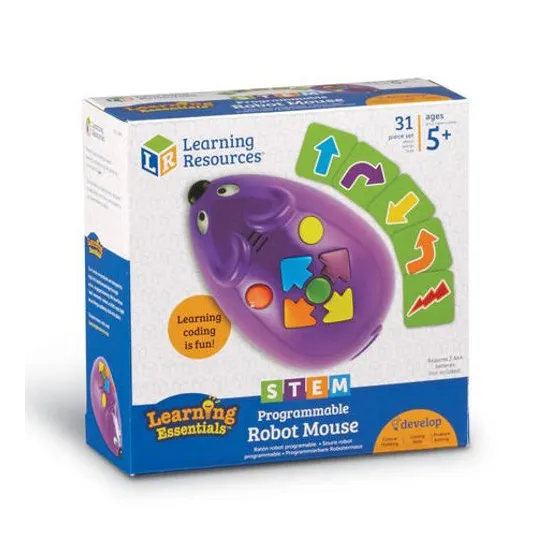
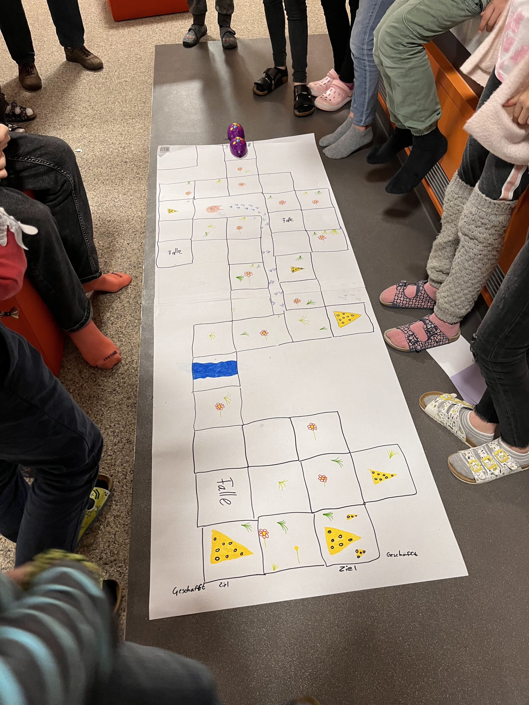
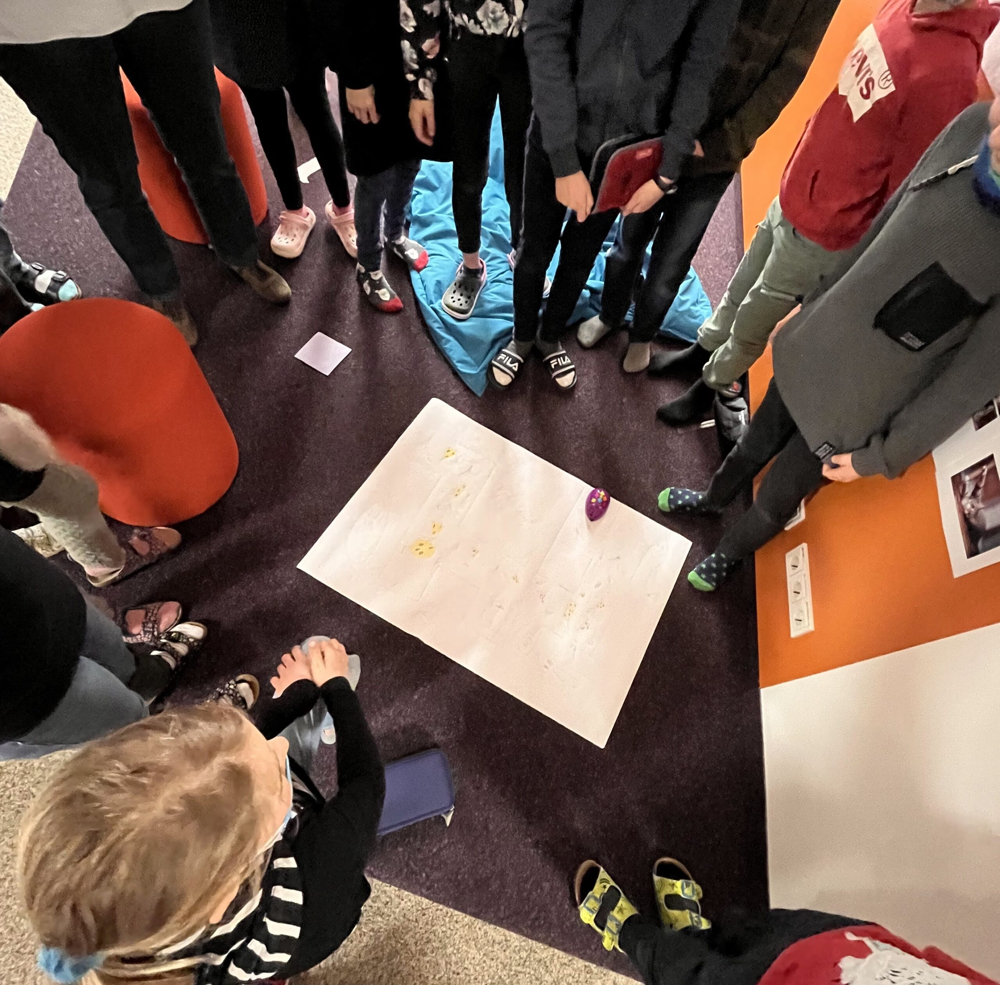
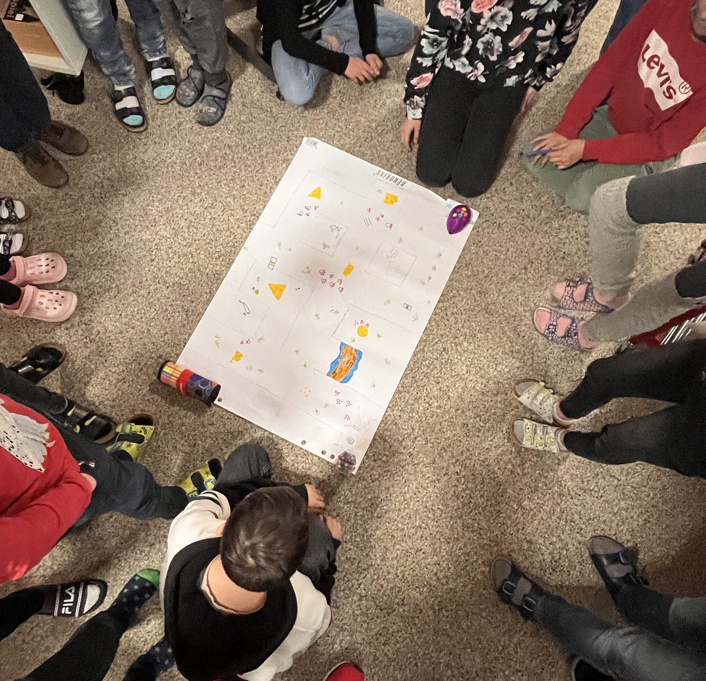
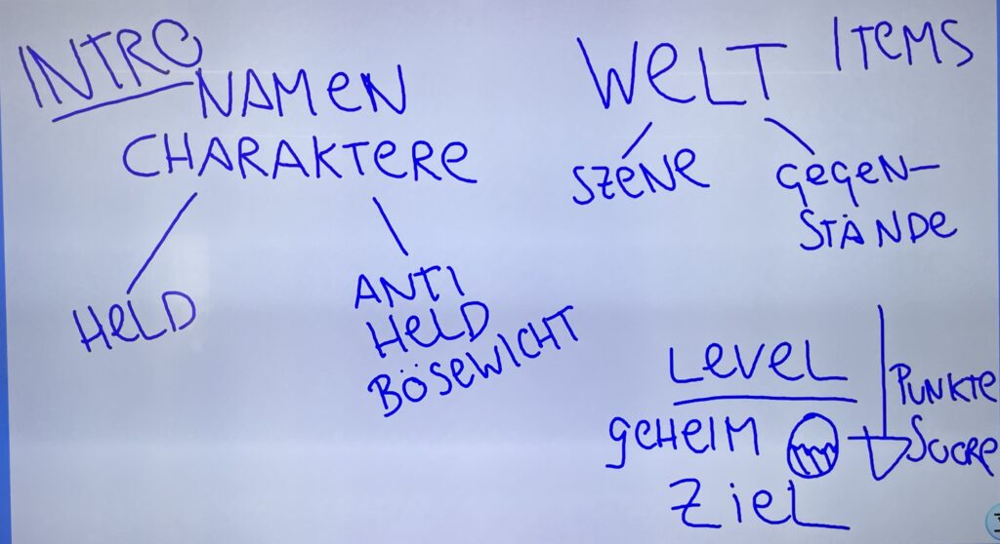
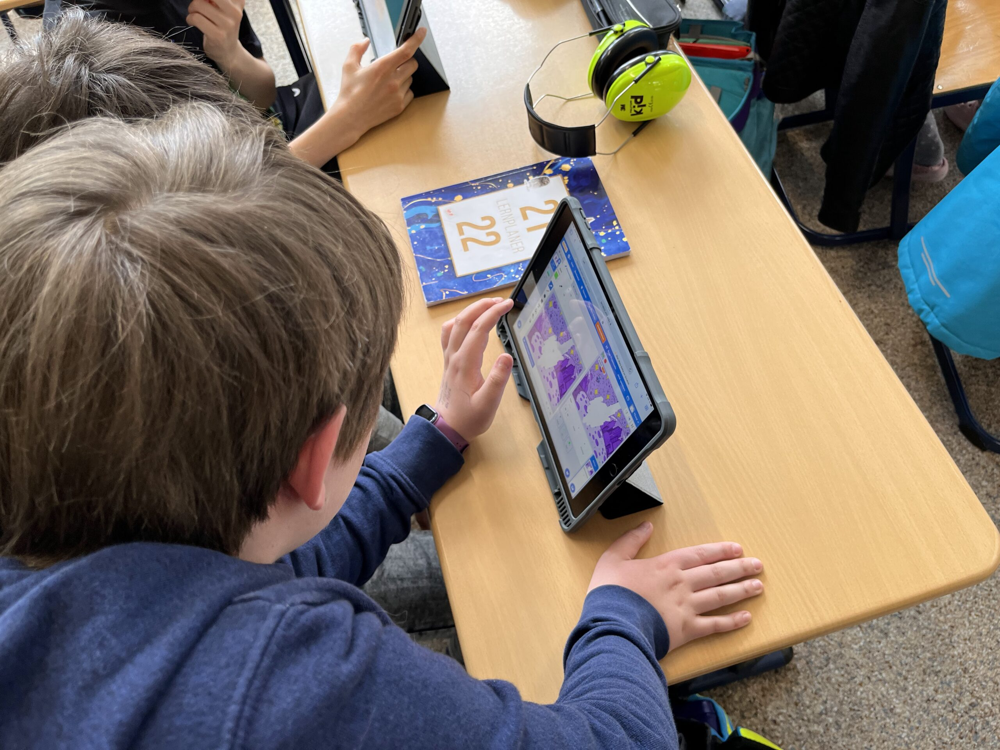
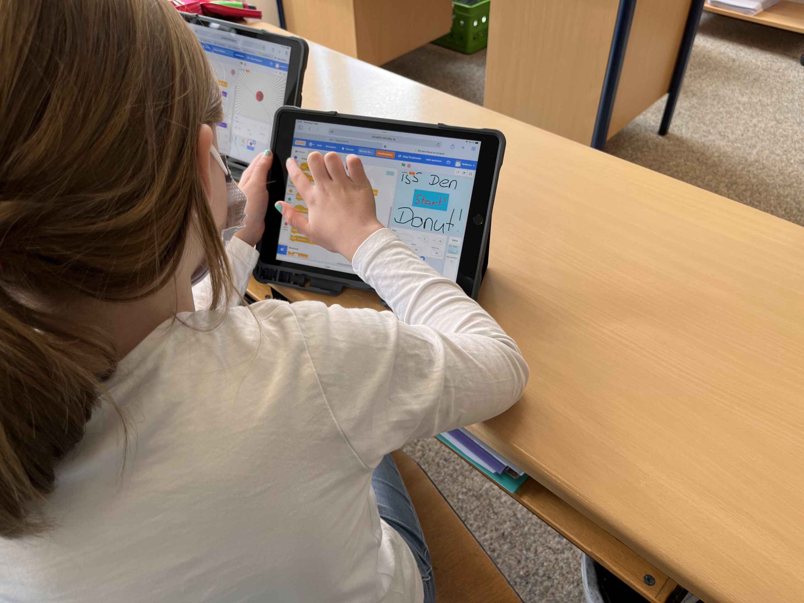
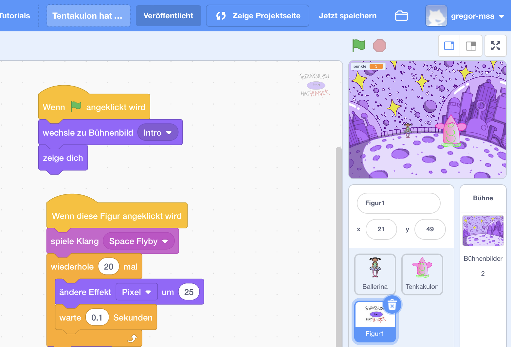
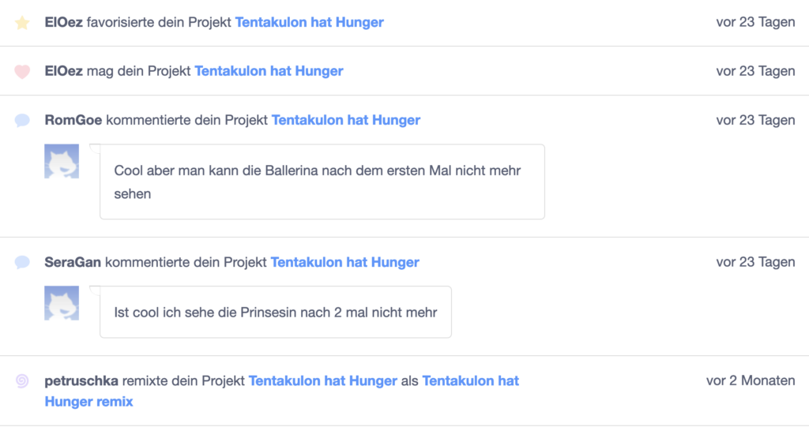
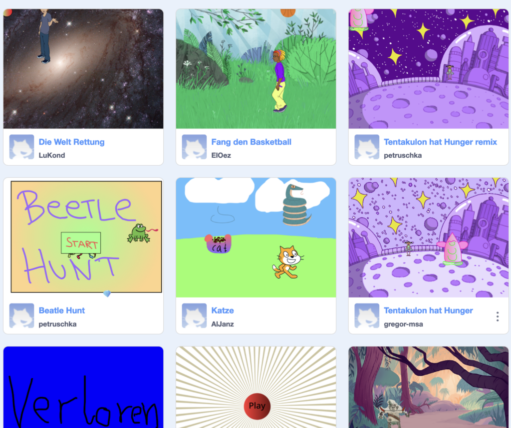

Mit Unterstützung der (https://msa.institut-medienpaedagogik.de/) habe ich in der letzten Wochen insgesamt 5 Workshops mit den Kindern der 4. Klasse der Grundschule Königsbrunn Süd organisiert. Ziel war es, dass die Kinder ihr eigenes Computer-Spiel erfinden und selbst programmieren. Geht das, können Grundschul-Schüler sowas überhaupt? Lasst Euch überraschen!

## Erster Start mit „Programmierbaren Mäusen“

Mausi kommt…

Was ist denn Programmieren überhaupt? Dazu haben wir immer unsere „Mausi“ im Gepäck – mit der kleinen Maus kann man das super gut erklären!

Das kleine Gerät funktioniert anders als eine Computer-Maus – man bewegt sie nicht mit der Hand, sondern mit Programmier-Befehlen! Und das funktioniert ganz einfach: Oben auf der Maus sind insgesamt 7 Knöpfe, mit der man der Maus Befehle gibt, wie sie sich bewegen soll.

Der Spaß beginnt: Die Kinder malen dann dazu Labyrinthe, eigene Spiele, Aufgaben, die eine oder mehrere Mäuse bewältigen müssen. Die Maus wird dann programmiert und losgelassen!

Das funktioniert so spielerisch, macht so viel Spaß – und nebenbei ist der erste Einstieg ins Programmieren schon geschafft 🙂

<figure >

</figure>

##

Let’s Scratch!

Was ist denn (https://scratch.mit.edu/) überhaupt? Mit Scratch können Kinder und Jugendliche eigene animierte Geschichten, Trickfilme und sogar eigene Computer-Spiele erfinden und erstellen!

Und genau das wollten wir machen mit den Kindern der 4. Klasse: ein eigenes Spiel! Aber was braucht man denn alles für ein Spiel? Das kam bei unserem ersten Brainstorming raus….

Und schon waren die ersten Ideen geboren: Jeder überlegte sich einen Helden, einen Gegner (oder auch Mitspieler, muss ja nicht immer ein Gegner sein). Stück für Stück entstanden so die Spiele.

Das Tolle an Scratch: die Kinder arbeiten selbstbestimmt an Ihren Ideen. Anstatt den Kindern frontal Sachen zu erklären, gibt es ein Ziel, das jeder erreichen will – das eigene Spiel. Mit viel Kreativität wird an der Ideen getüftelt … **und dann kommt der Punkt, wo die Hände hochgehen und die Kinder fragen: „Wie kann ich einen Highscore programmieren?“ – das Programmieren ist nicht etwas Abstraktes, sondern der Weg, um das eigene Ziel zu erreichen!**

<figure >

<figcaption >Los gehts – er wird programmiert!</figcaption></figure>

## Feedback & soziale Interaktion online

Es gibt auf der Scratch-Seite auch die Möglichkeit, die Spiele in der Klasse oder auch mit Freunden und Familie zu teilen – so kann man sein Erreichtes herzeigen! Das haben die Kinder auch fleißig gemacht – in der Klasse gab es ein Klassen-Studio, eine Sammlung aller veröffentlichten Spiele, in dem sich die Klassengemeinschaft die Spiele anschauen konnte, sich inspirieren lassen und auch Feedback gegeben werden konnte: Das hat super funktioniert – und zusätzlich zu vielen „Herzen“ habe ich auch noch gute Tipps zur Verbesserung für mein Spiel erhalten.

Und es sind so viele tolle, kreative Ideen und Spiele herausgekommen! **Jeder** in der Klasse hat es geschafft! Seht selbst:

Vielen lieben Dank an Petra Gall, die engagierte Lehrerin der Klasse 4 – ohne Sie wäre das ganze nicht möglich gewesen! Und natürlich an die Medienstelle Augsburg und Uschi Martin für die initiale Idee und Unterstützung des Projekts!
