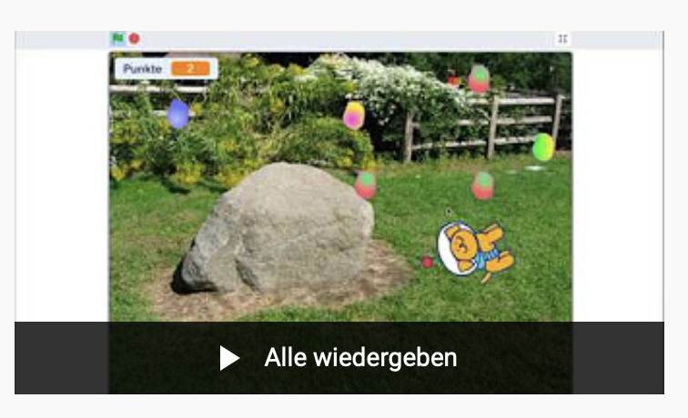

(https://scratch.mit.edu/) ist eine kostenlose Programmiersprache und -umgebung speziell für Kinder. Die Webseite beschreibt ihr Projekt so:

> Scratch hilft jungen Leuten, kreativ zu denken, systematisch zu schlussfolgern und miteinander zusammenzuarbeiten — grundlegende Fähigkeiten für das Leben im 21. Jahrhundert. 

<cite>https://scratch.mit.edu/about</cite>

Dem können wir nur voll und ganz zustimmen! Man kann mit Scratch:

- seine **eigenen Spiele **programmieren
- **coole Trickfilme** erstellen
- **Interaktive Gesichten** entwerfen
- sogar** Roboter programmieren** – wie [Lego WeDo 2.0](/selber-machen/lego-spike-mindstorms/) oder [Lego Mindstorms](/selber-machen/lego-spike-mindstorms/)

Und das beste: die **Kreationen können mit Freunden und der Familie online **geteilt werde!

Scratch ist einfach zu benutzen und zu erlernen:

- **Komplett im Browser** läuft – keine Installation notwendig!
- **Grafische Programmiersprache** mit übersichtlichen, farbigen Elementen
- viele **vorbereitete Elemente **wie Töne oder Figuren oder eigene Kreationen
- **Riesige Community** mit quelloffenen Beispielen
- **Komplett kostenlos **

Hier findest Du 3 kleine Videos, mit denen du innerhalb von nur einer Stunde dein erstes, kleines Spiel erstellen kannst:

<figure >Playlist: Programmier dein eigenes Ostereier-Spiel mit Scratch

Diese Wiedergabeliste ansehen (https://www.youtube.com/playlist?list=PL1v6GySgoQyxqgdqHMSsvxz1_NbDTZR6j)
<figcaption></figcaption></figure>

<figure ><figcaption>(https://www.youtube.com/playlist?list=PL1v6GySgoQyxqgdqHMSsvxz1_NbDTZR6j)</figcaption></figure>
