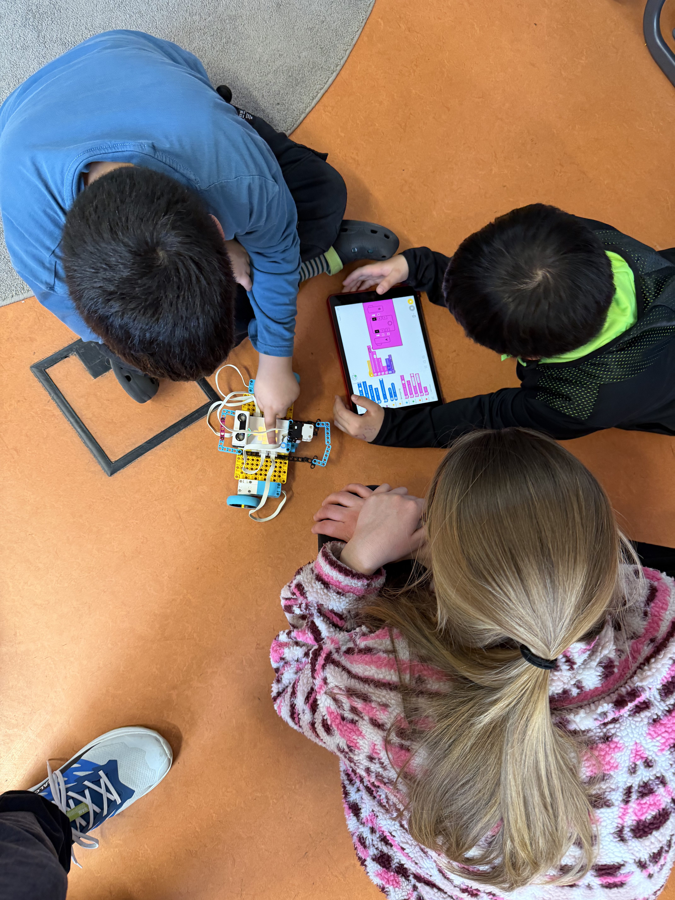

Seit einiger Zeit arbeiten wir eng mit der Drei-Auen-Schule zusammen – einer Grundschule, die am **StartChancen-Programm** teilnimmt. Dieses Bundesprogramm ermöglicht ausgewählten Schulen, zusätzliche Angebote zu finanzieren: AGs, außerschulische Projekte und kreative Lernformate, die sonst oft nicht möglich wären.

## Was ist das StartChancen-Programm?

Das StartChancen-Programm richtet sich gezielt an Schulen in herausfordernden Lagen und stellt Mittel bereit, um Chancengleichheit zu fördern. Mit diesen Mitteln können Schulen u.a. AG-Angebote, technische Ausstattung und Kooperationen mit außerschulischen Partnern finanzieren – genau das, was unsere Technik-AG ermöglicht!

## Von Scratch bis GamesLab

Zu Beginn der AG haben wir mit **Scratch** gestartet: Die Kinder lernten, wie man eigene Spiele und Animationen programmiert – spielerisch, intuitiv und ohne Vorkenntnisse. Scratch eignet sich perfekt als erster Einstieg in die Welt des Programmierens.

Im Anschluss ging es weiter mit dem **GamesLab**: Eigene Spielideen entwickeln, digitale Welten gestalten und erste Game-Design-Konzepte umsetzen. Besonders spannend: Einer der Teilnehmer wurde für sein Projekt mit einem **Kategorie-Preis** ausgezeichnet – herzlichen Glückwunsch!

## Jetzt geht es los mit LEGO Spike!

Gestern haben wir den nächsten Schritt gemacht und mit **LEGO Spike Prime** gestartet. Die Kinder bauen eigene Roboter, verbinden Motoren und Sensoren und bringen ihren Konstruktionen per Programm das Denken bei. Ganz ohne Anleitung – stattdessen mit freiem Entdecken und Ausprobieren.

Die Begeisterung war sofort spürbar: Kaum lagen die Teile auf dem Tisch, wurde schon gebaut, gesteckt und getestet. Es entstanden erste fahrende Roboter, die per App gesteuert wurden – und die Kinder konnten es kaum glauben, dass sie das selbst programmiert hatten!

## Eine tolle Kooperation

Wir sind begeistert, wie gut diese Zusammenarbeit mit der Drei-Auen-Schule funktioniert. Das StartChancen-Programm schafft echte Chancen für Kinder, die sonst vielleicht keinen Zugang zu solchen Technologie-Erfahrungen hätten. Wir freuen uns schon auf die kommenden Wochen – und auf die Roboter, die dabei noch entstehen werden!
