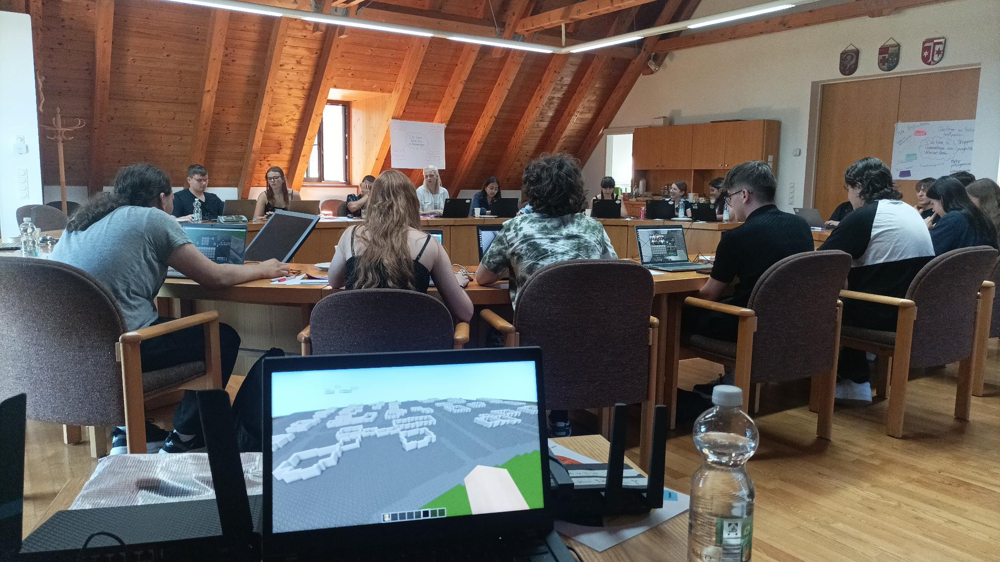
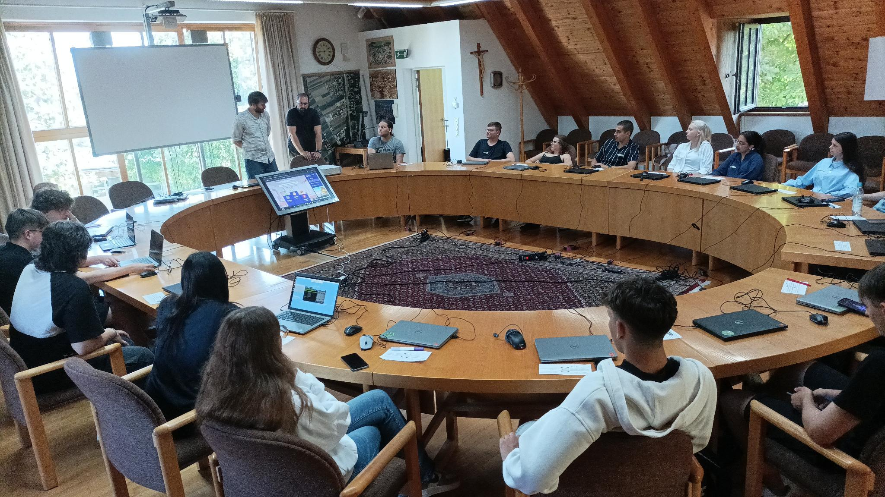

Organisiert wurde die Veranstaltung vom <strong>kommunalen Jugendpfleger Moritz Hochhauser</strong>. Ziel war es, Jugendlichen nicht nur die Strukturen der Kommunalpolitik näherzubringen, sondern ihnen auch konkrete Wege aufzuzeigen, wie sie sich vor Ort aktiv einbringen können.  <strong>Virtuelle Bauprojekte mit realem Einfluss</strong>  Nach einem Input und Workshopteil zu den Grundlagen und Handlungsspielräumen der Kommunalpolitik arbeiteten die Jugendlichen in der Open-Source-Welt <em>Minetest</em> an eigenen Projektideen für Untermeitingen und den umliegenden Gemeinden. Die entworfenen Projekte waren anschaulich, durchdacht und überzeugten durch starke Argumentationen.  Am Donnerstag präsentierten die Jugendlichen ihre Ergebnisse vor Vertreterinnen und Vertretern der Kommunalpolitik sowie einem engagierten und interessierten Publikum. Anwesend waren unter anderem die <strong>Bürgermeister der Lechfeld-Gemeinden Untermeitingen, Klosterlechfeld und Obermeitingen, Mitglieder des Gemeinderats Untermeitingen und  der Kommunalen Jugendarbeit Lechfeld, sowie Mitglieder des Jugendrats. </strong>  <strong>Ein Zukunftsvertrag für das Lechfeld</strong>  Besonders erfreulich: Die Vorschläge der Jugendlichen fanden nicht nur Anerkennung, sondern führten zu konkreten Vereinbarungen. Ein Zukunftsvertrag wurde beschlossen, der unter anderem ein gemeinsames Treffen mit dem Besitzer des <em>Lechparks</em> vorsieht. Die Jugendlichen erhalten hier die Möglichkeit, ihre Konzepte zur Zwischennutzung leerstehender Flächen zu präsentieren und aktiv an der Umsetzung mitzuwirken.  Zudem werden sie in die geplante Neugestaltung und Modernisierung des Jugendhauses einbezogen. Erste Ideen wie die Organisation von Spieletagen im Arcade-Stil oder Retro-Spielangebote, die verschiedene Generationen zusammenbringen, stoßen bereits auf großes Interesse. Auch die Umsetzung einer Jugenddisco wird geprüft – die Suche nach geeigneten Räumlichkeiten läuft.  <strong>Ein Paradebeispiel für gelungene Jugendbeteiligung</strong>  Die Veranstaltung gilt als voller Erfolg und zeigt eindrucksvoll, wie ernsthafte Jugendpartizipation auf kommunaler Ebene gelingen kann. Möglich wurde dies durch die hervorragende Organisation im Vorfeld, das Engagement der politischen Vertreterinnen und Vertreter sowie der Landkreis-Aktiven – und ganz besonders natürlich durch die Motivation der Jugendlichen, die mit Energie, Kreativität und Verantwortung ihre Gemeinde aktiv mitgestalten wollen!  Das Lechfeld hat mit den <em>Zukunftstagen</em> ein starkes Signal für gelebte Demokratie und Mitbestimmung gesetzt. Die Fortsetzung folgt – virtuell und ganz real.




