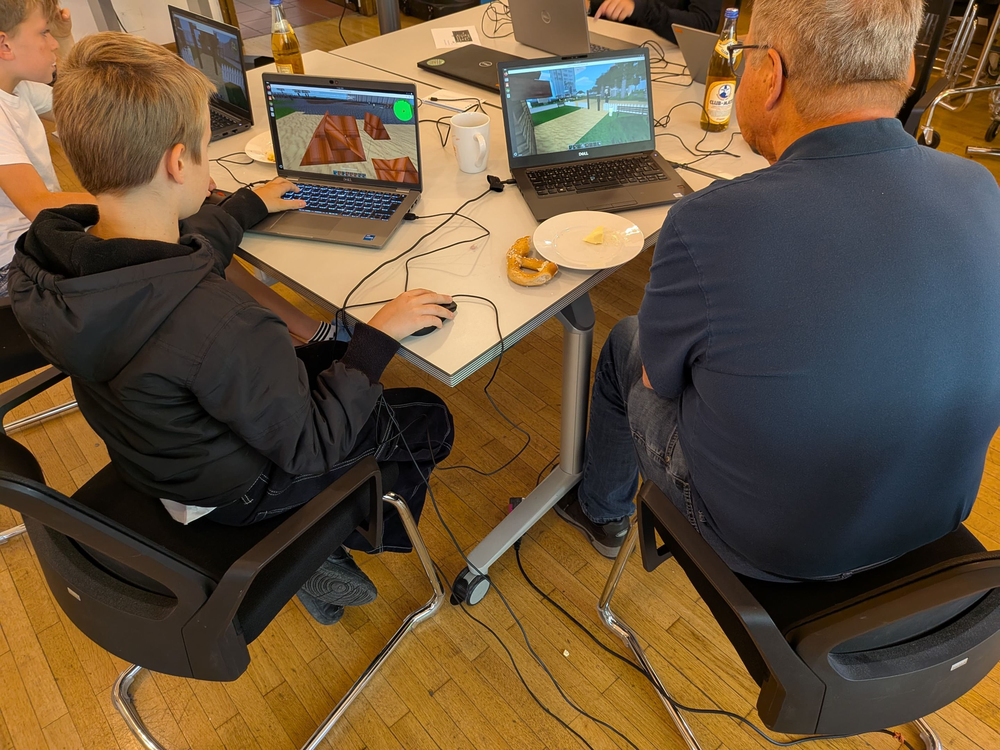
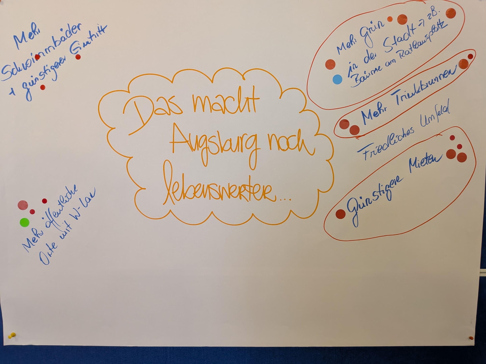
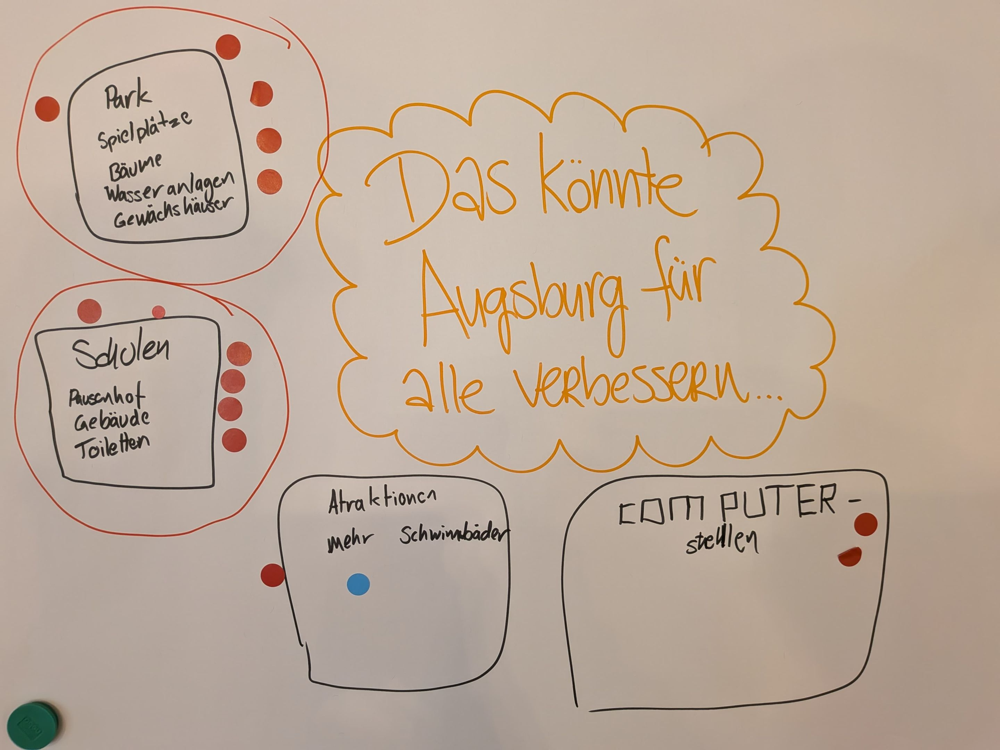
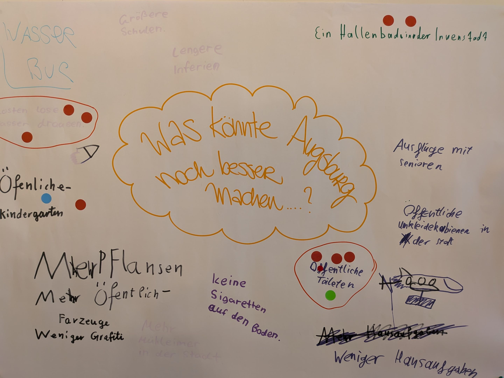
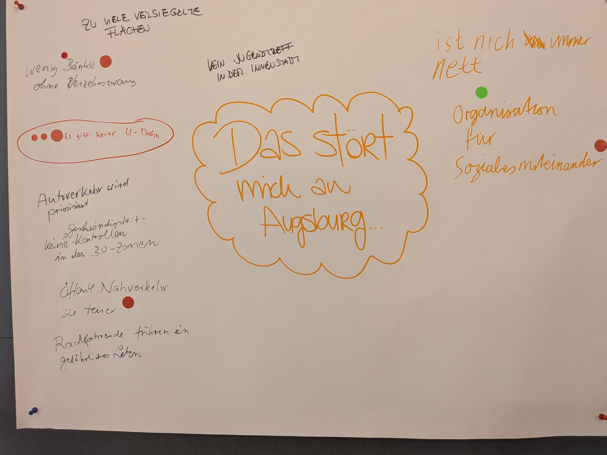

<strong>Rückblick: Zukunftswerkstatt „Demokratie in der Minecraft-Welt – Zukunft gemeinsam bauen“</strong>

Am 6. und 7. August 2025 verwandelte sich der Jakobssaal in Augsburg in einen kreativen Treffpunkt für Jung und Alt. 17 Kinder und Jugendliche sowie drei Mitglieder des Seniorenbeirats nahmen an der zweitägigen, generationsübergreifenden Zukunftswerkstatt „Demokratie in der Minecraft-Welt“ teil. Gemeinsam entwickelten sie in gemischten Teams Ideen für ein lebenswerteres Augsburg – und setzten diese direkt in der digitalen Welt von Minecraft um.

<strong>Erlebte Demokratie – hautnah:</strong> Schon nach kurzer Zeit war klar: Die Wünsche und Bedürfnisse von Jung und Alt liegen oft nah beieinander. In den Teams ergänzten sich die Fähigkeiten der Generationen optimal – technisches Know-how traf auf Lebenserfahrung, spontane Kreativität auf überlegte Planung. Am zweiten Tag präsentierten die Gruppen ihre fertigen Minecraft-Projekte vor einer Jury aus vier Stadtratsmitgliedern (Frau Hippke, Herr Pettinger, Herr Fink, Herr Zitzelsberger) , die mit offenem Feedback erklärten, wie solche Ideen in der Kommunalpolitik umgesetzt werden können. Dadurch wurde nicht nur Demokratie erfahrbar, sondern auch politische Entscheidungsprozesse transparent und greifbar.

<strong>Die fünf entstandenen Projekte im Überblick:</strong>
<ol><li>
<strong>Schule renovieren</strong> Eine Schule mit moderner Ausstattung und frisch renovierten Toiletten – weil es nicht nur schöner, sondern auch hygienischer ist, wenn es dort nicht unangenehm riecht. Ziel: Lernorte schaffen, an denen sich Schüler*innen wohlfühlen.
</li><li>
<strong>Grüne Stadt</strong> In enger Zusammenarbeit mit dem Projekt „Schule renovieren“ gestaltete das Team den Pausenhof grün, schattig und einladend. Pflanzkästen zum eigenen Gärtnern ermöglichen Naturkundeunterricht zum Anfassen. Darüber hinaus wurden der Oberhauser Bahnhofsplatz begrünt, ein Barfußpfad angelegt und Kneippbecken gebaut – neue Begegnungsorte, die Klima- und Lebensqualität verbessern.
</li><li>
<strong>Schwimmbad für alle</strong> Weil Eintrittspreise in Erlebnissbädern für viele zu hoch sind, entwarf das Team ein detailreiches, bezahlbares Schwimmbad mit Bereichen für Action (Rutschen, Sprungturm, Wellenbad) und Ruhe (Wellness, Liegebereiche). Auch ein 50-Meter-Becken und ein 10-Meter-Turm wurden diskutiert.
</li><li>
<strong>Spielplatz der Generationen</strong> Ein weitläufiger, begrünter Spielplatz, der Begegnung fördert: Schattenplätze, Trinkbrunnen, Spielbretter wie Schach oder Dame für Ältere in direkter Nähe zu den Attraktionen für Kinder. Hier können mehrere Generationen Zeit verbringen, ohne voneinander getrennt zu sein.
</li><li>
<strong>Grünes Rathaus</strong> Der Rathausplatz als grüner, belebter Mittelpunkt Augsburgs: mobile Pflanzkästen, die flexibel umgestellt werden können, und ein großer Baum mit Sitztreppe als Treffpunkt für alle. Ziel: Mehr Aufenthaltsqualität im Herzen der Stadt.
</li></ol>
<strong>Dank und Fazit:</strong> Ein großer Dank geht an das <strong>Freiwilligenzentrum</strong> für die Bereitstellung des Jakobssaals, an das <strong>Förderprogramm „Demokratie vor Ort“</strong> des Amtes für Kinder, Jugend und Familie sowie des Rotary Clubs Augsburg für die finanzielle Unterstützung und an das <strong>KidsLab</strong> um Gründer Gregor Walter für die Initiative!

Vor allem aber danken wir unseren engagierten Teilnehmer*innen – von jung bis alt –, die mit Ideen, Argumenten und Begeisterung diese Werkstatt zum Leben erweckt haben. Lieben Dank an dieser Stelle an den Seniorenbeirat der Stadt Augsburg für die schöne Kooperation. Die Veranstaltung hat gezeigt: Wenn wir offen aufeinander zugehen, kann Demokratie für alle erlebbar und erfolgreich sein – mit einem klaren gemeinsamen Nenner: <strong>Ein gutes Leben in Augsburg für alle Beteiligten.</strong>




