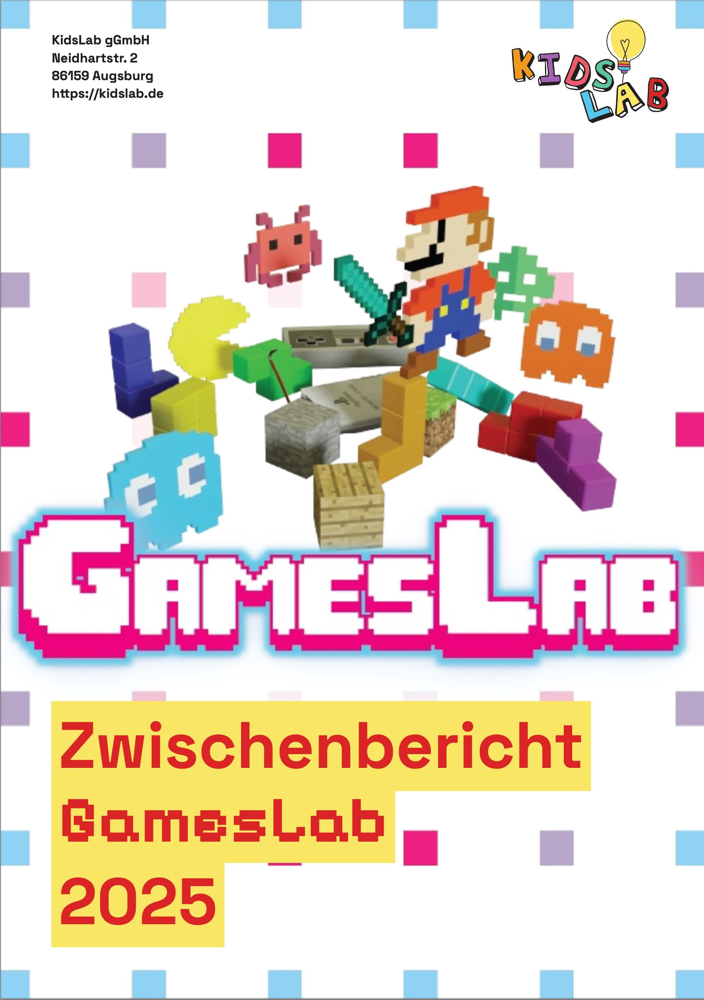

## GamesLab 2025: Erfolgreich expandiert und über 900 Kinder erreicht!

**Das GamesLab-Projekt hat sich 2025 von einem lokalen Augsburger Bildungsangebot zu einem skalierbaren Konzept entwickelt, das erfolgreich in andere Städte expandiert.** Hier fassen wir die wichtigsten Ergebnisse zusammen – den vollständigen Zwischenbericht gibt es als [PDF zum Download](zwischenbericht-gameslab-2025-juni-2025.pdf).

### Die wichtigsten Erfolge

**In Augsburg:**

- Über 700 Schülerinnen und Schüler aus 31 Schulklassen aller Schularten erreicht
- 33 selbstprogrammierte Spiele beim 2. Augsburger GamesPreis eingereicht
- Staatsminister Dr. Fabian Mehring würdigte persönlich die jungen Programmiertalente
- Überwältigende Nachfrage mit mehr als doppelt so vielen Anmeldungen wie Plätze

**Erste Expansion nach Traunstein:**

- 8 erfolgreiche Veranstaltungen durchgeführt
- Partnerschaftsmodell mit Q3. Quartier für Medien.Bildung.Abenteuer bewährt sich
- Wichtige Verbesserungen in Dokumentation und Standardisierung entwickelt

**Innovation "GamesLab Schule":**

- Neues Format für nachhaltige Integration in den Schulalltag pilotiert
- Fächerübergreifender Ansatz mit Deutsch, Mathe und Kunst getestet

### Beeindruckende Resonanz

Die Zahlen sprechen für sich: 84% der Teilnehmenden bewerten die Workshops mit 4 oder 5 Sternen, und 72% der Lehrkräfte planen, die Inhalte in den regulären Unterricht zu integrieren. Die Durchschnittsbewertung der Lehrkräfte liegt bei 4,51 von 5,0 Punkten – das zeigt, dass unser Konzept aufgeht.

### Wie geht es weiter?

Das GamesLab Augsburg wird 2026 durch Restmittel und lokale Sponsoren fortgeführt. Weitere Expansionen in andere Städte sind geplant. Die größten Herausforderungen bleiben die Nachhaltigkeit nach den Workshops und die kontinuierliche Integration in den Schulalltag – hier arbeiten wir an neuen Lösungsansätzen.

Wer den kompletten Zwischenbericht mit allen Details lesen möchte, kann ihn hier herunterladen:



*Vielen Dank an unsere Sponsoren Klaus Tschira Stiftung, XITASO GmbH und Stiftung AUFWIND, die dieses Projekt ermöglichen!*
