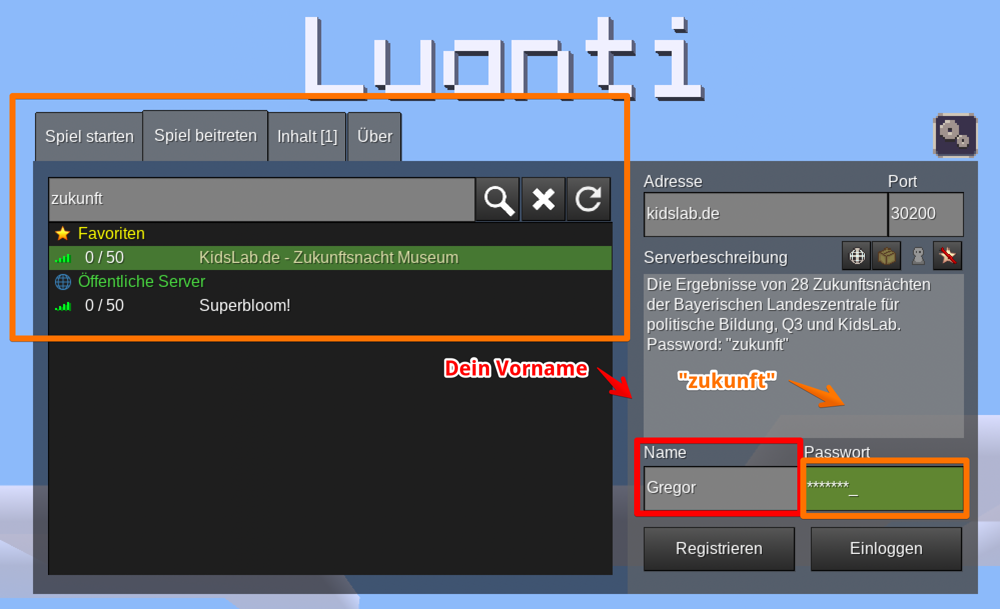
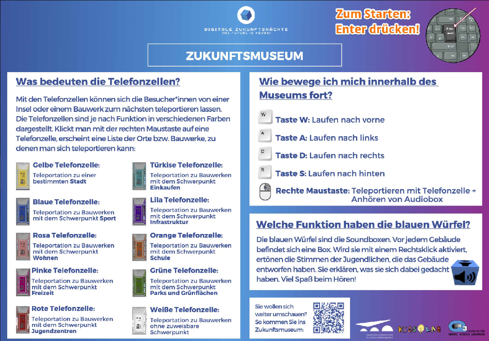

Explore the **Future Museum** in a special Minecraft world! Discover interactive exhibits about technology and innovation. A digital museum trip that's fun and educational at the same time.

**Step 1:**

- 
step: Open Minetest- 
step: 'Click on **Join server**'- 
step: 'Search for **zukunft**'- 
step: 'Enter your name and the password **zukunft**'
image:
- 
- 
step: 'Click on **log in**'- 
step: Have fun at the museum!
image:
- 

# Visitor info

The museum is open 24 hours a day and can easily be visited virtually with Minetest. All you need is a computer or tablet and an internet connection!
Installing Minetest

Minetest is free to use — here's a guide on how to download and install it:

- [Installation for Windows](https://handbuch.kidslab.de/minetest/allgemeines/installation-von-minetest)
- [Installation for macOS](https://handbuch.kidslab.de/minetest/allgemeines/installation-minetest-mac)

Entering the museum server

- Start Minetest
- Click on "Join Game"
- Search for "zukunft"
- Select the server "Zukunftsnacht Museum"
- Enter your name under "Name"
- No spaces, no special characters
- Enter the password "zukunft"
- Click on "Log in"

And you're online 🙂
