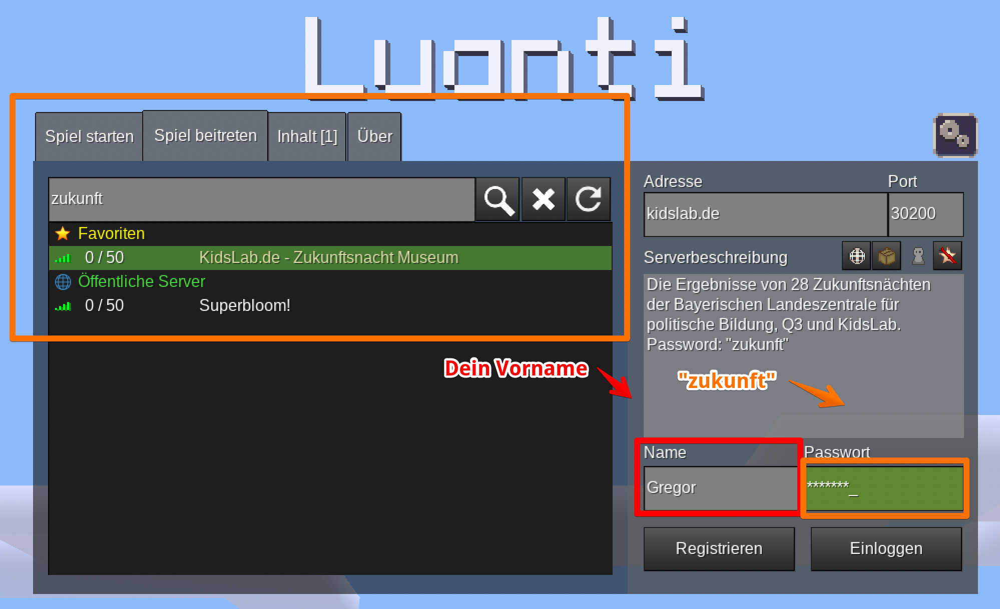
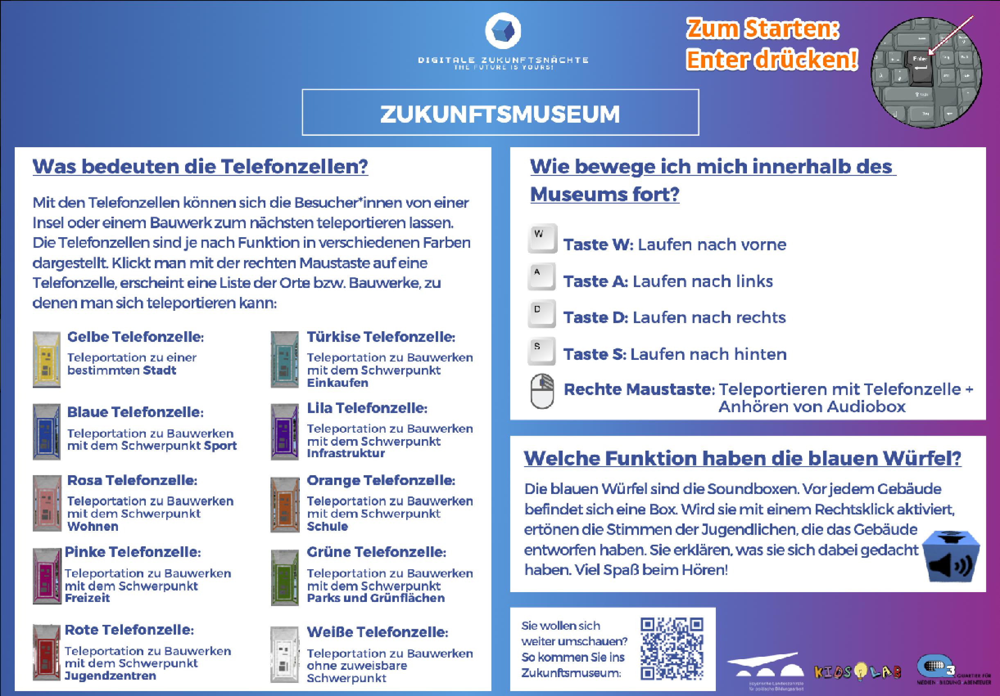

Erkunde das **Zukunftsmuseum** in einer speziellen Minecraft-Welt! Entdecke interaktive Ausstellungen über Technologie und Innovation. Eine digitale Museumsreise, die Spaß macht und gleichzeitig bildet.

**Schritt 1:**

- 
step: Öffne Minetest- 
step: 'Klicke auf **Server beitreten**'- 
step: 'Suche nach **zukunft**'- 
step: 'Gib deinen Namen ein und das Passwort **zukunft**'
image:
- 
- 
step: 'Klicke auf **einloggen**'- 
step: Viel Spaß im Museum!
image:
- 

# Besucher-Info

Das Museum ist 24h geöffnet und kann ganz einfach virtuell mit Minetest besucht werden. Du brauchst lediglich einen Computer oder Tablet und eine Internetverbindung!
Minetest installieren

Minetest kann kostenlos benutzt werden, hier findest Du eine Anleitung wie der Download und die Installation geht:

- [Installation Windows](https://handbuch.kidslab.de/minetest/allgemeines/installation-von-minetest)
- [Installation MacOS](https://handbuch.kidslab.de/minetest/allgemeines/installation-minetest-mac)

Museums-Server betreten

- Starte Minetest
- Klicke auf “Spiel beitreten“
- Suche nach “zukunft“
- Wähle den Server “Zukunftsnacht Museum” aus
- Gebe Deinen Namen unter “Name” ein
- Keine Leerzeichen, keine Sonderzeichen
- Gebe das Passwort “zukunft” ein
- Klicke auf “Einloggen“

Und schon bist du Online 🙂
