A vibration motor. An old toothbrush. A coin cell battery. And just like that, the world's smallest robot is born — the BürstiBot.

At this station you build your own BürstiBot, fit it with eyes and decorations, and send it onto the race track. Whose bot reaches the finish line first?


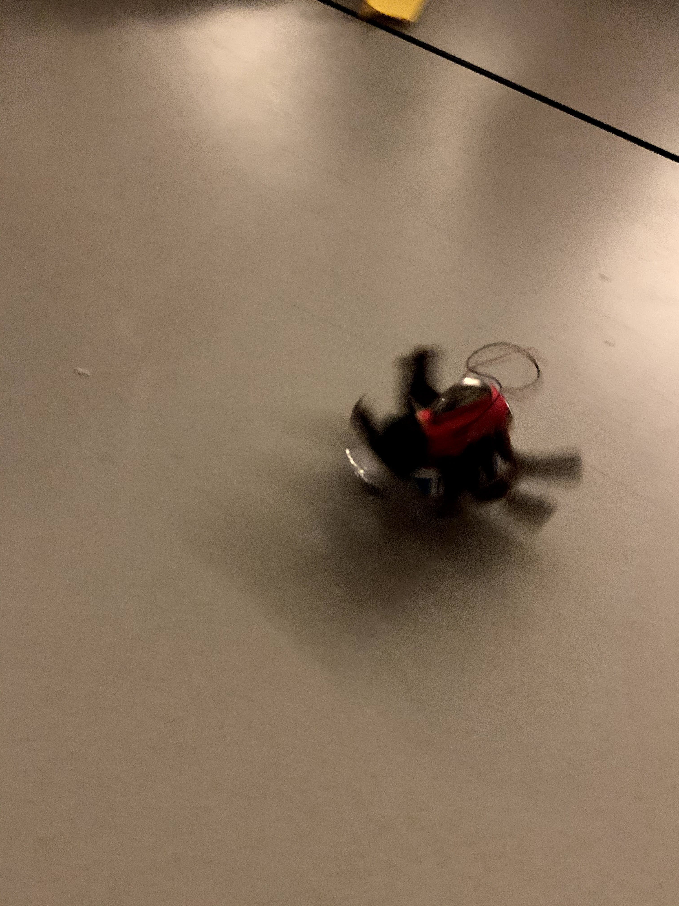
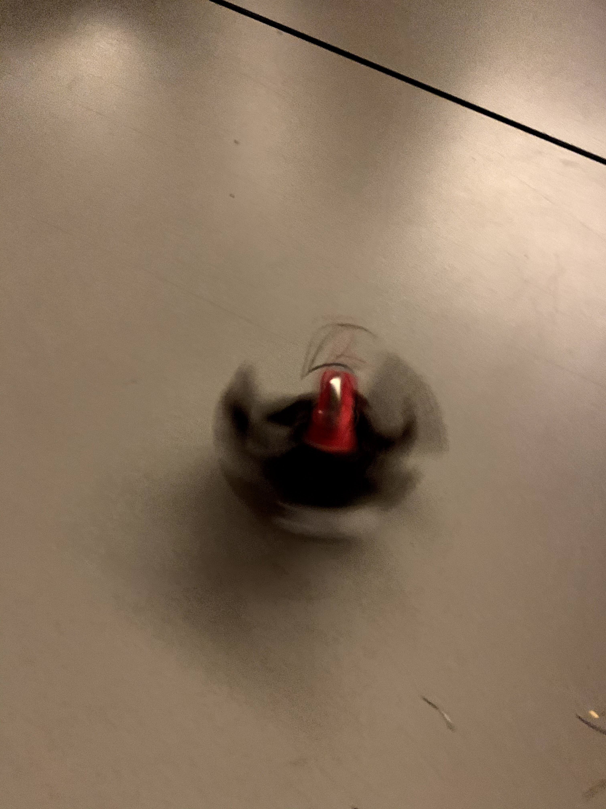
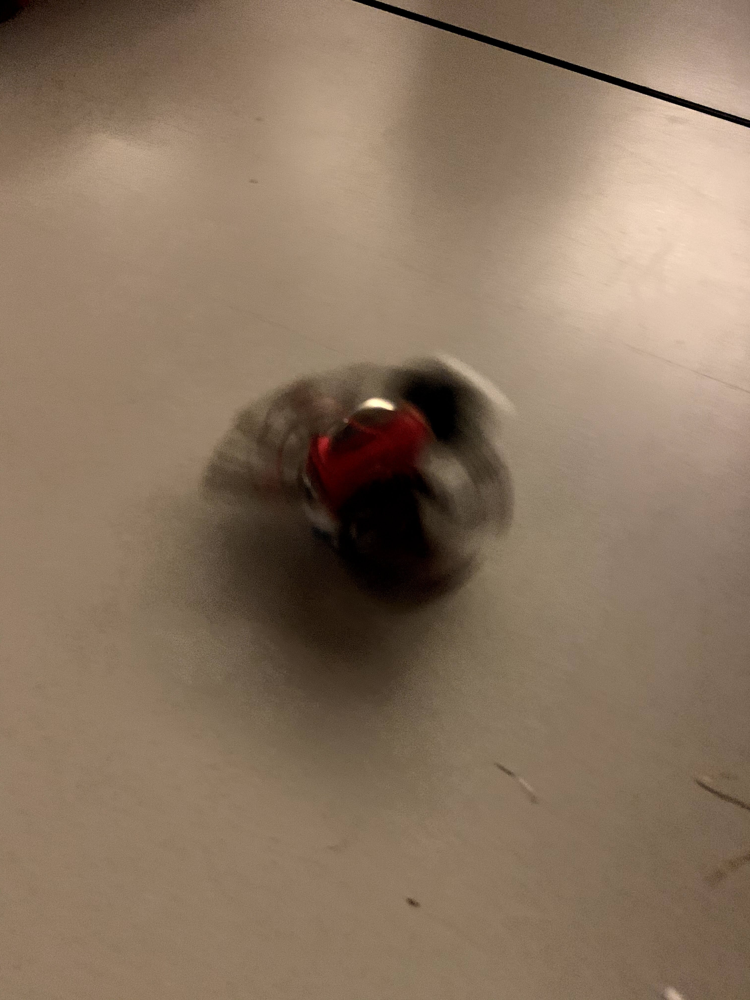
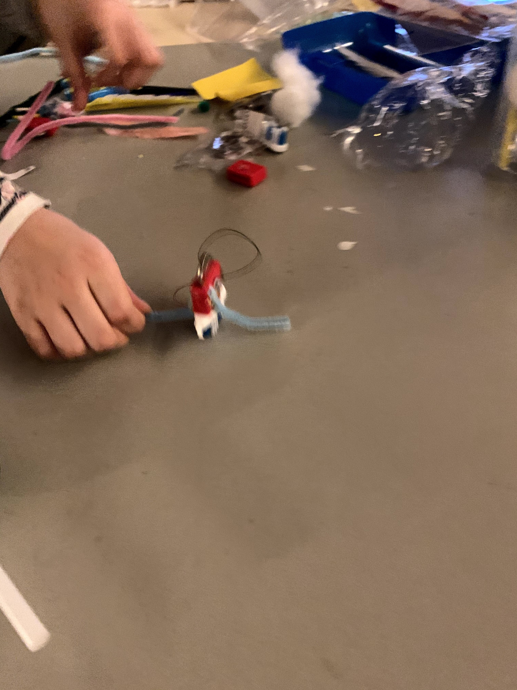
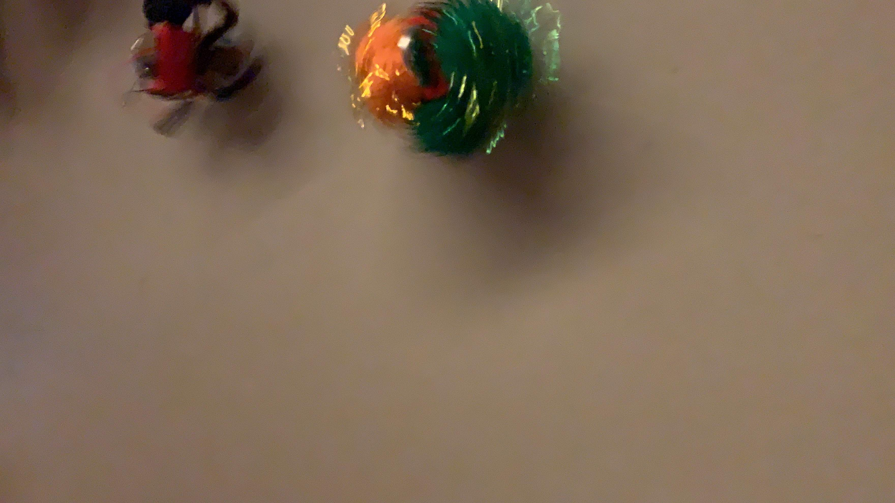
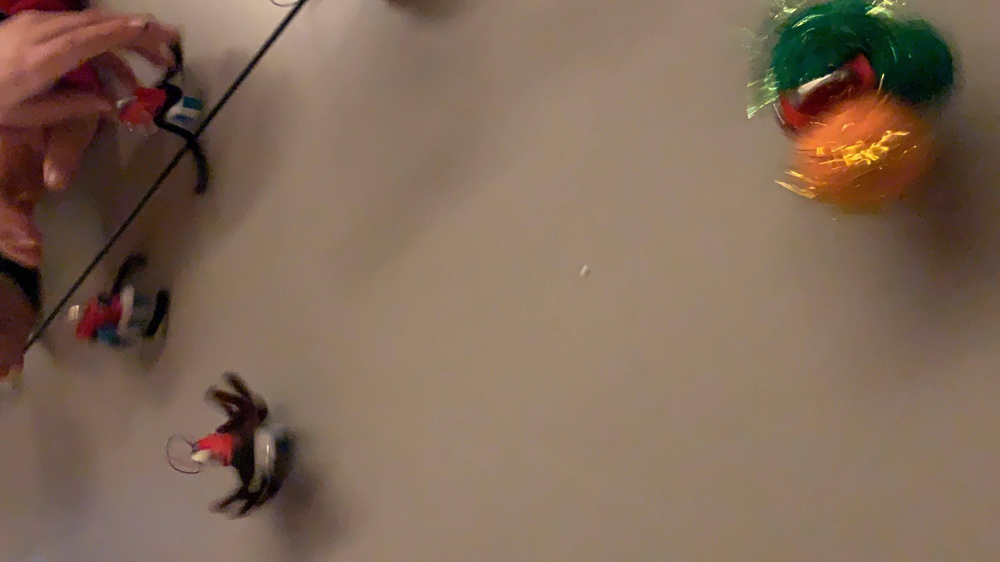
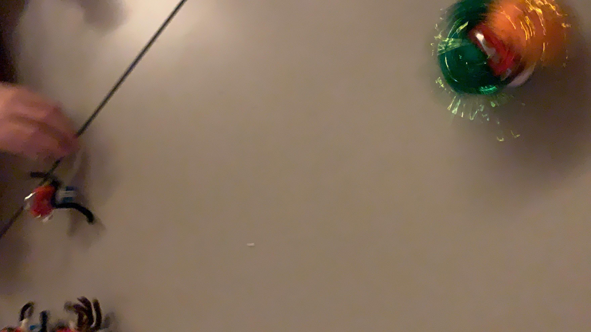
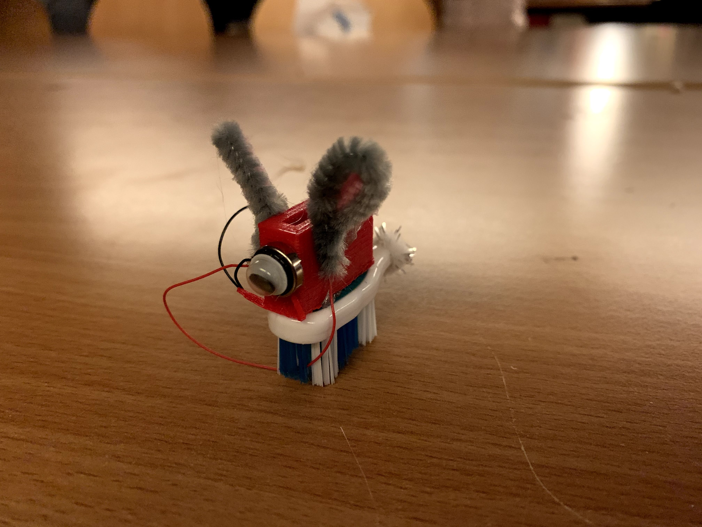
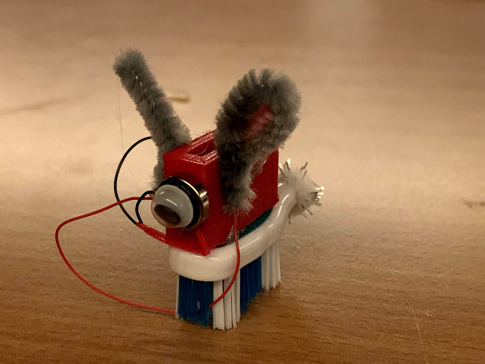
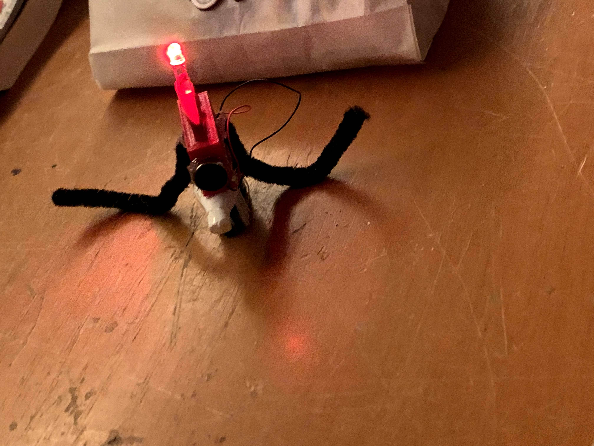
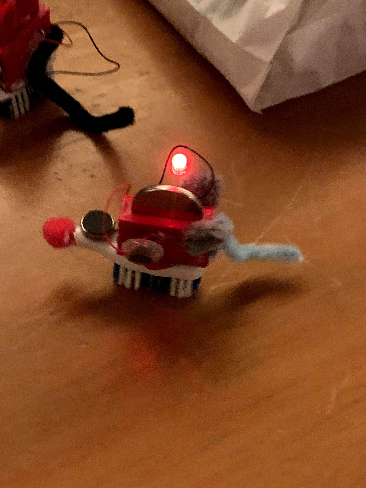
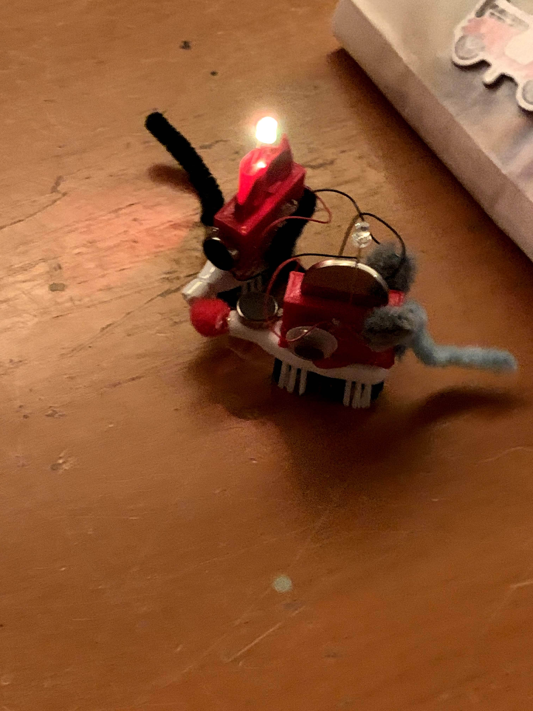


## What is a BürstiBot?

The BürstiBot is a miniature vibration robot: a small motor with an eccentric weight sits on the head of an old toothbrush. When the motor runs, the bot vibrates — and thanks to the angled bristles, it moves forward. Physics you can touch.

The principle is simple, but the details make the difference: how you position the motor, how heavily you decorate the bot, how you attach the battery — all of it affects speed and direction.

## Who is this station for?

For everyone from about age 7 — kids, teenagers, and adults. No prior knowledge needed. Build instructions are available right at the station, and KidsLab mentors are happy to help with soldering.

You'll find a detailed step-by-step guide here:

View the BürstiBot build guide

## When is the station open?

The BürstiBot station is set up during open KidsLab evenings and events. Just walk in and get started!

## Rent the BürstiBot station

The complete station — race track, building materials, and instructions — can be booked for school events, festivals, and corporate events:

Inquire & book
