Ein Vibrationsmotor. Eine alte Zahnbürste. Eine Knopfzelle. Und schon entsteht der kleinste Roboter der Welt — der BürstiBot.

Bei dieser Station baust du deinen eigenen BürstiBot, bestückst ihn mit Augen und Dekoration, und schickst ihn dann auf die Rennbahn. Wessen Bot kommt zuerst ans Ziel?


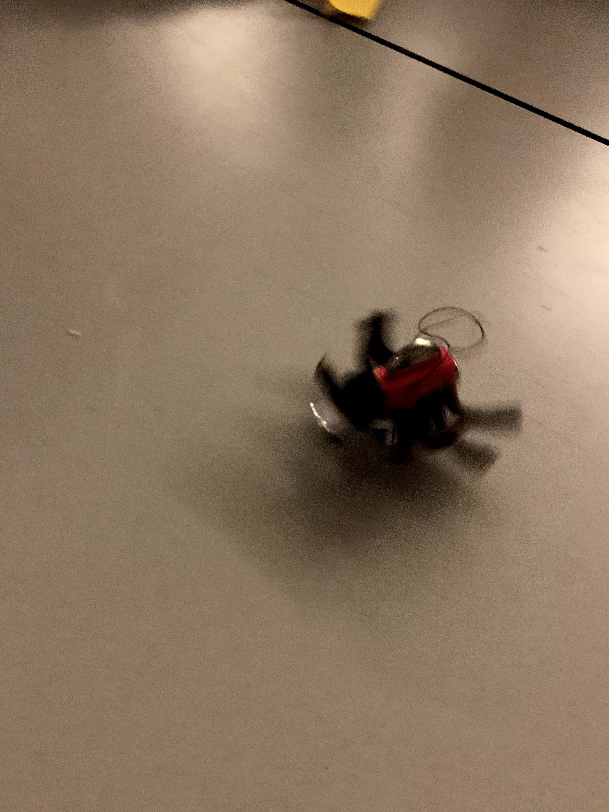
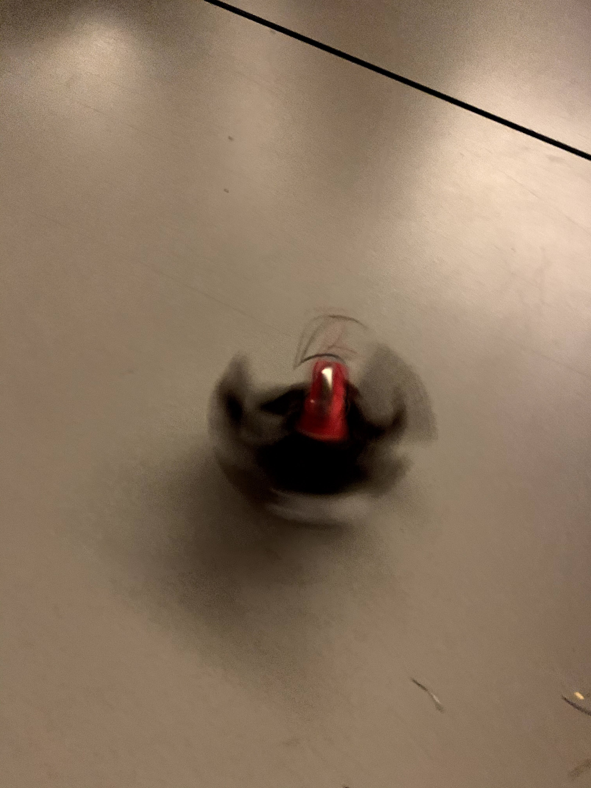
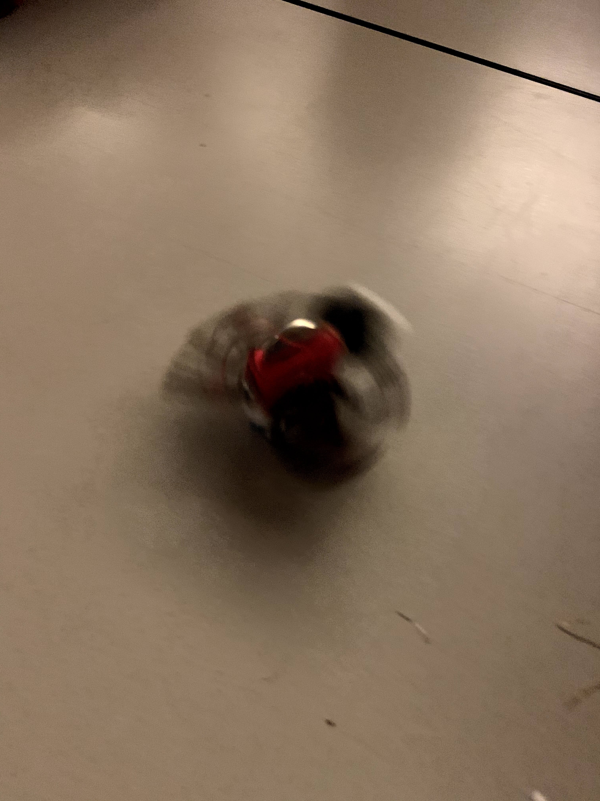
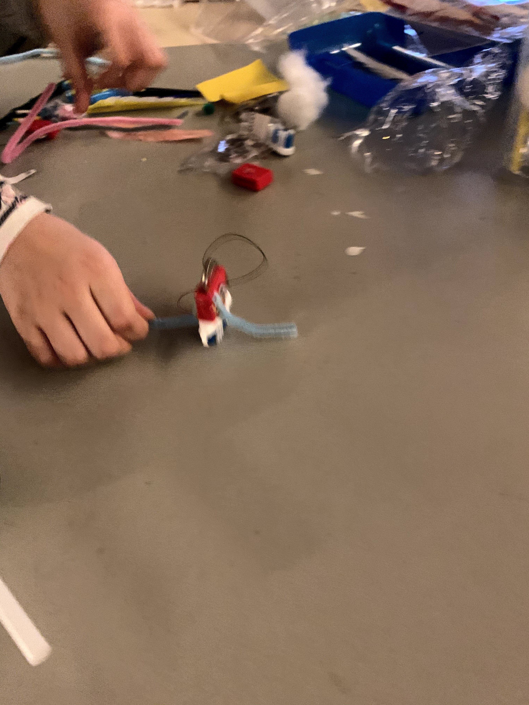
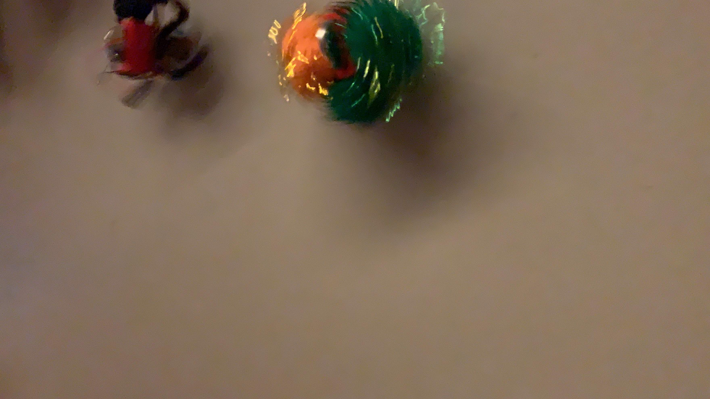
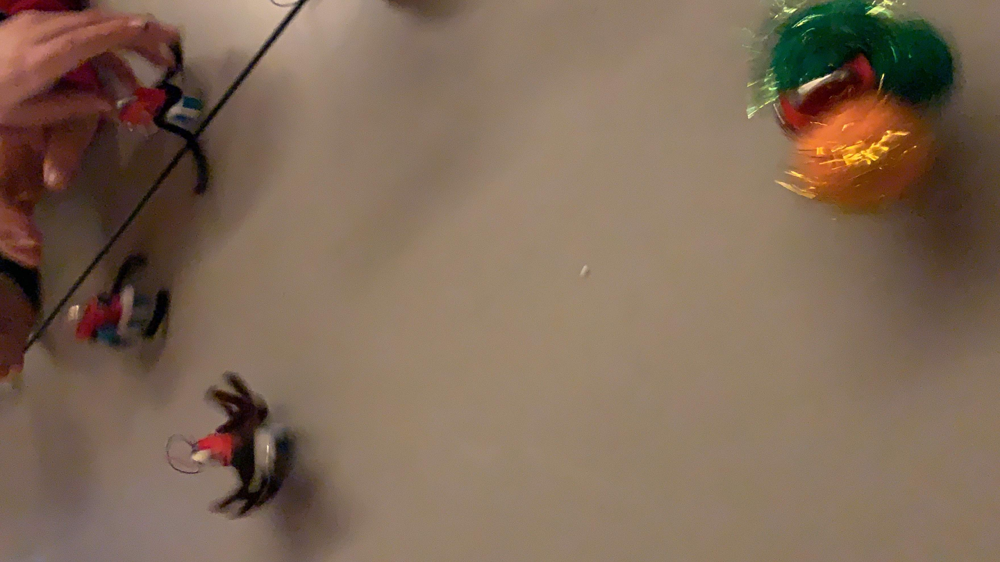
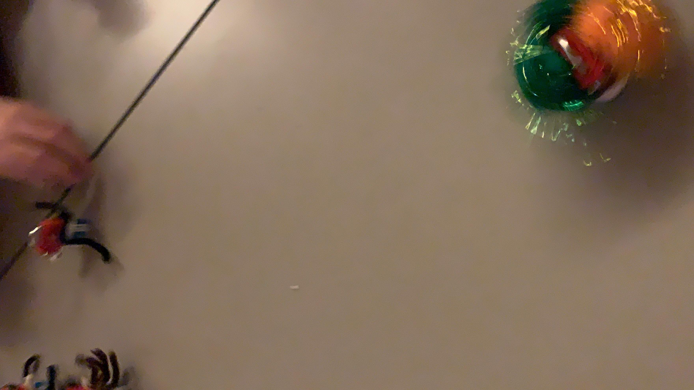
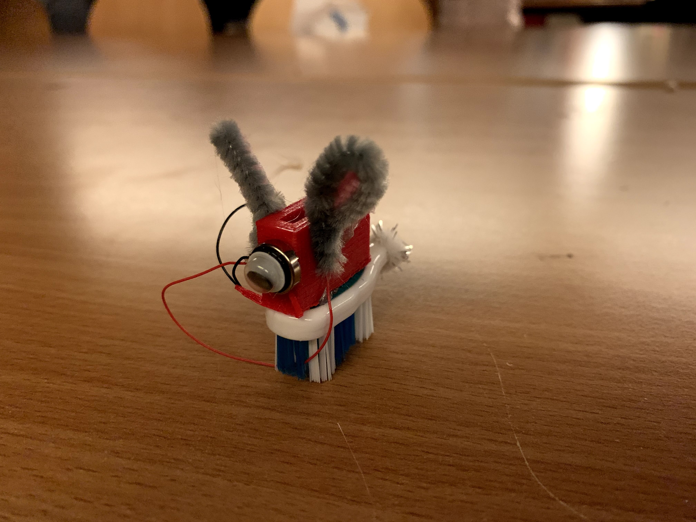
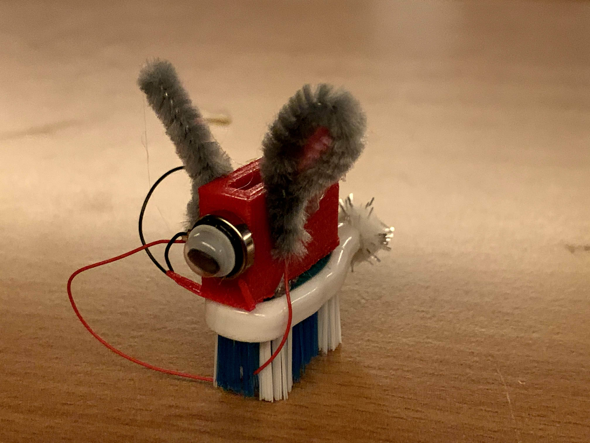
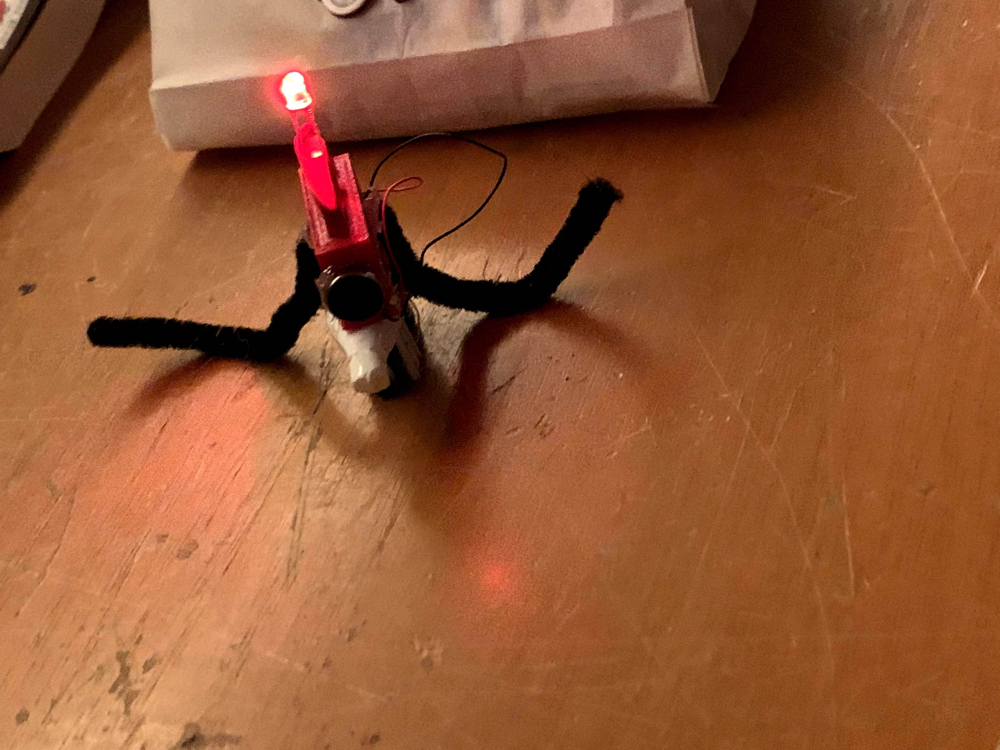
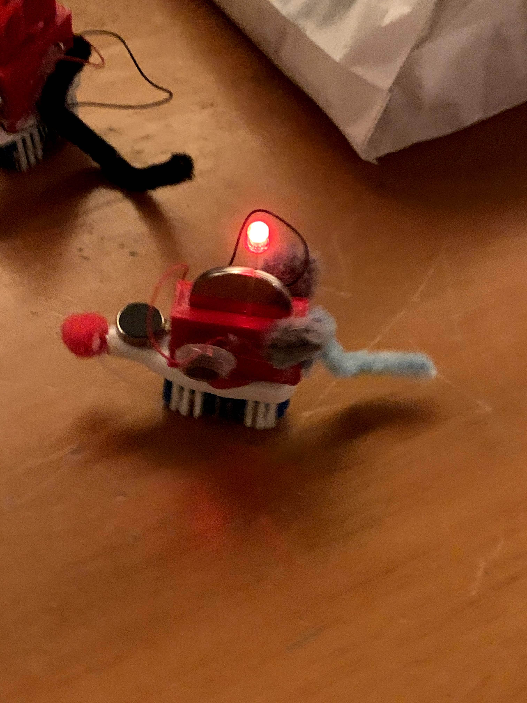
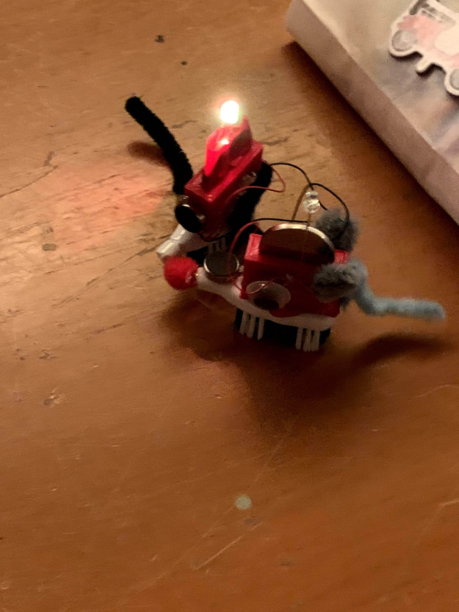


## Was ist ein BürstiBot?

Der BürstiBot ist ein Miniatur-Vibrationsroboter: Ein kleiner Motor mit Exzentergewicht sitzt auf dem Bürstenkopf einer alten Zahnbürste. Wenn der Motor läuft, vibriert der Bot — und durch die schräg stehenden Borsten bewegt er sich vorwärts. Physik zum Anfassen.

Das Prinzip ist simpel, aber die Feinheiten machen den Unterschied: Wie du den Motor platzierst, wie schwer du den Bot dekorierst, wie du die Batterie befestigst — all das beeinflusst die Geschwindigkeit und Richtung.

## Für wen ist diese Station?

Für alle ab ca. 7 Jahren — Kinder, Jugendliche und Erwachsene. Keine Vorkenntnisse nötig. Die Bauanleitung liegt direkt an der Station aus, und KidsLab-Mentoren helfen gerne beim Löten.

Eine ausführliche Schritt-für-Schritt-Anleitung findest du hier:

BürstiBot-Bauanleitung ansehen

## Wann ist die Station zugänglich?

Die BürstiBot-Station ist bei offenen KidsLab-Abenden und Veranstaltungen aufgebaut. Einfach reinkommen und loslegen!

## BürstiBot-Station mieten

Die komplette Station — Rennbahn, Material zum Bauen und Bauanleitung — kann für Schulveranstaltungen, Festivals und Firmenevents gebucht werden:

Anfragen & Buchung
