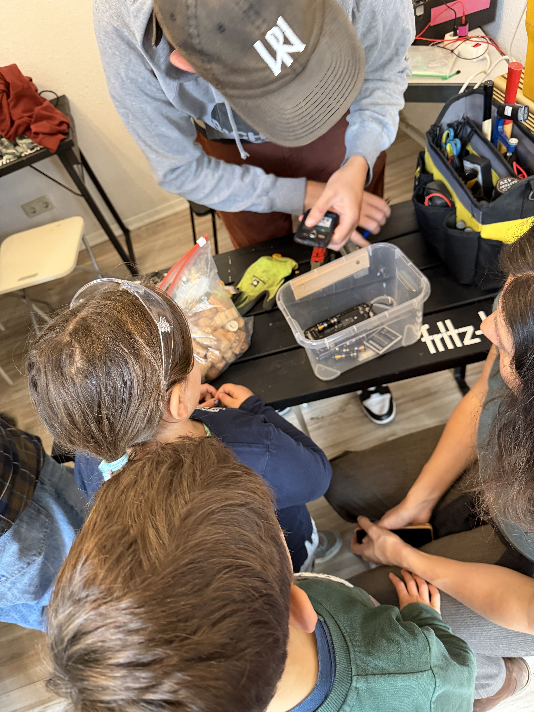
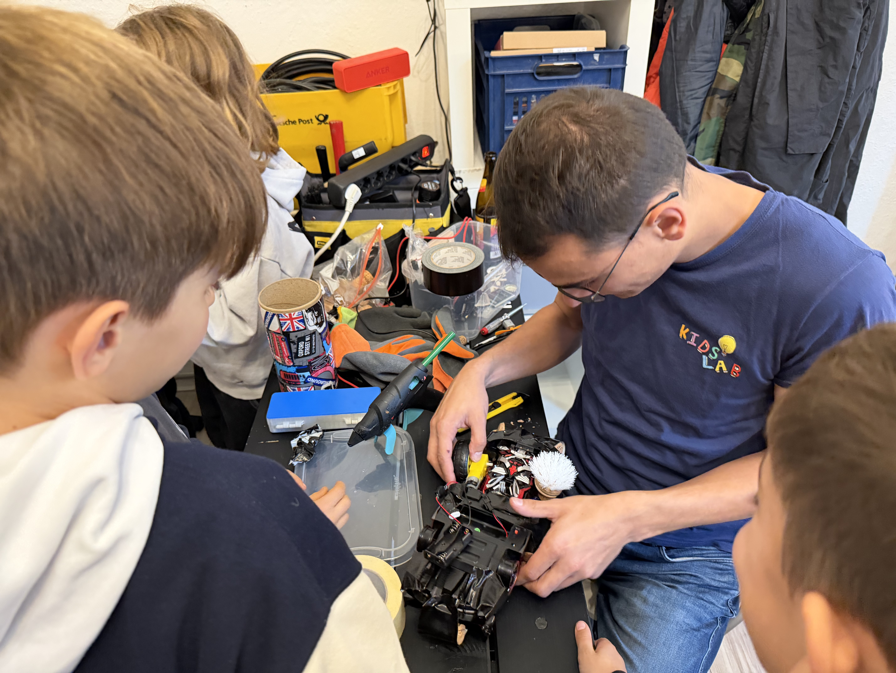
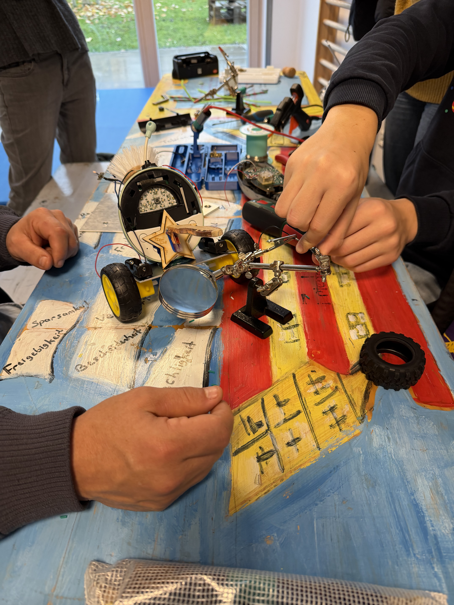
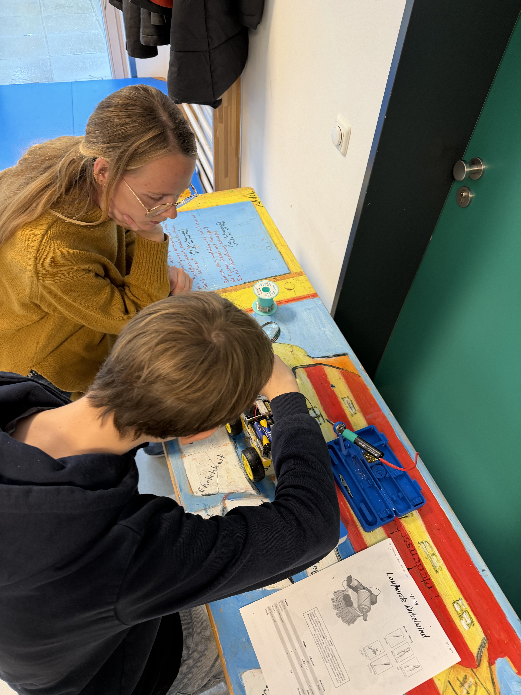
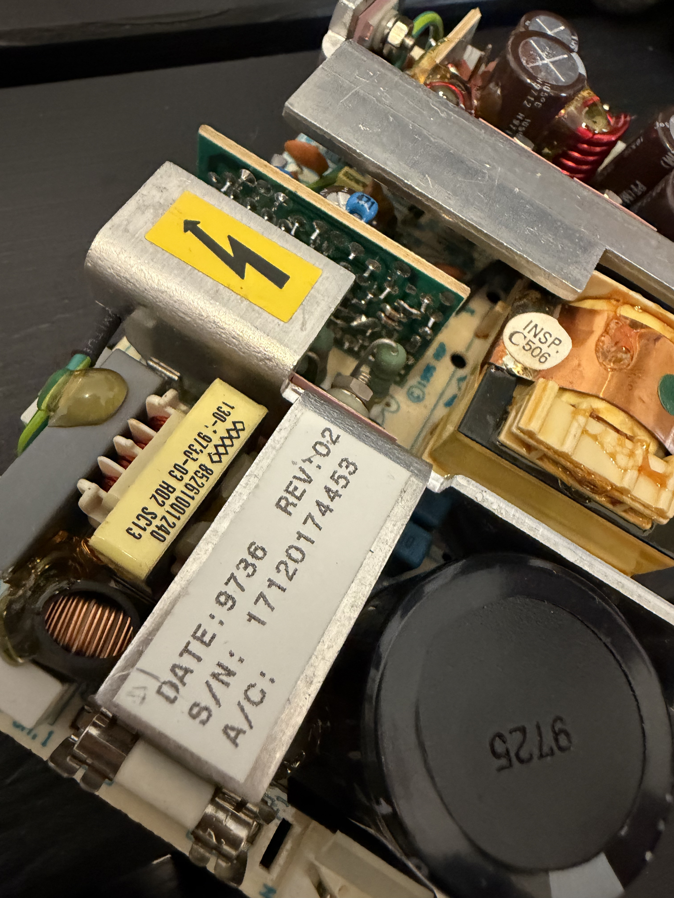

> The competition for the world's worst robots — the more broken, the better! Build robots from scrap, pit them against each other, and learn a ton along the way.


  
  
  
  
  


## What is HeboCon / Shitty Robots?

**HeboCon** originated in Japan — as a competition for anyone who knows nothing about robotics but wants to build a robot anyway. The term "heboi" comes from Japanese and roughly means "lousy" or "badly made."

The goal isn't to create the perfect high-tech robot, but the opposite: **the wonkiest, funniest, most absurd machines built from scrap** that somehow move — and ultimately "fight" each other. It's gloriously chaotic, creative, and full of humor.

## How a Shitty Robots workshop works


Old alarm clocks, remote controls, phones, flashlights — everything gets taken apart. Kids discover the motors, gears, LEDs, and switches inside devices they use every day.



From the salvaged parts, hot glue, cable ties, and plenty of imagination, the robots take shape. There are no instructions — just the goal that the thing somehow moves.



All robots compete against each other in an arena. Who pushes whom off the platform? Who stays standing the longest? Who has the funniest robot? There are prizes in several categories — not just for the "best."


## What do kids learn?

- **How technology works** — motors, circuits, mechanics you can touch
- **Improvisation & creativity** — there's no "wrong," only creative solutions
- **Teamwork** — planning, building, and problem-solving together
- **Sustainability** — e-waste becomes something new. Upcycling instead of throwing away.
- **Frustration tolerance** — if the robot doesn't work, you rebuild it. And again. And again.

## Who is this for?

- **Age:** from 8 years (younger with supervision)
- **Group size:** 10–30 kids
- **Duration:** 2–4 hours (depending on format)
- **Prior knowledge:** none! That's the whole point.

## Where we've been

We run Shitty Robots workshops regularly at various events:

- **[lab30 media art festival](https://www.lab30.de/programm-2025/shittyrobotssa)** in Augsburg — workshops and robot battles as part of the international media art festival
- **KidsLab Hacker Workshop** — as a regular workshop format
- **Schools and youth centres** — bookable as a project day
- **Holiday programmes** — multi-day workshops with a big final battle





## What's needed?

**We bring:**
- Tools (screwdrivers, pliers, hot glue guns, soldering irons)
- Craft materials (cable ties, tape, wheels, axles)
- Batteries and motors as backup
- The robot arena

**Participants bring:**
- Old electronic devices to dismantle (alarm clocks, remote controls, flashlights, broken toys)
- A good mood and no fear of chaos

## Book Shitty Robots

Shitty Robots is the perfect workshop for schools, youth centres, festivals, or corporate events. We bring the complete equipment and run the workshop.

Inquire & book
