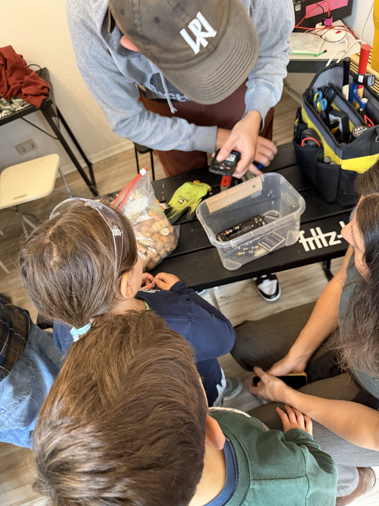
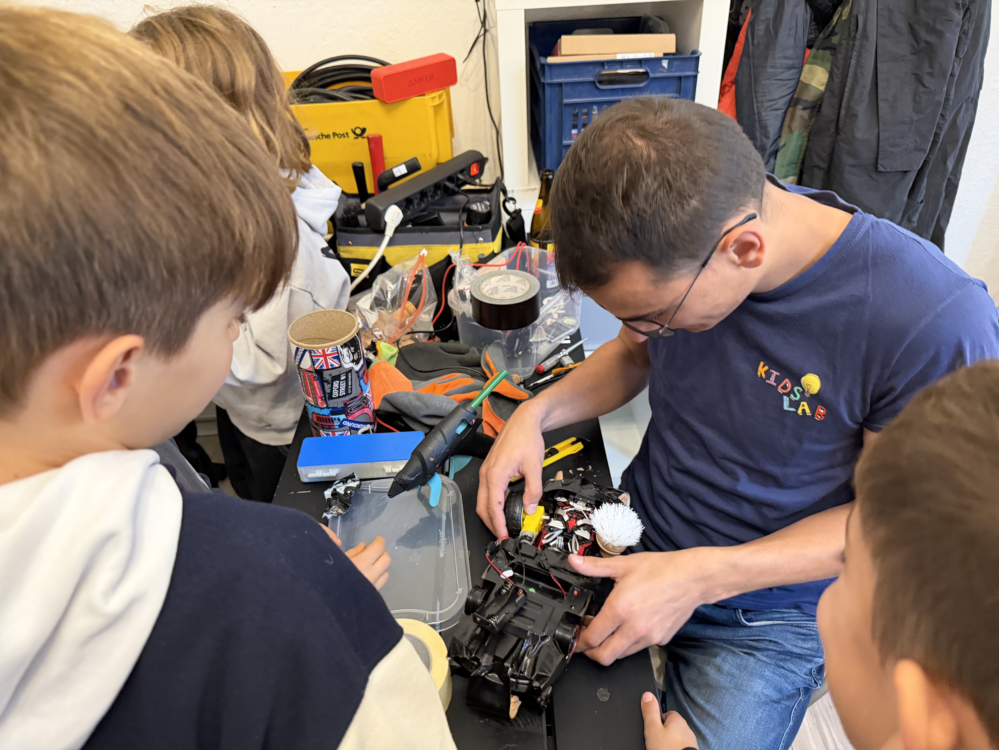
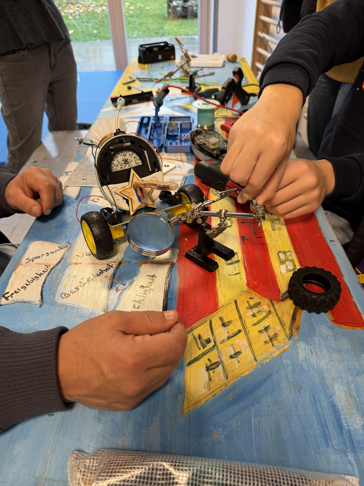
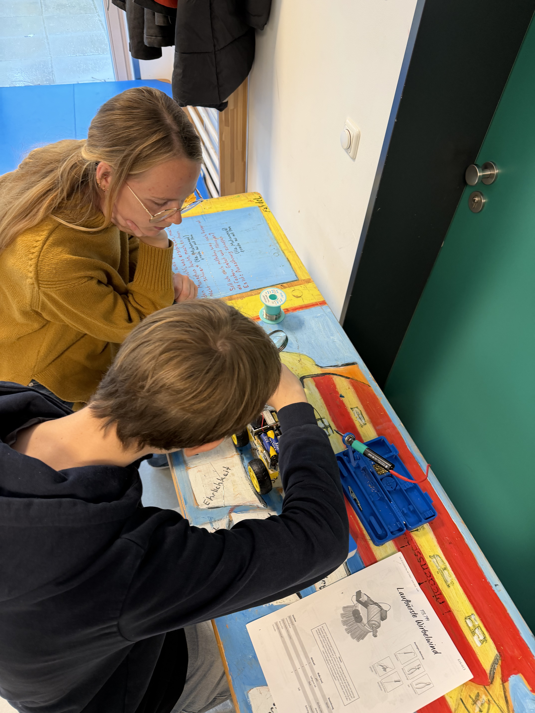
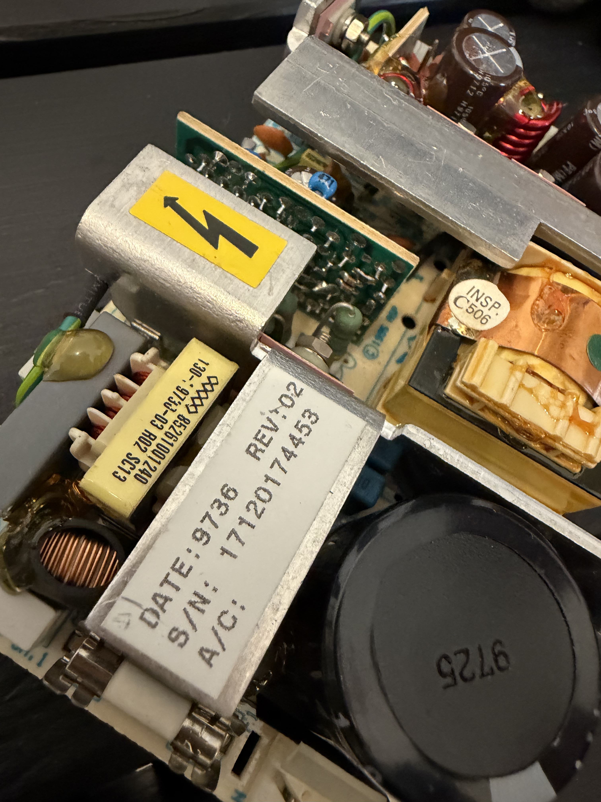

> Der Wettbewerb für die schlechtesten Roboter der Welt — je kaputter, desto besser! Roboter aus Schrott bauen, gegeneinander antreten lassen und dabei eine Menge lernen.


  
  
  
  
  


## Was ist HeboCon / Shitty Robots?

**HeboCon** ist ursprünglich in Japan entstanden — als Wettbewerb für alle, die keine Ahnung von Robotik haben, aber trotzdem Roboter bauen wollen. Der Begriff "Heboi" stammt aus dem Japanischen und bedeutet so viel wie "minderwertig" oder "schlecht gemacht".

Das Ziel ist nicht, den perfekten Hightech-Roboter zu erschaffen, sondern das Gegenteil: **möglichst schiefe, lustige, absurde, aus Schrott gebaute Maschinen**, die sich irgendwie bewegen — und am Ende gegeneinander "kämpfen". Das ist herrlich chaotisch, kreativ und voller Humor.

## So läuft ein Shitty-Robots-Workshop ab


Alte Wecker, Fernbedienungen, Handys, Taschenlampen — alles wird auseinandergenommen. Die Kinder entdecken Motoren, Zahnräder, LEDs und Schalter in Geräten, die sie jeden Tag benutzen.



Aus den gewonnenen Bauteilen, Heißkleber, Kabelbindern und jeder Menge Fantasie entstehen die Roboter. Es gibt keine Bauanleitung — nur das Ziel, dass sich das Ding irgendwie bewegt.



Alle Roboter treten auf einer Arena gegeneinander an. Wer schiebt wen von der Platte? Wer bleibt am längsten stehen? Wer hat den lustigsten Roboter? Es gibt Preise für verschiedene Kategorien — nicht nur für den "Besten".


## Was lernen die Kinder dabei?

- **Wie Technik funktioniert** — Motoren, Schaltkreise, Mechanik zum Anfassen
- **Improvisation & Kreativität** — Es gibt kein "falsch", nur kreative Lösungen
- **Teamarbeit** — Gemeinsam planen, bauen, Probleme lösen
- **Nachhaltigkeit** — Aus Elektroschrott wird etwas Neues. Upcycling statt Wegwerfen.
- **Frustrationstoleranz** — Wenn der Roboter nicht funktioniert, wird umgebaut. Und nochmal. Und nochmal.

## Für wen ist das?

- **Alter:** Ab 8 Jahren (mit Betreuung auch jünger)
- **Gruppengröße:** 10–30 Kinder
- **Dauer:** 2–4 Stunden (je nach Format)
- **Vorkenntnisse:** Keine! Das ist der Witz daran.

## Wo wir schon waren

Wir veranstalten Shitty-Robots-Workshops regelmäßig bei verschiedenen Events:

- **[lab30 Medienkunstfestival](https://www.lab30.de/programm-2025/shittyrobotssa)** in Augsburg — Workshops und Roboter-Battles im Rahmen des internationalen Festivals für Medienkunst
- **KidsLab HackerWerkstatt** — als regelmäßiges Workshop-Format
- **Schulen und Jugendzentren** — als Projekttag buchbar
- **Ferienprogramme** — mehrtägige Workshops mit großem Abschluss-Battle





## Was wird gebraucht?

**Wir bringen mit:**
- Werkzeug (Schraubenzieher, Zangen, Heißklebepistolen, Lötkolben)
- Bastelmaterial (Kabelbinder, Klebeband, Räder, Achsen)
- Batterien und Motoren als Backup
- Die Roboter-Arena

**Die Teilnehmer bringen mit:**
- Alte Elektrogeräte zum Zerlegen (Wecker, Fernbedienungen, Taschenlampen, kaputte Spielzeuge)
- Gute Laune und keine Angst vor Chaos

## Shitty Robots buchen

Shitty Robots eignet sich perfekt als Workshop für Schulen, Jugendzentren, Festivals oder Firmenevents. Wir kommen mit dem kompletten Equipment und betreuen den Workshop.

Anfragen & Buchung
