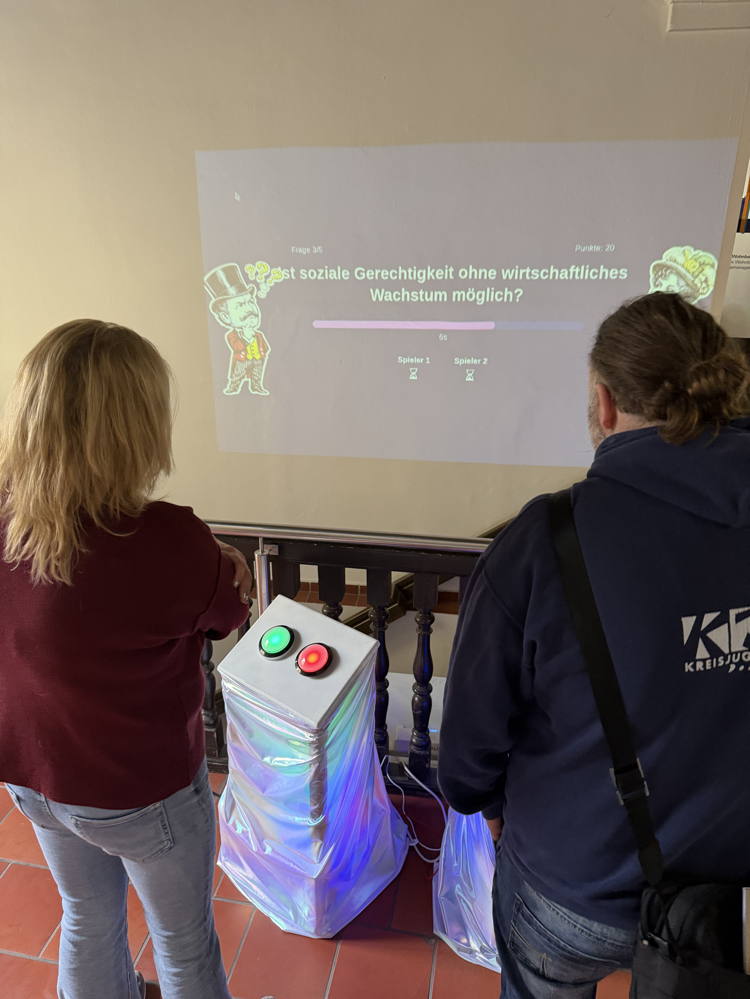
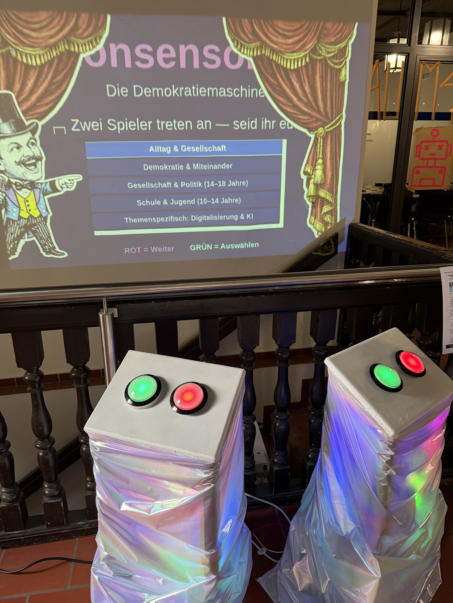
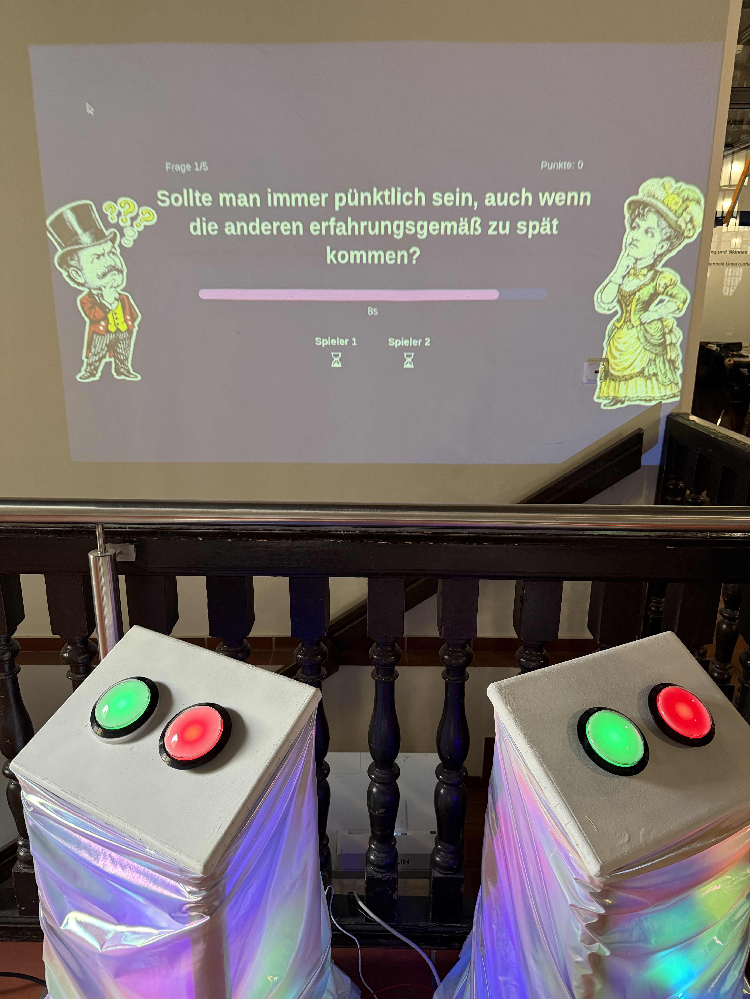
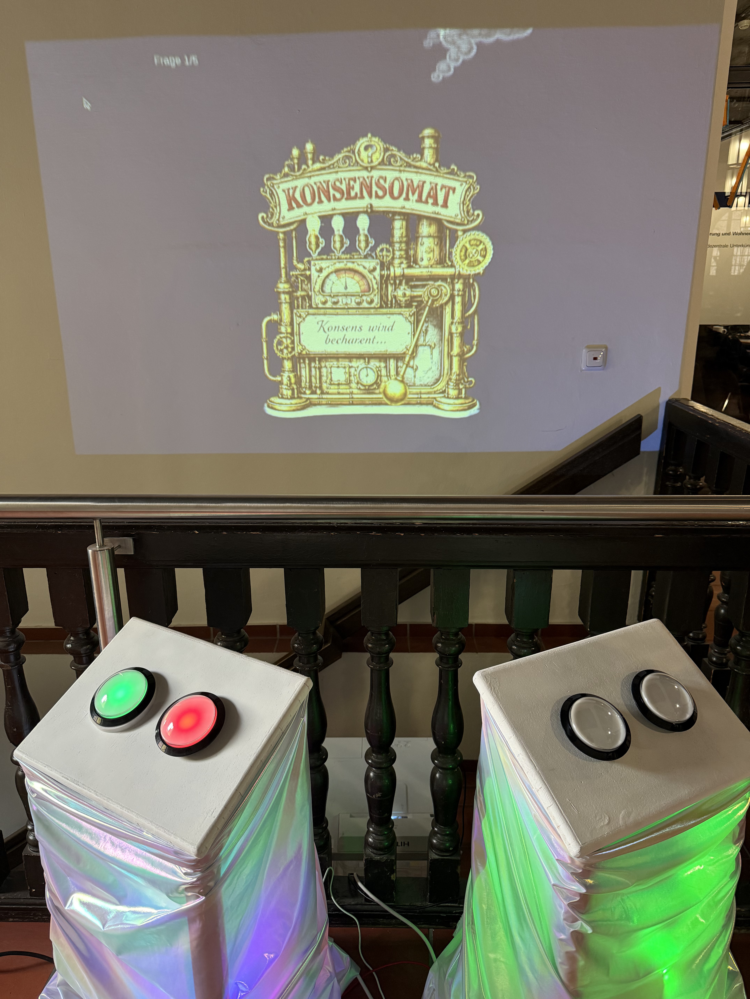
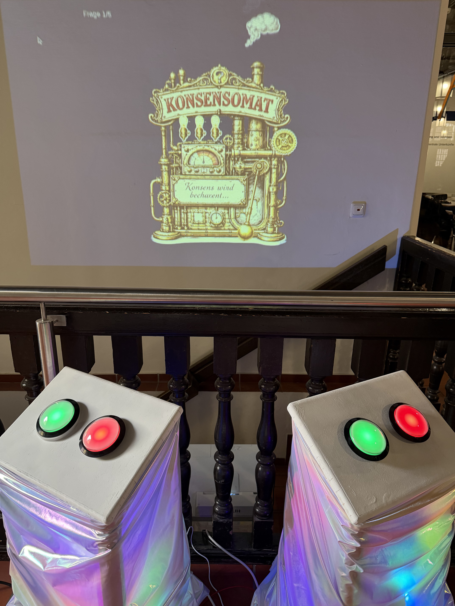
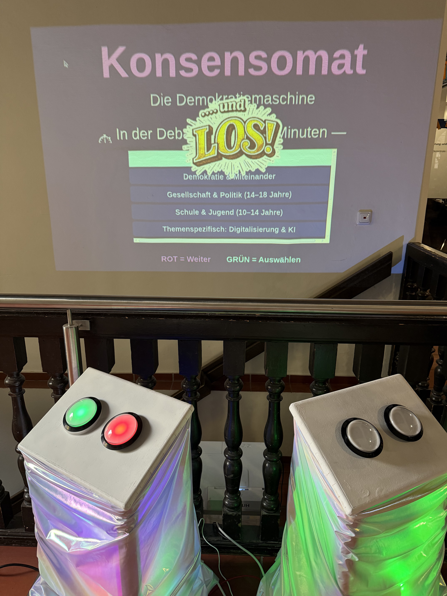
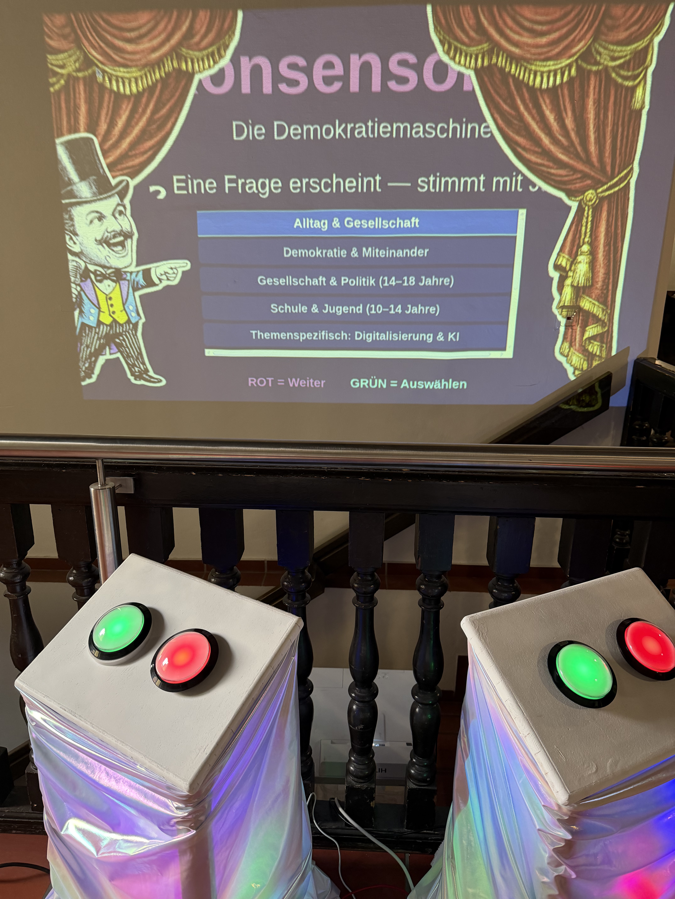

> Two people. One question. Two minutes to agree — or the game is over. **Konsensomat** turns democracy into an experience.




  
  
  
  
  
  
  


## What is the Konsensomat?

Voting is easy. Agreeing is harder. In **Konsensomat**, two people face off at physical voting stations. A question appears on a big screen — both press yes or no. Do they agree? Point! Not in agreement? Then the clock starts ticking: **two minutes** to reach consensus through discussion, argument, and negotiation — or the game is over.

Democracy means more than voting — it thrives on debate, the courage to hold your own opinion, and the strength to find a compromise. Konsensomat makes exactly that tangible: playful, loud, and for everyone aged 10 and up.

## How it works


A question shows up on the big screen — e.g. *"Should you always be punctual, even if others are usually late?"*



Each person presses the green (yes) or red (no) buzzer at their own station.



Same answer? You get a point and the next question comes up.



Different answers? The clock starts ticking — you have 2 minutes to reach agreement. If you don't make it: game over!


## Question categories

Konsensomat includes questions from various areas — depending on the target group and event:

- **Everyday life & society** — everyday questions that spark reflection
- **Democracy & living together** — core values of coexistence
- **Society & politics (ages 14–18)** — political and social topics for teenagers
- **School & youth (ages 10–14)** — age-appropriate questions about school and living together
- **Topic-specific: digitalisation & AI** — questions about digital topics

## What makes Konsensomat special

- **No prior knowledge needed** — just a willingness to listen
- **No prior knowledge** — just a willingness to really listen
- **No loser** — instead, the result of a genuine dialogue
- **A physical installation** — touch, press, experience instead of just clicking
- **For everyone aged 10 and up** — at school, at festivals, at youth centres

## Suitable for

- School events & project days
- Festivals & trade fairs
- Civic education
- Corporate & club events
- Workshops & action days

## The tech behind it

The installation consists of two buzzer stations (wooden boxes with large arcade buttons, LED lighting, and holographic foil), a Raspberry Pi as a server, and a projector/screen. The software is completely open source:

- **Backend:** Python (Flask + Socket.IO) on Raspberry Pi
- **Frontend:** real-time WebSocket connection to the game server
- **Controls:** large arcade buttons (yes/no), replaceable with GPIO or USB encoders
- **Kiosk mode:** starts automatically on power-up, including fallback hotspot



## Rent Konsensomat

Konsensomat can be rented for events — including setup, on-site support, and question set. Contact: [gregor@kidslab.de](mailto:gregor@kidslab.de)

[Download poster (PDF)](konsensomat_plakat.pdf)

Inquire & book

---

*Inspired by Adam J. Scarborough's "The Democracy Machine!" — an interactive installation by [KidsLab gGmbH](https://kidslab.de), Augsburg.*
